# Educagioco

### 🎲 **[Si gioca qui → msporchia.github.io/educagioco](https://msporchia.github.io/educagioco/)**

Giochi educativi per bambini **dai quattro ai dieci anni**: tabelline e
calcolo a mente, inglese e spagnolo, operazioni in colonna, misure, soldi e
resto, logica, e i primi passi della programmazione.

- 📵 **Nessun server, nessun account, nessuna pubblicità.** Dopo la prima
  apertura funziona anche senza internet, e i progressi restano sul telefono.
- 🎚️ **Si tara sull'età.** La prima volta si dice quanti anni ha il bambino:
  da lì dipende quali giochi trova e quanto sono difficili le domande.
- 🧠 **Quello che non sa torna, quello che sa si ripassa di rado.** Sotto
  tutti i giochi c'è un unico motore di ripetizione dilazionata.

---

## 🎮 I giochi

Nessuno li trova tutti insieme: quali compaiono in home lo decide l'età, e
ogni gioco si può spegnere. Il nome porta alla pagina del gioco.

### Numeri, misure e lingue

<table>
<tr>
<td align="center" width="33%" valign="top">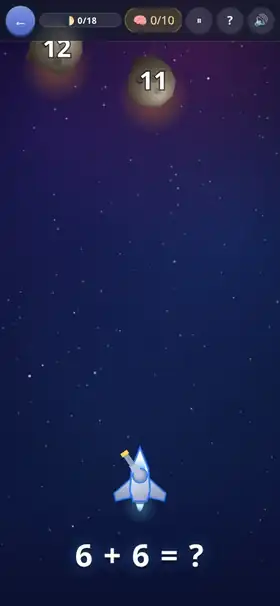<br><b><a href="docs/asteroidi.md">☄️ Asteroidi</a></b><br>Tabelline e calcolo a mente: si spara al risultato giusto.</td>
<td align="center" width="33%" valign="top">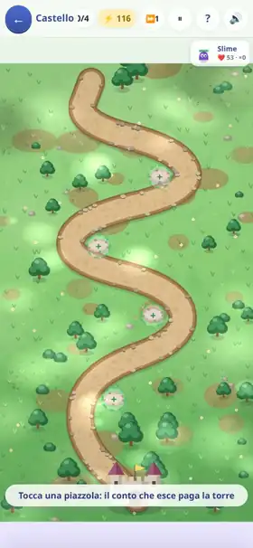<br><b><a href="docs/castello.md">🏰 Difendi il Castello</a></b><br>Tower defense: ogni torre si paga con un'operazione in colonna.</td>
<td align="center" width="33%" valign="top">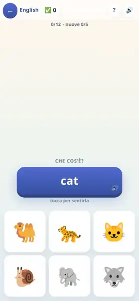<br><b><a href="docs/lingue.md">🌐 English e 🇪🇸 Spagnolo</a></b><br>Parole, verbi e frasi, e ogni parola si sente pronunciata, anche offline.</td>
</tr>
<tr>
<td align="center" width="33%" valign="top">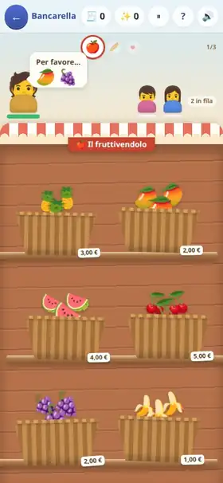<br><b><a href="docs/bancarella.md">🛒 La bancarella</a></b><br>Si vende, si incassa e si dà il resto.</td>
<td align="center" width="33%" valign="top">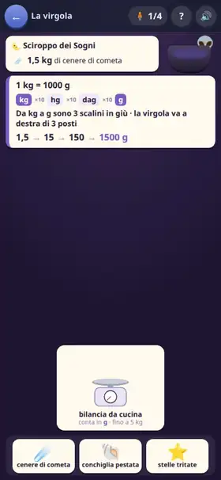<br><b><a href="docs/pozioni.md">⚗️ Le pozioni</a></b><br>Litri, chili e metri: si dosa con gli attrezzi che si hanno.</td>
<td width="33%"></td>
</tr>
</table>

### Imparare a programmare

Tre gradini della stessa scala, e nessuno fa scrivere codice: si comincia con le frecce, a cinque anni, e si arriva a funzioni, parametri e variabili.

<table>
<tr>
<td align="center" width="33%" valign="top">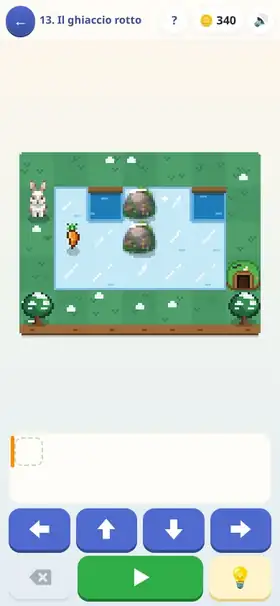<br><b><a href="docs/passo-passo.md">🐇 Passo passo</a></b><br>Una fila di frecce riporta il coniglio alla tana. Poi il cane pastore, poi i cicli.</td>
<td align="center" width="33%" valign="top">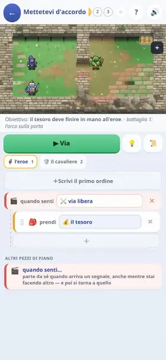<br><b><a href="docs/generale.md">🎖️ Il Generale</a></b><br>Ordini a una squadretta: sequenze, condizioni, cicli e segnali.</td>
<td align="center" width="33%" valign="top">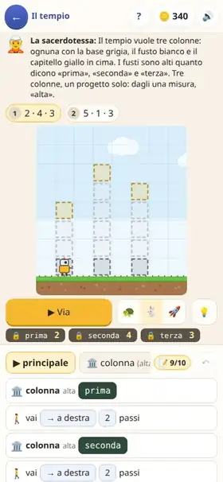<br><b><a href="docs/costruttore.md">🏗️ Il costruttore</a></b><br>Un robot costruisce quello che programmi: funzioni, parametri, variabili.</td>
</tr>
</table>

### Avventure fatte di domande

Pescano da un magazzino comune di italiano, matematica, spazio, tempo e
logica, tarato sull'età: [cosa c'è dentro](docs/domande.md). Dopo uno
sbaglio si legge il perché, e come si fa.

<table>
<tr>
<td align="center" width="33%">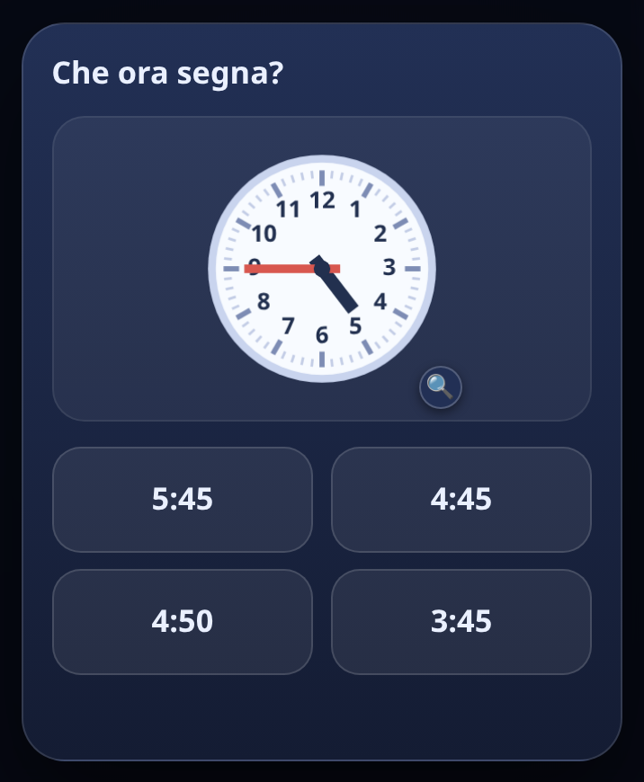</td>
<td align="center" width="33%">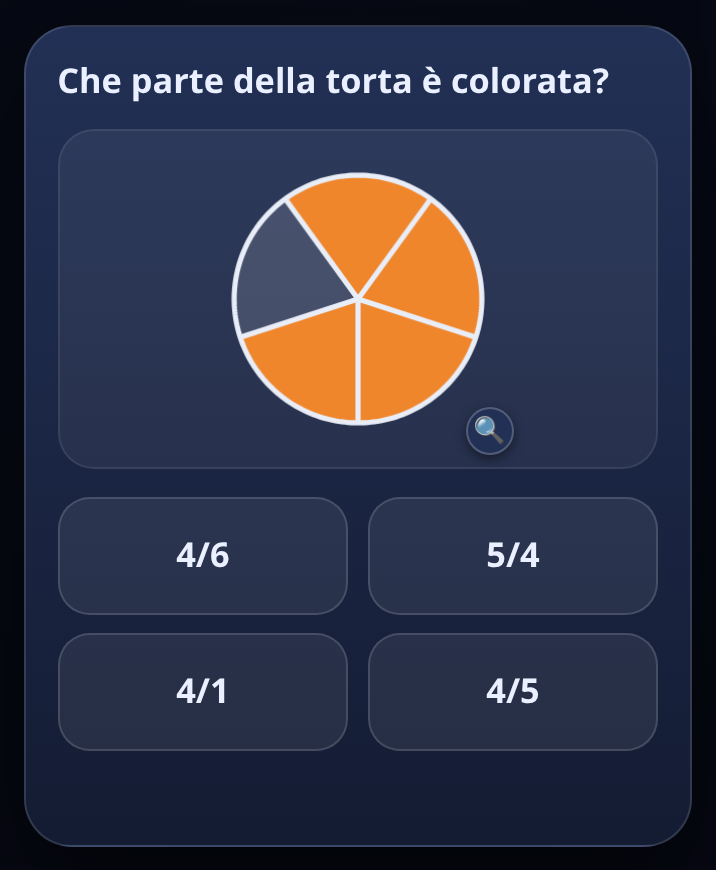</td>
<td align="center" width="33%">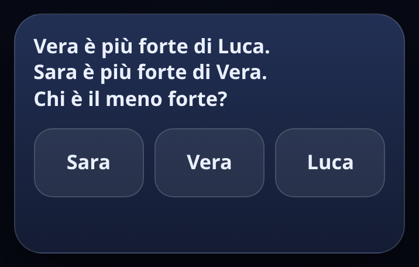</td>
</tr>
</table>

<table>
<tr>
<td align="center" width="33%" valign="top">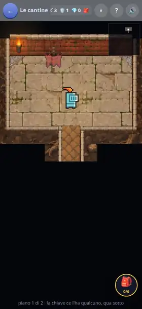<br><b><a href="docs/sotterraneo.md">🗺️ Il sotterraneo</a></b><br>Porte, forzieri e mostri al buio: ogni cosa che vale costa una risposta.</td>
<td align="center" width="33%" valign="top">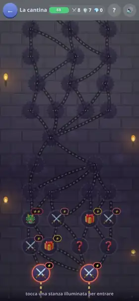<br><b><a href="docs/dungeon.md">⚔️ Il Dungeon</a></b><br>Di stanza in stanza, e ogni risposta giusta porta bottino.</td>
<td align="center" width="33%" valign="top">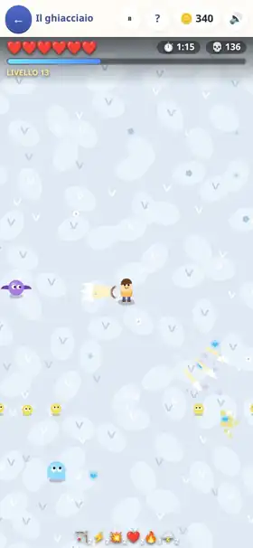<br><b><a href="docs/survivors.md">🏹 Survivors</a></b><br>Sopravvivenza a ondate: la carta più forte costa la domanda più tosta.</td>
</tr>
</table>

### Senza domande

<table>
<tr>
<td align="center" width="33%" valign="top">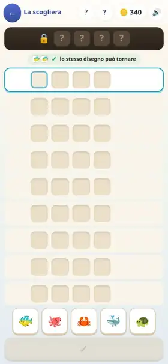<br><b><a href="docs/codice-segreto.md">🔐 Codice Segreto</a></b><br>Deduzione pura: si indovina la combinazione leggendo i pallini.</td>
<td align="center" width="33%" valign="top">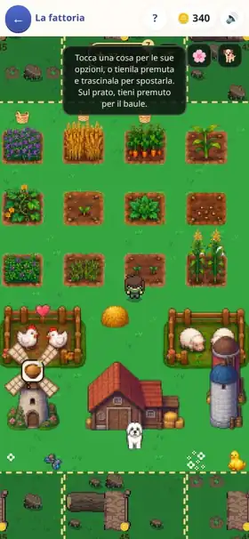<br><b><a href="docs/fattoria.md">🚜 La fattoria</a></b><br>Dove si spendono le monete: campi, mulini e animali, col tempo vero.</td>
<td width="33%"></td>
</tr>
</table>

### Per chi non legge ancora

<table>
<tr>
<td align="center" width="33%" valign="top">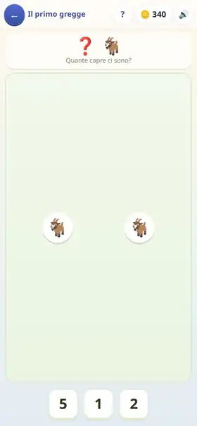<br><b><a href="docs/conta.md">🐑 Conta gli animali</a></b><br>Si conta quello che si vede, in fila, sparpagliato, in mezzo agli intrusi.</td>
<td align="center" width="33%" valign="top">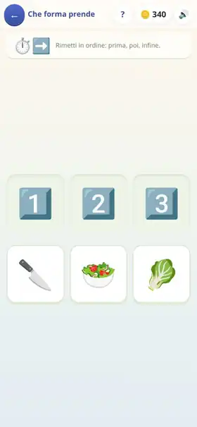<br><b><a href="docs/prima-dopo.md">⏭️ Prima e dopo</a></b><br>Il seme, il germoglio, l'albero: si rimette in fila una storia.</td>
<td width="33%"></td>
</tr>
</table>

---

## 📱 Come si comincia

**Apri il link dal telefono e aggiungilo alla schermata iniziale**: da lì si
comporta come un'app, a tutto schermo e senza rete.

- **Android (Chrome)** → menù ⋮ → *Aggiungi a schermata Home*
- **iPhone (Safari)** → Condividi → *Aggiungi a Home*
- **Computer** → si gioca nel browser, oppure si
  [scarica la pagina](https://msporchia.github.io/educagioco/index.html) e si
  apre con doppio click

Tutto il resto è spiegato **dentro l'app**, in *? Come funziona* in fondo alla
home: il codice dei genitori (all'inizio `0000`), come si spegne un gioco o
una materia, come si sposta l'età.

> [!IMPORTANT]
> I progressi stanno **solo nel browser di quel dispositivo**: nessuno li
> vede, ma se si cancellano i dati del sito non tornano. Dalla schermata dei
> genitori si salvano su file, ed è anche il modo di passarli a un altro
> telefono.

---

## Chi l'ha fatto, e come

È nato per i miei due figli, ed è tarato sulla scuola italiana. L'ho scritto
con Claude Code, mettendo il rigore dove si rompe in silenzio: che una tappa
sia superabile da chi sbaglia un conto su quattro, che un modulo di quiz non
dia sempre le stesse venti domande, che i progressi finiscano davvero nel
salvataggio. Quelle cose si riprovano da sole a ogni modifica.

<details>
<summary><b>Costruirlo e modificarlo</b></summary>

<br>

Il prodotto finale è **un unico file HTML**: codice, immagini e voci incise
dentro, niente server.

```bash
npm ci              # installazione pulita
npm run dev         # server di sviluppo
npm run build       # dist/index.html, il file unico
npm test            # le prove senza browser, pochi secondi
npm run scatti      # rifà le immagini e le clip di questa pagina
```

Tutti i comandi e cosa riscrivono stanno in [`ADMIN.md`](ADMIN.md), le
regole del motore di apprendimento in [`LEGGIMI.md`](LEGGIMI.md).

</details>

**Se qualcosa non va**: dalla schermata dei genitori si arriva a
[un modulo](https://tally.so/r/D4OO1q) già compilato con la versione e
l'ultimo errore, oppure si
[apre una segnalazione](https://github.com/msporchia/educagioco/issues/new/choose).
Per il resto sto su [LinkedIn](https://www.linkedin.com/in/marcosporchia).

MIT — vedi [LICENSE](LICENSE). Se serve a un altro bambino, tanto meglio.
