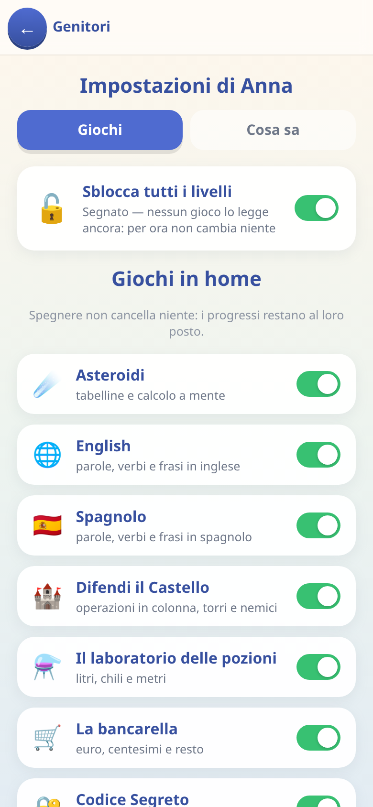
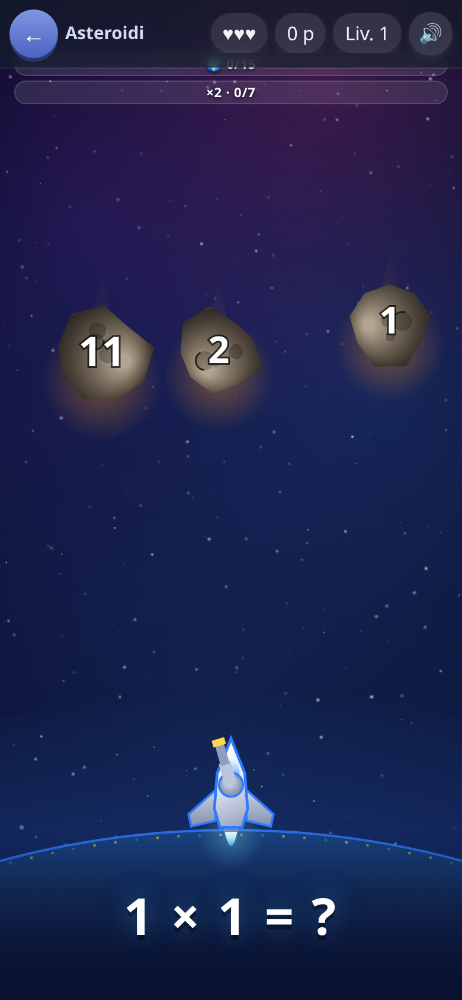
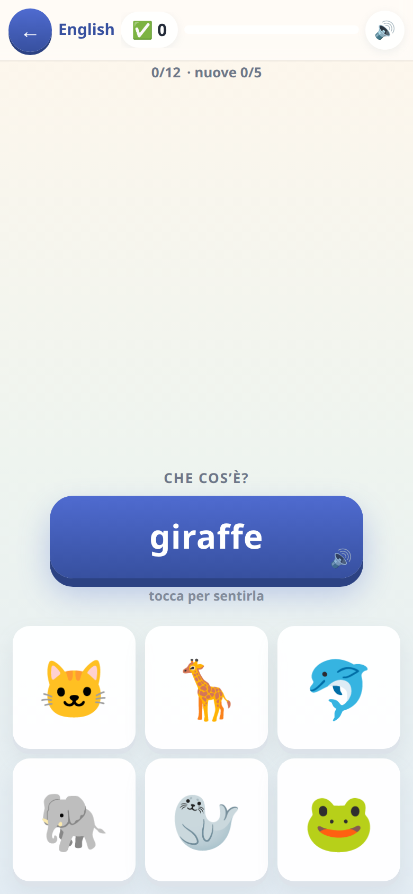
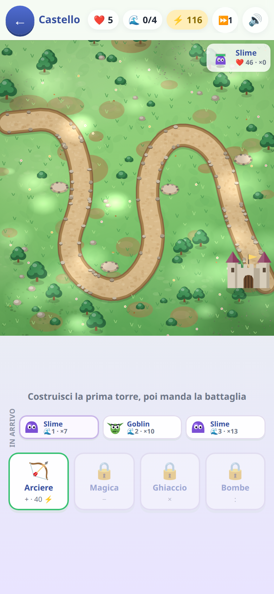
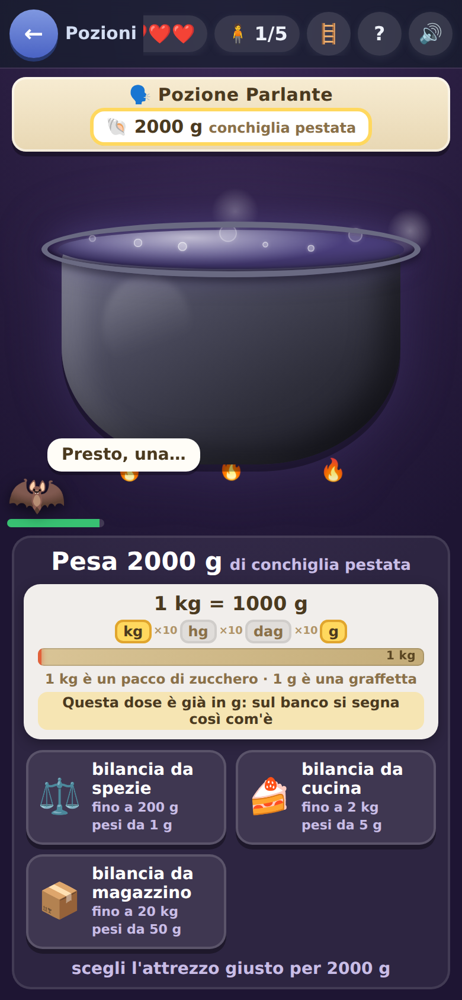
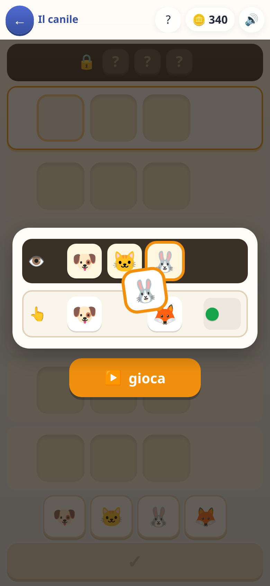
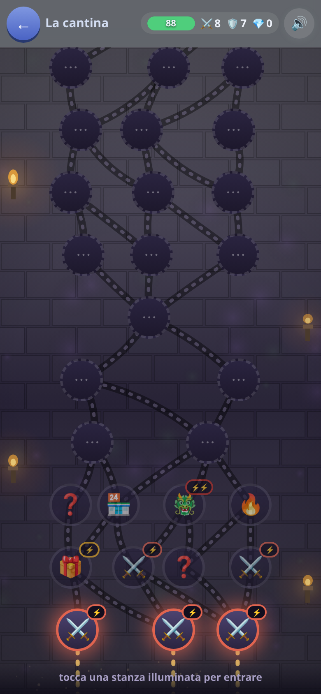
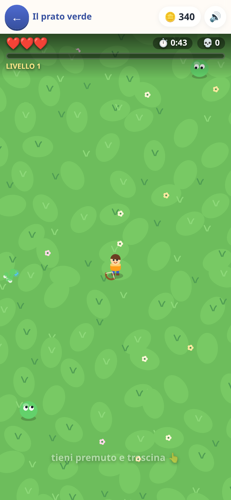
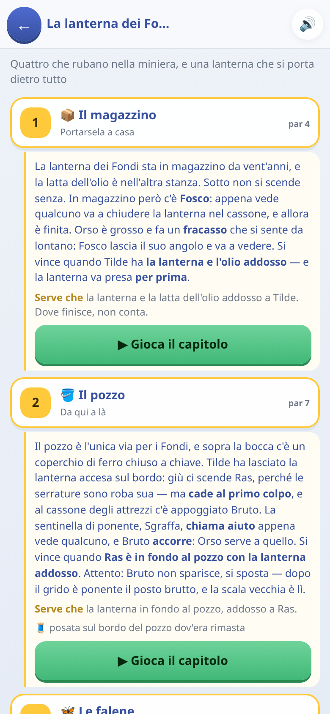
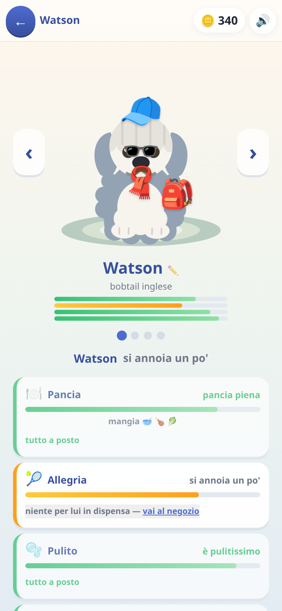

# Educagioco

### 🎲 **[Si gioca qui → msporchia.github.io/educagioco](https://msporchia.github.io/educagioco/)**

Giochi educativi per bambini delle elementari: inglese, spagnolo, matematica
in colonna, calcolo a mente, un tower defense che si paga facendo le
operazioni, un mercato dove si dà il resto, un laboratorio di pozioni, un
dungeon a carte, un gioco di programmazione a ordini.

**Gira interamente sul dispositivo: nessun server, nessun account, nessuna
pubblicità, e funziona senza internet.**

---

> [!TIP]
> ### Se vuoi solo farci giocare tuo figlio
>
> **Apri il link qui sopra dal telefono e aggiungilo alla schermata iniziale.**
> Da lì in poi si comporta come un'app vera: icona sua, a tutto schermo.
>
> - **Android (Chrome)** → menù ⋮ → *Aggiungi a schermata Home*
> - **iPhone (Safari)** → tasto Condividi → *Aggiungi a Home*
> - **Computer** → l'icona ⊕ nella barra degli indirizzi, oppure si gioca
>   direttamente nel browser
>
> ### ✈️ Funziona completamente offline
>
> **Dopo la prima apertura non serve più internet.** Né per giocare, né per
> salvare i progressi, né per sentire la pronuncia inglese e spagnola: le
> voci sono registrate dentro l'app, non chieste a un servizio. In aereo, in
> macchina, in montagna senza campo, in ospedale: funziona uguale.
>
> Non è un ripiego degradato — è *tutta* l'app. Non c'è una sola funzione che
> richieda la rete, perché non c'è nessun server con cui parlare.
>
> **Si aggiorna da solo.** Quando pubblico una versione nuova, l'app se la
> prende al primo avvio in cui c'è rete: non c'è niente da reinstallare, e
> nel frattempo si continua a giocare con quella che si ha. In fondo alla
> schermata iniziale è scritto di quando è la versione in uso (*aggiornato il
> 9 agosto alle 14:30*), così si capisce a colpo d'occhio se è arrivata.
>
> Non serve registrarsi, non c'è pubblicità, non ci sono acquisti, non c'è
> niente da scaricare oltre alla pagina stessa.
>
> **Se preferisci il file da tenerti**, il gioco *è* una pagina sola:
> [scaricala](https://msporchia.github.io/educagioco/index.html) e aprila con
> doppio click. Funziona uguale, anche passata su una chiavetta a un
> computer che non ha mai visto internet.

> [!IMPORTANT]
> ### Dove finiscono i progressi
>
> **Tutto resta nel dispositivo su cui si gioca.** Monete, parole imparate,
> tappe superate, animali della cameretta: stanno nella memoria del browser
> (IndexedDB), sul telefono o sul computer di chi gioca.
>
> **Non c'è nessun server e non viene inviato niente a nessuno.** Non esiste
> un account, non c'è un database dall'altra parte, e io non vedo né potrei
> vedere come sta andando tuo figlio. Il rovescio della medaglia è che i
> progressi sono legati a quel browser: se si cancellano i dati del sito, o
> si cambia telefono, senza un backup non tornano.
>
> **Per questo c'è il salvataggio su file** (Genitori → codice → *Salva su
> file*): scarica un `.json` con dentro tutto, che si rimette con *Rimetti da
> un file*. È anche il modo di **passare i progressi da un dispositivo a un
> altro** — o di tenerne una copia da parte, che è la cosa che consiglio di
> fare la prima sera. Vedi [i settaggi per i genitori](docs/genitori.md).

---

## Per chi è

**È nato per i miei due figli**, per farli esercitare su quello che stanno
facendo a scuola e per dargli qualcosa di più costruttivo da aprire quando
chiedono il telefono. È cresciuto guardandoli giocare: quello che funzionava
restava, il resto lo buttavo.

Due conseguenze da sapere prima di darlo a un bambino:

- **È tarato su di loro**, e su quello che stavano facendo a scuola in quel
  momento. Per un bambino più piccolo certe cose sono impossibili, per uno
  più grande sono noiose. Quello che non va bene [si spegne](docs/genitori.md).
- **Alcuni giochi sono in prova** e restano nascosti finché non si accende
  l'interruttore apposta nei settaggi.

Se serve a un altro bambino, è tutto qui e si prende liberamente.

---

## 👨‍👩‍👧 Se qualcosa non va bene per tuo figlio, si spegne

C'è una schermata per i genitori, dietro un codice di quattro cifre —
**all'inizio è `0000`**, e si cambia da lì dentro.



Da lì si può:

- **Spegnere un gioco intero.** Se uno non piace, o è troppo difficile, o
  fa perdere tempo: sparisce dalla home e basta. I progressi restano dove
  sono, e riaccendendolo si ritrovano.
- **Dire cosa a scuola non ha ancora fatto.** Questa è la parte che uso di
  più. I litri, i chili, le divisioni, l'orologio a lancette, l'analisi
  grammaticale: si spengono uno per uno, e da quel momento **quelle domande
  non escono più**. Non è una difficoltà in meno, è una domanda muta in
  meno — un bambino che non ha ancora visto i litri non può ragionare su
  «quanti centilitri sono due litri», può solo tirare a indovinare.
- **Salvare e rimettere i progressi**, come detto sopra.
- **Gestire chi gioca**: aggiungere un bambino, cambiargli nome,
  eliminarlo. Ognuno ha i suoi progressi, separati.

Se qualcosa è ancora troppo difficile, in fondo c'è anche l'interruttore che
apre tutte le tappe: a volte serve per far vedere a un fratello più grande
un gioco che il piccolo ha appena cominciato.

**[→ Come funzionano i settaggi, per esteso](docs/genitori.md)**

---

## 🎮 I giochi

Ogni riquadro porta a una pagina con più immagini e la spiegazione di **quali
domande escono e come cambia la difficoltà**.

| | |
|:--|:--|
| [](docs/asteroidi.md) | ### [☄️ Asteroidi](docs/asteroidi.md)<br>Tabelline e calcolo a mente. **Ogni tabellina ha la sua storia**: quelle incerte tornano spesso, quelle sicure spariscono per settimane e poi rispuntano per un controllo.<br>*→ [come sceglie le domande](docs/asteroidi.md)* |
| [](docs/lingue.md) | ### [🌐 English e 🇪🇸 Spagnolo](docs/lingue.md)<br>Parole, verbi e frasi, con la **pronuncia incisa da una voce vera**. Più una parola è sicura, più il modo di chiederla si fa difficile.<br>*→ [i sei modi di chiedere](docs/lingue.md)* |
| [](docs/castello.md) | ### [🏰 Difendi il Castello](docs/castello.md)<br>Un tower defense dove **ogni torre si paga con un'operazione in colonna**. Quante ne servono per finire una tappa è deciso a monte, e misurato da un simulatore.<br>*→ [quante operazioni e di che tipo](docs/castello.md)* |
| [](docs/pozioni.md) | ### [⚗️ Il laboratorio delle pozioni](docs/pozioni.md)<br>Litri, chili e metri: si dosa con gli attrezzi che si hanno. Le otto tappe salgono **a coppie**, e quella che porta un gesto nuovo riparte coi numeri facili.<br>*→ [le misure e le conversioni](docs/pozioni.md)* |
| [](docs/bancarella.md) | ### [🛒 La bancarella](docs/bancarella.md)<br>Si vende, si incassa, si dà il resto. La difficoltà non sta nelle cifre ma in **quante monete deve chiedere il resto** — e nell'ultima giornata il resto lo calcola il bambino.<br>*→ [euro, centesimi e resto](docs/bancarella.md)* |
| [](docs/codice-segreto.md) | ### [🔐 Codice Segreto](docs/codice-segreto.md)<br>Deduzione pura, tipo Mastermind: si indovina la combinazione leggendo i pallini. Niente conti, solo ragionamento.<br>*→ [le nove tappe](docs/codice-segreto.md)* |
| [](docs/dungeon.md) | ### [⚔️ Il Dungeon](docs/dungeon.md)<br>Si scende di stanza in stanza, e ogni risposta giusta porta **bottino: armi, armature, oggetti** con cui equipaggiarsi per scendere ancora più a fondo. È quello che tiene incollati a una fila di domande — che sono di tutte le materie, non solo matematica, e **si fanno più difficili man mano che si scende**.<br>*→ [come cresce la difficoltà](docs/dungeon.md)* |
| [](docs/survivors.md) | ### [🏹 Survivors](docs/survivors.md)<br>Sopravvivenza a ondate. **Ogni potenziamento ha un prezzo in difficoltà**: la carta più forte si paga con la domanda più tosta. Scegliere è il gioco.<br>*→ [il prezzo delle carte](docs/survivors.md)* |
| [](docs/generale.md) | ### [🎖️ Il Generale](docs/generale.md) *(in prova)*<br>Si dà una fila di ordini a una squadretta e si guarda cosa succede: sequenze, condizioni, cicli, e **segnali fra personaggi diversi** che non partono insieme. È programmazione asincrona travestita da gioco.<br>*→ [i concetti, uno per uno](docs/generale.md)* |
| [](docs/cameretta.md) | ### [🛏️ La cameretta](docs/cameretta.md)<br>Dove finiscono le monete guadagnate negli altri giochi: animali da accudire, mobili, e una macchinetta delle sorprese da cui **non esce mai un doppione**. Non ci sono domande — è il motivo per cui si torna.<br>*→ [animali, negozio e sorprese](docs/cameretta.md)* |

**[❓ Le domande di tutte le materie](docs/domande.md)** — il Dungeon e
Survivors non hanno un contenuto proprio: pescano da un magazzino comune di
italiano, matematica, spazio, tempo e logica. Cosa c'è dentro, come si fa più
difficile, e come si spegne quello che tuo figlio non ha ancora fatto.

---

## 🧠 La cosa che tiene insieme tutto

Sotto i giochi c'è **un motore di ripetizione dilazionata** condiviso: ogni
cosa da imparare — una tabellina, una parola inglese — ha una sua *forza*, che
sale quando si risponde giusto e scende quando si sbaglia, e che **cala da
sola con il tempo** se non la si rivede. Una parola imparata dieci giorni fa
non vale quanto una imparata ieri, e torna a farsi vedere senza che nessuno
l'abbia sbagliata.

Da qui viene il comportamento che si nota giocando: le cose incerte tornano
spesso, quelle sicure spariscono per settimane e poi rispuntano per un
controllo. Chi risponde giusto due volte di fila su una stessa cosa non se la
ritrova più per il resto della partita — è tempo tolto a quello che non sa.

I dettagli, se interessano, stanno in [`LEGGIMI.md`](LEGGIMI.md).

---

## 🛠️ Per chi vuole metterci le mani

<details>
<summary><b>Costruirlo, provarlo, modificarlo</b></summary>

<br>

Il prodotto finale è **un unico file HTML** che si apre con doppio click:
dentro c'è tutto, codice, stili, immagini e voci incise. Niente server,
niente rete, niente backend.

```bash
npm ci             # installazione pulita (usare questo, non npm install)
npm run dev        # server di sviluppo
npm run build      # produce dist/index.html, il file unico (~3,7 MB)
```

### Le prove

```bash
npm test           # tutto: ricostruisce, poi unità e browser
npm run test:unita # solo quelle senza browser, sono secondi
```

Sono di due tipi, e la differenza conta.

**Quelle di unità girano senza browser**, perché i motori dei giochi sono
scritti apposta per funzionare anche fuori da uno schermo: non toccano un
canvas, non importano Vue, non sanno cosa sia un pulsante. Questo permette di
**giocare le partite per davvero, migliaia di volte, in pochi secondi** — il
tower defense affrontato tappa per tappa da un finto giocatore che sbaglia un
conto ogni tanto, i livelli del gioco di programmazione risolti sul serio, il
gioco di deduzione vinto ragionando. Non si controlla che una funzione
restituisca il numero atteso: si controlla che una tappa sia superabile, che
non lo sia spendendo male, e che un bambino distratto ce la faccia lo stesso.

I moduli di quiz hanno una prova a parte che misura anche la **varietà**: un
grado che produce sempre le stesse domande si impara a memoria e vale zero.

**Quelle di integrazione aprono il file costruito in Chrome e giocano col
dito**, come farebbe un bambino: toccano le carte, rispondono alle domande,
comprano, controllano che i progressi finiscano davvero nel salvataggio. Sono
quelle che si accorgono se una schermata non si apre più.

### Gli altri comandi

```bash
npm run voci       # incide la pronuncia inglese (solo se aggiungi parole)
npm run voci -- --lingua es    # la stessa cosa per lo spagnolo
npm run simula     # gioca il tower defense senza browser: quanto è duro davvero
npm run tara       # ritrova la vita dei nemici ondata per ondata e riscrive i dati
npm run mappe      # controlla i livelli del Generale
npm run quiz:banco # prova i moduli di quiz senza browser: forma, varietà, doppioni
npm run scatti     # rifà le immagini di questa documentazione
node strumenti/icone.mjs       # rigenera i PNG delle icone da public/icona.svg
```

### Le scelte che spiegano il resto

- **Un file solo.** Da qui viene quasi tutto: nessuna dipendenza a runtime
  oltre a Vue, effetti sonori sintetizzati invece che campionati, icone emoji
  invece che file, grafica disegnata a canvas con un motorino fatto in casa
  (Pixi o Konva peserebbero da 100 a 450 KB).
- **La pronuncia non usa `speechSynthesis`.** La voce del dispositivo è una
  lotteria — su Linux esce espeak, incomprensibile — e a un bambino una
  pronuncia sbagliata fa più danno del silenzio. Le clip sono incise a monte
  e concatenate in sprite. Sono due terzi del peso del file.
- **Il codice è in italiano.** Nomi, funzioni, commenti.
- **Chi gioca non disegna.** Una schermata costruisce la lista delle cose in
  scena e la passa al pittore; chi dipinge non sa cosa siano energia, prezzi
  e ondate.
- **L'equilibrio si ricalcola da solo.** Il tower defense ha il suo motore
  senza schermo e un simulatore che gioca migliaia di partite per trovare
  quanta vita devono avere i nemici, ondata per ondata. Il punto non è che
  sia più preciso: è che **quando si cambia una decisione — un prezzo, la
  potenza di una torre, quante operazioni deve costare una tappa — non c'è
  niente da ritoccare a mano.** Si rilancia la taratura e tutti i numeri si
  riallineano insieme. Senza, ogni ritocco vorrebbe dire rimettere in fila
  decine di valori sperando di non averne dimenticato uno, e in pratica non
  si toccherebbe più niente.

</details>

## Sull'implementazione

È un prototipo per due bambini, e l'ho scritto con Claude Code. **Il rigore
l'ho messo in proporzione alla posta in gioco**, che su un progetto così è la
decisione che conta: non ho revisionato riga per riga l'implementazione, ho
fatto verificare a macchina le cose che si rompono in silenzio. Che una tappa
sia superabile da chi sbaglia un conto su quattro, che un modulo di quiz non
produca sempre le stesse venti domande, che i progressi finiscano davvero nel
salvataggio: quelle sono provate, e si riprovano da sole a ogni modifica.

Il resto di quello che si fa su un prodotto — review riga per riga,
osservabilità, sicurezza, manutenibilità a due anni, proprietà del codice nel
tempo — qui non serviva a nessuno, e metterci attenzione dove non c'è rischio
è attenzione tolta a dove il rischio c'è.

Quindi la parte interessante non è la singola riga: sono le decisioni. I
vincoli (un file solo, tutto offline), le meccaniche, il modello di
apprendimento, l'equilibrio misurato con un simulatore invece che a occhio.

## Licenza

MIT — vedi [LICENSE](LICENSE). I giochi sono miei, ma se servono a un altro
bambino, tanto meglio.
