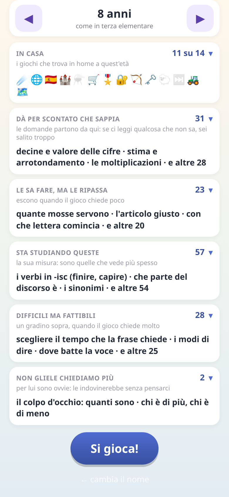
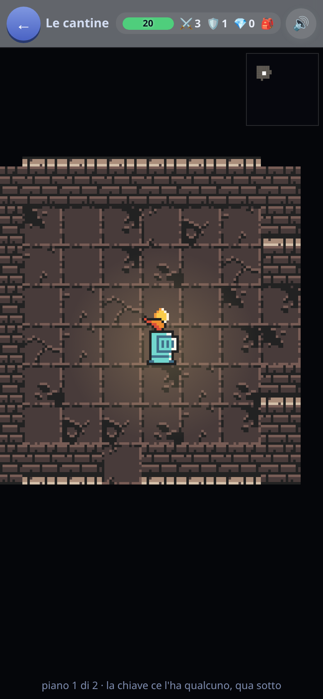
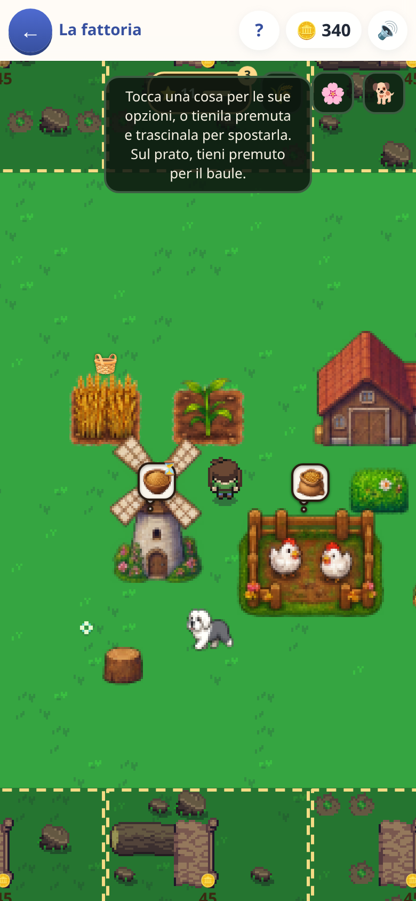
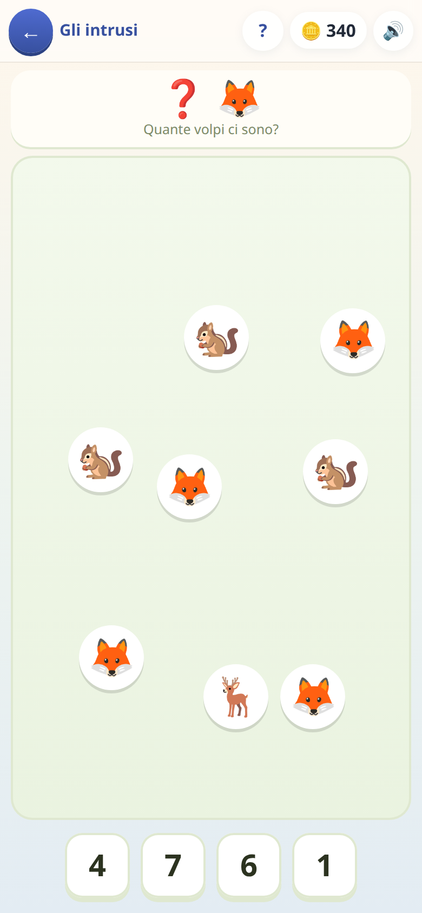
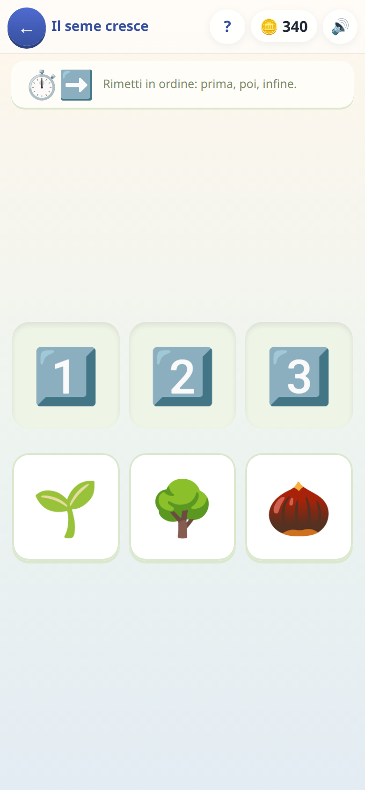

# Educagioco

### 🎲 **[Si gioca qui → msporchia.github.io/educagioco](https://msporchia.github.io/educagioco/)**

Giochi educativi per bambini **dai quattro ai dieci anni**: inglese,
spagnolo, matematica in colonna, calcolo a mente, un tower defense che si
paga facendo le operazioni, un mercato dove si dà il resto, un laboratorio di
pozioni, un dungeon a carte, un gioco di programmazione a ordini — e, per chi
non legge ancora, contare gli animali e rimettere in fila una storia.

**Quello che un bambino trova in home dipende da quanti anni ha**, e lo dice
un grande la prima volta che lo apre: [come funziona](#-quanti-anni-ha-e-cosa-cambia).

**Gira interamente sul dispositivo: nessun server, nessun account, nessuna
pubblicità, e funziona senza internet.**

---

> [!TIP]
> ### Se vuoi solo farci giocare tuo figlio
>
> **Apri il link qui sopra dal telefono e aggiungilo alla schermata iniziale.**
> Da lì in poi si comporta come un'app vera: icona sua, a tutto schermo.
>
> - **Android (Chrome)** → menù ⋮ → *Aggiungi a schermata Home*
> - **iPhone (Safari)** → tasto Condividi → *Aggiungi a Home*
> - **Computer** → l'icona ⊕ nella barra degli indirizzi, oppure si gioca
>   direttamente nel browser
>
> ### ✈️ Funziona completamente offline
>
> **Dopo la prima apertura non serve più internet.** Né per giocare, né per
> salvare i progressi, né per sentire la pronuncia inglese e spagnola: le
> voci sono registrate dentro l'app, non chieste a un servizio. In aereo, in
> macchina, in montagna senza campo, in ospedale: funziona uguale.
>
> Non è un ripiego degradato — è *tutta* l'app. Non c'è una sola funzione che
> richieda la rete, perché non c'è nessun server con cui parlare.
>
> **Si aggiorna da solo.** Quando pubblico una versione nuova, l'app se la
> prende al primo avvio in cui c'è rete: non c'è niente da reinstallare, e
> nel frattempo si continua a giocare con quella che si ha. In fondo alla
> schermata iniziale è scritto di quando è la versione in uso (*aggiornato il
> 9 agosto alle 14:30*), così si capisce a colpo d'occhio se è arrivata.
>
> Non serve registrarsi, non c'è pubblicità, non ci sono acquisti, non c'è
> niente da scaricare oltre alla pagina stessa.
>
> **Se preferisci il file da tenerti**, il gioco *è* una pagina sola:
> [scaricala](https://msporchia.github.io/educagioco/index.html) e aprila con
> doppio click. Funziona uguale, anche passata su una chiavetta a un
> computer che non ha mai visto internet.

> [!IMPORTANT]
> ### Dove finiscono i progressi
>
> **Tutto resta nel dispositivo su cui si gioca.** Monete, parole imparate,
> tappe superate, animali della fattoria: stanno nella memoria del browser
> (IndexedDB), sul telefono o sul computer di chi gioca.
>
> **Non c'è nessun server e non viene inviato niente a nessuno.** Non esiste
> un account, non c'è un database dall'altra parte, e io non vedo né potrei
> vedere come sta andando tuo figlio. Il rovescio della medaglia è che i
> progressi sono legati a quel browser: se si cancellano i dati del sito, o
> si cambia telefono, senza un backup non tornano.
>
> **Per questo c'è il salvataggio su file** (Genitori → codice → *Salva su
> file*): scarica un `.json` con dentro tutto, che si rimette con *Rimetti da
> un file*. È anche il modo di **passare i progressi da un dispositivo a un
> altro** — o di tenerne una copia da parte, che è la cosa che consiglio di
> fare la prima sera. Vedi [i settaggi per i genitori](docs/genitori.md).

---

## Per chi è

**È nato per i miei due figli**, per farli esercitare su quello che stanno
facendo a scuola e per dargli qualcosa di più costruttivo da aprire quando
chiedono il telefono. È cresciuto guardandoli giocare: quello che funzionava
restava, il resto lo buttavo.

Una cosa da sapere prima di darlo a un bambino: **è tarato sulla scuola
italiana**, e su quello che i miei figli stavano facendo in quel momento. Il
resto — che a un bambino di cinque anni non arrivi roba di quarta, e a uno di
dieci non arrivino le cose dei piccoli — se lo aggiusta da sé a partire da
quanti anni ha, e quello che resta storto [si spegne](docs/genitori.md).

Se serve a un altro bambino, è tutto qui e si prende liberamente.

---

## 🎚️ Quanti anni ha, e cosa cambia

**La prima volta che si apre, l'app chiede come si chiama il bambino e quanti
anni ha.** Non è un'anagrafe — nessuno chiede una data di nascita e il numero
non si vede da nessuna parte mentre si gioca: è **la taratura**, ed è il
numero da cui dipende tutto il resto.



Decide tre cose, e le decide in continuo:

- **quali giochi trova in home.** La bancarella non compare prima dei sei
  anni, il laboratorio delle pozioni prima dei sette e mezzo; «Conta gli
  animali» smette di essere offerto proprio lì, e «Prima e dopo» a otto.
  Nessun elenco scritto a mano: ogni tappa di ogni gioco dichiara quanto è
  difficile, e la carta compare quando qualcuna di quelle tappe cade alla
  portata di chi guarda.
- **cosa si dà per scontato che a scuola abbia già fatto.** A cinque anni le
  divisioni non esistono, a dieci sì — e quello che la scuola non ha ancora
  dato non compare nelle domande.
- **quanto sono difficili le domande.** A nove anni «2×2» è tempo perso, a sei
  «7×8» è un muro, a otto vanno bene tutte e due: è esattamente la differenza
  che l'età fa.

Sotto sta **una scala sola, da 0 a 100** — zero il primo giorno di materna,
cento la fine della primaria, dodici punti e mezzo per anno — e ci stanno
sopra tutte le materie insieme: una tabellina, una parola inglese, l'orologio
a lancette, una tappa del castello. L'età diventa una finestra su quella
scala, e i giochi pescano lì dentro.

**Quello che è cominciato non sparisce mai.** L'età decide cosa *si offre a
chi arriva*, non cosa si toglie a chi c'è già: un gioco aperto anche una volta
sola resta in home per sempre. E dentro una campagna non sparisce nessuna
tappa — quelle sotto la sua età nascono già aperte («l'hai già passato»),
quelle sopra dicono che arrivano più avanti.

**La manopola si sposta di mezzo anno per volta, e sotto dice cosa fa**:
quanti giochi restano in casa e quali, cosa si dà per scontato, come si
spartiscono le domande fra facili, nel segno e difficili. Non c'è niente da
immaginare: si muove una tacca e si guarda cambiare l'elenco. Spostarla di
poco non tocca quello che un grande ha già sistemato a mano; quando cambia
fascia di scuola lo dice **prima**, con scritto cosa si sta per perdere.
Monete, animali, campagne e traguardi non si toccano in nessun caso.

---

## 👨‍👩‍👧 Se qualcosa non va bene per tuo figlio, si spegne

C'è una schermata per i genitori, dietro un codice di quattro cifre —
**all'inizio è `0000`**, e la prima volta che si entra l'app invita a
sceglierne uno vero. Se poi lo si dimentica c'è **«Non ricordi il codice?»**,
che lo rimette a zero rispondendo a una domanda di cultura generale: non è
sicurezza, è un gradino contro il tocco distratto, e il gioco arriva a
famiglie con cui non ho nessun altro canale.


Tre schede, una per domanda che un grande si fa — *chi gioca su questo
telefono*, *cosa gli chiedono i giochi*, *cosa vede in home*. Da lì si può:

- **Spostare l'età.** È la manopola di sopra: si muove di mezzo anno per
  volta e sotto dice cosa cambia, gioco per gioco e materia per materia.
- **Spegnere un gioco intero.** Se uno non piace, o è troppo difficile, o
  fa perdere tempo: sparisce dalla home e basta. I progressi restano dove
  sono, e riaccendendolo si ritrovano.
- **Dire cosa a scuola non ha ancora fatto.** Questa è la parte che uso di
  più. I litri, i chili, le divisioni, l'orologio a lancette, l'analisi
  grammaticale: si spengono uno per uno, e da quel momento **quelle domande
  non escono più**. Non è una difficoltà in meno, è una domanda muta in
  meno — un bambino che non ha ancora visto i litri non può ragionare su
  «quanti centilitri sono due litri», può solo tirare a indovinare.
- **Ritoccare una materia sola.** Se una cosa gli è difficile o gli è ormai
  facile si sposta di mezzo anno per volta senza toccare il resto — e quando
  ha già risposto abbastanza volte, **è la schermata a consigliarlo**: legge
  come sta andando e lo scrive sulla riga, col tasto già pronto.
- **Guardare e provare le domande.** Tutte quelle che esistono, con la loro
  difficoltà di fianco e un ▶ che ne apre una vera: si giudica prima di
  decidere, invece di aspettare che ricapiti giocando.
- **Salvare e rimettere i progressi**, come detto sopra.
- **Gestire chi gioca**: aggiungere un bambino, cambiargli nome,
  eliminarlo. Ognuno ha i suoi progressi, separati.

Se qualcosa è ancora troppo difficile, in fondo c'è anche l'interruttore che
apre tutte le tappe: a volte serve per far vedere a un fratello più grande
un gioco che il piccolo ha appena cominciato.

**E cancellare non è più per sempre.** Prima di azzerare i progressi di un
bambino, di eliminarlo o di ricominciare una campagna, l'app ne mette da
parte una copia — le ultime tre — e in fondo a *Progressi* c'è il tasto per
rimetterla. Chi cancella per sbaglio non è il bambino entrato di nascosto: è
il grande stanco che tocca la carta rossa alle undici di sera.

**[→ Come funzionano i settaggi, per esteso](docs/genitori.md)**

---

## 🎮 I giochi

Ogni riquadro porta a una pagina con più immagini e la spiegazione di **quali
domande escono e come cambia la difficoltà**. Sono grosso modo in ordine di età —
i primi danno per scontato che il bambino legga da solo, **gli ultimi due
no** — e nessuno li trova tutti insieme in home: quali arrivano lo decide
l'età.

| | |
|:--|:--|
| [](docs/asteroidi.md) | ### [☄️ Asteroidi](docs/asteroidi.md)<br>Tabelline e calcolo a mente. **Ogni tabellina ha la sua storia**: quelle incerte tornano spesso, quelle sicure spariscono per settimane e poi rispuntano per un controllo.<br>*→ [come sceglie le domande](docs/asteroidi.md)* |
| [](docs/lingue.md) | ### [🌐 English e 🇪🇸 Spagnolo](docs/lingue.md)<br>Parole, verbi e frasi, con la **pronuncia incisa da una voce vera**. Più una parola è sicura, più il modo di chiederla si fa difficile.<br>*→ [i sei modi di chiedere](docs/lingue.md)* |
| [](docs/castello.md) | ### [🏰 Difendi il Castello](docs/castello.md)<br>Un tower defense dove **ogni torre si paga con un'operazione in colonna**. Quante ne servono per finire una tappa è deciso a monte, e misurato da un simulatore.<br>*→ [quante operazioni e di che tipo](docs/castello.md)* |
| [](docs/pozioni.md) | ### [⚗️ Il laboratorio delle pozioni](docs/pozioni.md)<br>Litri, chili e metri: si dosa con gli attrezzi che si hanno. Le otto tappe salgono **a coppie**, e quella che porta un gesto nuovo riparte coi numeri facili.<br>*→ [le misure e le conversioni](docs/pozioni.md)* |
| [](docs/bancarella.md) | ### [🛒 La bancarella](docs/bancarella.md)<br>Si vende, si incassa, si dà il resto. La difficoltà non sta nelle cifre ma in **quante monete deve chiedere il resto** — e nell'ultima giornata il resto lo calcola il bambino.<br>*→ [euro, centesimi e resto](docs/bancarella.md)* |
| [](docs/codice-segreto.md) | ### [🔐 Codice Segreto](docs/codice-segreto.md)<br>Deduzione pura, tipo Mastermind: si indovina la combinazione leggendo i pallini. Niente conti, solo ragionamento.<br>*→ [le nove tappe](docs/codice-segreto.md)* |
| [](docs/dungeon.md) | ### [⚔️ Il Dungeon](docs/dungeon.md)<br>Si scende di stanza in stanza, e ogni risposta giusta porta **bottino: armi, armature, oggetti** con cui equipaggiarsi per scendere ancora più a fondo. È quello che tiene incollati a una fila di domande — che sono di tutte le materie, non solo matematica, e **si fanno più difficili man mano che si scende**.<br>*→ [come cresce la difficoltà](docs/dungeon.md)* |
| [](docs/survivors.md) | ### [🏹 Survivors](docs/survivors.md)<br>Sopravvivenza a ondate. **Ogni potenziamento ha un prezzo in difficoltà**: la carta più forte si paga con la domanda più tosta. Scegliere è il gioco.<br>*→ [il prezzo delle carte](docs/survivors.md)* |
| [](docs/sotterraneo.md) | ### [🗺️ Il sotterraneo](docs/sotterraneo.md)<br>Un posto che si gira col dito, non un menù: si cammina fra stanze e corridoi al buio, e **ogni cosa che vale ha un prezzo — il prezzo è rispondere**. Una porta chiusa costa una domanda facile, un forziere una sola e tosta (sbagliandola resta chiuso per sempre), un mostro una per colpo. La scala che scende è chiusa e la chiave ce l'ha un guardiano: è l'unica cosa che non si può aggirare, tutto il resto si sceglie. Scappare da un mostro costa un graffio e **le volte che si può svenire sono contate**: chi risponde bene arriva in fondo, chi preme a caso torna su a mani vuote.<br>*→ [dove spendere le risposte](docs/sotterraneo.md)* |
| [](docs/generale.md) | ### [🎖️ Il Generale](docs/generale.md)<br>Si dà una fila di ordini a una squadretta e si guarda cosa succede: sequenze, condizioni, cicli, e **segnali fra personaggi diversi** che non partono insieme. È programmazione asincrona travestita da gioco.<br>*→ [i concetti, uno per uno](docs/generale.md)* |
| [](docs/fattoria.md) | ### [🚜 La fattoria](docs/fattoria.md)<br>Dove finiscono le monete guadagnate negli altri giochi: terra da comprare, duecento cose da posare, animali da accudire, e **cinque campi da seminare** che crescono col tempo vero — anche a gioco chiuso, e niente marcisce mai. Il raccolto diventa **mangime** al fienile e da lì passa ai **recinti**, che si vede da lontano se hanno fame — sopra la testa gli galleggia proprio quello che aspettano: ne tornano uova, latte, tartufi e lana. Costa la metà di quello che si compra, e un quarto d'ora di attesa. Non ci sono domande — è il motivo per cui si torna.<br>*→ [la catena, i numeri e cosa manca](docs/fattoria.md)* |
| [](docs/conta.md) | ### [🐑 Conta gli animali](docs/conta.md)<br>**Per i quattro-sei anni**, e non c'è niente da leggere: la consegna è fatta di icone. Si conta quello che si vede — in fila, sparpagliato, in mezzo agli intrusi — e più avanti si arriva alla cosa che a quell'età non è affatto ovvia: **cinque pecore sparpagliate sono sempre cinque**.<br>*→ [i nove modi di chiedere «quanti?»](docs/conta.md)* |
| [](docs/prima-dopo.md) | ### [⏭️ Prima e dopo](docs/prima-dopo.md)<br>**Per i quattro-sei anni.** Il seme, il germoglio, l'albero: si rimette in fila una storia, e poi si indovina il pezzo che non si vede. Cinquanta storie, e la regola che le tiene in piedi è severa — **fra due vignette ci dev'essere un prima e un dopo veri**, se no chi ragiona bene prende un no.<br>*→ [i sei modi, e le storie disegnate](docs/prima-dopo.md)* |

**[❓ Le domande di tutte le materie](docs/domande.md)** — il Dungeon,
Survivors e il sotterraneo non hanno un contenuto proprio: pescano da un
magazzino comune di italiano, matematica, spazio, tempo e logica, dove ogni
classe di domande dichiara **a che età serve**. Cosa c'è dentro, come si fa
più difficile, e come si spegne quello che tuo figlio non ha ancora fatto.

---

## 🧠 La cosa che tiene insieme tutto

Sotto i giochi c'è **un motore di ripetizione dilazionata** condiviso: ogni
cosa da imparare — una tabellina, una parola inglese — ha una sua *forza*, che
sale quando si risponde giusto e scende quando si sbaglia, e che **cala da
sola con il tempo** se non la si rivede. Una parola imparata dieci giorni fa
non vale quanto una imparata ieri, e torna a farsi vedere senza che nessuno
l'abbia sbagliata.

Da qui viene il comportamento che si nota giocando: le cose incerte tornano
spesso, quelle sicure spariscono per settimane e poi rispuntano per un
controllo. Chi risponde giusto due volte di fila su una stessa cosa non se la
ritrova più per il resto della partita — è tempo tolto a quello che non sa.

Sono due meccanismi diversi e non si pestano i piedi: **l'età dice cosa può
arrivare**, la forza dice **quando torna** quello che è già arrivato.

I dettagli, se interessano, stanno in [`LEGGIMI.md`](LEGGIMI.md).

---

## 🛠️ Per chi vuole metterci le mani

<details>
<summary><b>Costruirlo, provarlo, modificarlo</b></summary>

<br>

Il prodotto finale è **un unico file HTML** che si apre con doppio click:
dentro c'è tutto, codice, stili, immagini e voci incise. Niente server,
niente rete, niente backend.

```bash
npm ci             # installazione pulita (usare questo, non npm install)
npm run dev        # server di sviluppo
npm run build      # produce dist/index.html, il file unico (~3,7 MB)
```

L'elenco completo dei comandi — cosa fa ognuno, cosa riscrive, e quali file
sono **generati** e non si toccano a mano — sta in [`ADMIN.md`](ADMIN.md),
insieme al banco degli sprite e a come si pubblica.

### Le prove

```bash
npm test            # il giro di ogni giorno: solo quelle senza browser, secondi
npm run test:tutto  # tutto: ricostruisce, poi unità e browser (~5 minuti e mezzo)
```

Sono di due tipi, e la differenza conta.

**Quelle di unità girano senza browser**, perché i motori dei giochi sono
scritti apposta per funzionare anche fuori da uno schermo: non toccano un
canvas, non importano Vue, non sanno cosa sia un pulsante. Questo permette di
**giocare le partite per davvero, migliaia di volte, in pochi secondi** — il
tower defense affrontato tappa per tappa da un finto giocatore che sbaglia un
conto ogni tanto, i livelli del gioco di programmazione risolti sul serio, il
gioco di deduzione vinto ragionando. Non si controlla che una funzione
restituisca il numero atteso: si controlla che una tappa sia superabile, che
non lo sia spendendo male, e che un bambino distratto ce la faccia lo stesso.

I moduli di quiz hanno una prova a parte che misura anche la **varietà**: un
grado che produce sempre le stesse domande si impara a memoria e vale zero.

**Quelle di integrazione aprono il file costruito in Chrome e giocano col
dito**, come farebbe un bambino: toccano le carte, rispondono alle domande,
comprano, controllano che i progressi finiscano davvero nel salvataggio. Sono
quelle che si accorgono se una schermata non si apre più.

### Gli altri comandi

```bash
npm run voci       # incide la pronuncia inglese (solo se aggiungi parole)
npm run voci -- --lingua es    # la stessa cosa per lo spagnolo
npm run simula     # gioca il tower defense senza browser: quanto è duro davvero
npm run tara       # ritrova la vita dei nemici ondata per ondata e riscrive i dati
npm run mappe      # controlla i livelli del Generale
npm run quiz:banco # prova i moduli di quiz senza browser: forma, varietà, doppioni
npm run quiz:eta   # chi vede cosa: la calibrazione per età, e i buchi che restano
npm run mondo      # il banco degli sprite: guardarli, e correggere i ritagli
npm run scatti     # rifà le immagini di questa documentazione
node strumenti/icone.mjs       # rigenera i PNG delle icone da public/icona.svg
```

### Le scelte che spiegano il resto

- **Un file solo.** Da qui viene quasi tutto: nessuna dipendenza a runtime
  oltre a Vue, effetti sonori sintetizzati invece che campionati, icone emoji
  invece che file, grafica disegnata a canvas con un motorino fatto in casa
  (Pixi o Konva peserebbero da 100 a 450 KB).
- **La pronuncia non usa `speechSynthesis`.** La voce del dispositivo è una
  lotteria — su Linux esce espeak, incomprensibile — e a un bambino una
  pronuncia sbagliata fa più danno del silenzio. Le clip sono incise a monte
  e concatenate in sprite. Sono due terzi del peso del file.
- **Il codice è in italiano.** Nomi, funzioni, commenti.
- **Chi gioca non disegna.** Una schermata costruisce la lista delle cose in
  scena e la passa al pittore; chi dipinge non sa cosa siano energia, prezzi
  e ondate.
- **L'equilibrio si ricalcola da solo.** Il tower defense ha il suo motore
  senza schermo e un simulatore che gioca migliaia di partite per trovare
  quanta vita devono avere i nemici, ondata per ondata. Il punto non è che
  sia più preciso: è che **quando si cambia una decisione — un prezzo, la
  potenza di una torre, quante operazioni deve costare una tappa — non c'è
  niente da ritoccare a mano.** Si rilancia la taratura e tutti i numeri si
  riallineano insieme. Senza, ogni ritocco vorrebbe dire rimettere in fila
  decine di valori sperando di non averne dimenticato uno, e in pratica non
  si toccherebbe più niente.

</details>

## Sull'implementazione

È un prototipo per due bambini, e l'ho scritto con Claude Code. **Il rigore
l'ho messo in proporzione alla posta in gioco**, che su un progetto così è la
decisione che conta: non ho revisionato riga per riga l'implementazione, ho
fatto verificare a macchina le cose che si rompono in silenzio. Che una tappa
sia superabile da chi sbaglia un conto su quattro, che un modulo di quiz non
produca sempre le stesse venti domande, che i progressi finiscano davvero nel
salvataggio: quelle sono provate, e si riprovano da sole a ogni modifica.

Il resto di quello che si fa su un prodotto — review riga per riga,
osservabilità, sicurezza, manutenibilità a due anni, proprietà del codice nel
tempo — qui non serviva a nessuno, e metterci attenzione dove non c'è rischio
è attenzione tolta a dove il rischio c'è.

Quindi la parte interessante non è la singola riga: sono le decisioni. I
vincoli (un file solo, tutto offline), le meccaniche, il modello di
apprendimento, l'equilibrio misurato con un simulatore invece che a occhio.

## Se qualcosa non va

Se il gioco fa una cosa strana — un tasto che non risponde, una schermata che
resta nera — c'è [un modulo](https://tally.so/r/D4OO1q) che non chiede di
registrarsi da nessuna parte. Dentro il gioco si arriva allo stesso modulo
dalla pagina dei grandi, e da lì arriva già compilato con la versione e
l'ultimo inciampo: è la strada buona, perché quei due dati sono esattamente
quelli che nessuno saprebbe scrivere a mano.

Chi su GitHub c'è già può
[aprire una segnalazione](https://github.com/msporchia/educagioco/issues/new/choose),
che è lo stesso lavoro fatto alla luce del sole.

Per il resto — un'idea, una domanda, o del lavoro — sto su
[LinkedIn](https://www.linkedin.com/in/marcosporchia).

## Licenza

MIT — vedi [LICENSE](LICENSE). I giochi sono miei, ma se servono a un altro
bambino, tanto meglio.
