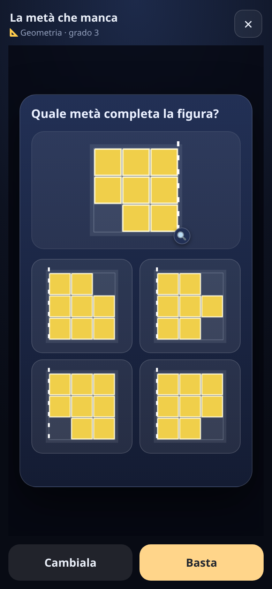

[← torna al README](../../README.md)

# ❓ Le domande di tutte le materie

Alcuni giochi — [Survivors](../survivors/presentazione.md) e
[il sotterraneo](../sotterraneo/presentazione.md) — non
hanno un contenuto scolastico proprio: chiedono **una domanda** e basta. Le
domande arrivano da un magazzino comune, e questa pagina spiega cosa c'è
dentro.

## Le materie

| materia | di che si parla |
|---|---|
| **Italiano** | ortografia, sillabe e rime, significato delle parole, nomi e articoli, analisi grammaticale, coniugazione dei verbi, capire un testo, i connettivi |
| **Matematica** | senso del numero, decine, stima e arrotondamento, frazioni, soldi e decimali, bilance, grafici e tabelle, misure e conversioni |
| **Spazio** | coordinate e direzioni su una griglia, percorsi, area e perimetro, figure e solidi |
| **Tempo** | l'orologio a lancette, giorni e mesi, stagioni, contare i giorni fra due date |
| **Logica** | analogie, sequenze da completare, deduzioni, indizi |
| **Scienze** | dove vivono gli animali, e come il corpo dice il posto |

## Che tipo di domande, davvero

Ogni materia si divide in tipologie precise. Qualche esempio:

- **Ortografia** — gn, gl, sc, le doppie, cqu, ce/cie, la lettera h, l'accento
  che cambia il significato (*pero* / *però*), l'apostrofo
- **Senso del numero** — riconoscere una quantità a colpo d'occhio,
  confrontare, mettere in ordine, trovare il posto sulla linea dei numeri,
  quanto vale una cifra dentro un numero, stimare, arrotondare
- **La griglia** — coordinate, direzioni, contare le mosse di un percorso,
  area e perimetro, e la differenza fra i due
- **Logica** — «tutti i gatti hanno la coda» e le sue trappole: la frase
  girata, quella negata, quella che non è stata detta, le catene
- **Calendario** — giorni e mesi, quanti giorni ha un mese, le stagioni, le
  feste, quanti giorni passano fra due date, quanto dura una cosa

Le risposte possono essere testo, emoji, o **una scena disegnata**: un
orologio con le lancette, una figura sulla griglia, un solido visto
dall'alto. Toccando il disegno lo si guarda a tutto schermo.

## Come si fanno più difficili

Ogni domanda sa **a che età serve**, sulla stessa scala per tutte le materie.
Un gioco non la conosce: chiede una domanda **facile o tosta**, da 0 a 1, e
quel numero diventa un punto intorno all'età di chi gioca. A un bambino di
sei anni «tosta» e a uno di dieci «facile» non vogliono dire la stessa
domanda: a nessuno arrivano le domande di quarta se fa la prima, e a nessuno
di dieci anni arrivano i pallini da contare.

Giochi diversissimi usano la stessa scorta in modi opposti:

- nel **sotterraneo** la durezza dipende da quanto si è scesi;
- in **Survivors** la sceglie il bambino, perché ogni carta ha il suo prezzo
  in difficoltà;

Si pesca direttamente **una classe di domande** (tipo + grado) fra quelle
adatte, così le domande più facili e più difficili di ogni tipo si vedono
davvero. Il magazzino misura anche la propria **varietà**: un grado che
produce sempre le stesse venti domande si impara a memoria, e una prova
automatica se ne accorge.

## Quello che il bambino non ha mai fatto non viene chiesto

Ogni tipologia dichiara **da quale pezzo di scuola dipende**. Se nei
[settaggi](../genitori/presentazione.md) spegni «i litri e i chili», tutte le
domande che li danno per scontati spariscono — in tutti i giochi, in tutte le
difficoltà. Si può spegnere un gruppo intero («accenti e apostrofi») o una
sola tipologia (solo la lettera h). E quando spegnere svuota un grado, il
gioco **scende a un grado più facile invece di sparire**: nessuna partita si
blocca.

Non si spegne però quello che si può spiegare in una riga: sbagliarlo è il
momento in cui si impara, e dopo ogni errore il gioco dice sia perché quella
risposta era sbagliata sia **come si fa**. Partendo dall'età del bambino,
l'app spegne da sola solo le cose che una riga non basta a spiegare — girare
una figura a mente, contare i cubetti nascosti.

## Il modo più veloce: provarle

Non serve leggere questa pagina per capire che domande arrivano — **si
guardano**. Apri le impostazioni dei grandi (codice `0000`), scheda
**«Giochi e domande»**: accanto a ogni voce c'è un tasto **▶**.

 

Esce una domanda vera, giocabile, esattamente come la vedrebbe tuo figlio,
con *Cambiala* per vederne un'altra e *Basta*. Non cambia niente nel gioco e
non conta come esercizio. In trenta secondi si capisce se una tipologia è
alla portata, molto meglio che ragionandoci sopra.

## Quello che va male torna più spesso (ma non troppo)

Ogni risposta si segna sotto il **concetto** che c'era dietro: non
«lavagna», ma «il gruppo *gn*». Da lì la pesca smette di essere cieca:

- una tipologia che va male esce **una volta e mezza** più spesso;
- una che il bambino ha dimostrato di sapere, **la metà**;
- tutte le altre restano dov'erano.

Con una decina di cose in ballo vuol dire passare dal 10% al 15% e al 5%. Ed è
tutto lì di proposito. In [Asteroidi](../asteroidi/presentazione.md) e nelle
[lingue](../lingue/presentazione.md) lo studio *è* il gioco, quindi quello che
sai smette di uscire; qui la domanda è il pedaggio dentro un gioco
d'avventura, e un bambino che non capisce la geometria non deve trovarsi una
partita di sola geometria. Nel caso peggiore quella materia arriva a circa un
quinto delle domande, non a metà. Le cose mai incontrate valgono come le
altre, e quello che si è saputo e poi lasciato lì per mesi torna da solo.
Le domande guardate col ▶ dei grandi non contano.

## Sbagliare non si paga, tirare a caso sì

**Sbagliare non si paga — basta averci provato — ma se hai tirato a caso,
dalla penalità te ne devi liberare.**

Chi legge la domanda e sbaglia aspetta il tempo di leggere il perché (almeno
quattro secondi, di più se la spiegazione è lunga) e nient'altro; una barra
che si riempie fa vedere quanto manca. Quello che costa è rispondere *senza
guardare*: non si può sapere se un bambino tira a caso, ma si sa **se non ha
avuto il tempo di leggere**. La soglia dipende da quanto c'è da leggere —
circa 1,7 s per una tabellina, 3,8 s per un problema lungo — e sotto quella,
con la risposta sbagliata, si sta fermi di più:

| | si sta fermi |
|---|---|
| sbaglia e basta | 4,0 s |
| 1ª risposta senza leggere | 5,5 s |
| 2ª di fila | 7,0 s |
| 3ª | 9,0 s |
| dalla 4ª in poi | 10,0 s |

Il primo scatto è piccolo perché un tocco affrettato capita a chiunque; gli
ultimi sono grossi perché a quel punto non è più un caso. Per uscirne servono
**quattro risposte giuste**, che tirando a caso capitano una volta su
duecentocinquanta. A schermo c'è una riga sola, «🐢 Troppo di fretta: leggi
bene la domanda»: il resto si sente, non si studia.

La penalità è tempo, mai vita o monete: quelle punirebbero anche chi è svelto
e sa, e insegnerebbero che rispondere è pericoloso. Quello che si vuole
insegnare è che leggere conviene.

## E se una cosa va male per settimane, lo dice a un grande

Sopra le otto risposte, con meno di metà giuste, il gioco lo scrive nella
posta dei grandi — pallino sul ⚙︎ e nastro in home — col numero e non il
giudizio: «Le doppie — ne ha sbagliate 7 su 10». Una volta sola per quella
cosa lì.

Non ritocca da sé: un pomeriggio storto o un fratello che ha giocato al posto
suo, e il gioco «imparerebbe» la cosa sbagliata senza che nessuno lo veda.
Chi legge decide se quel 7 su 10 vuol dire «troppo difficile» o «era stanco»,
e la ritocca con la ✎ della sua riga in *Giochi e domande*, dove intanto la
riga è segnata in rosso.

Per chi ci lavora: come è fatto dentro sta nelle altre pagine di
[questa cartella](README.md).
