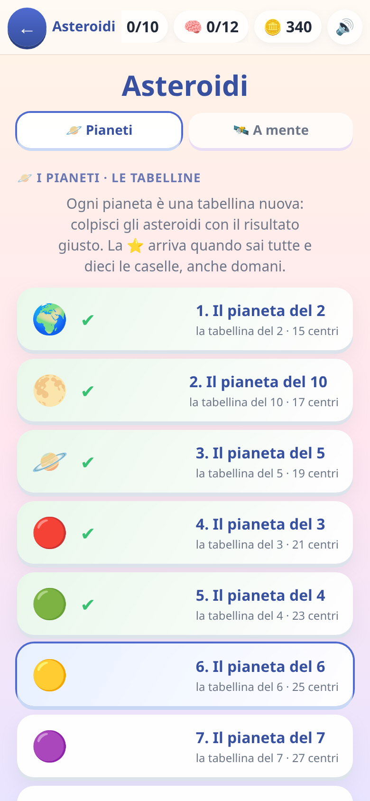
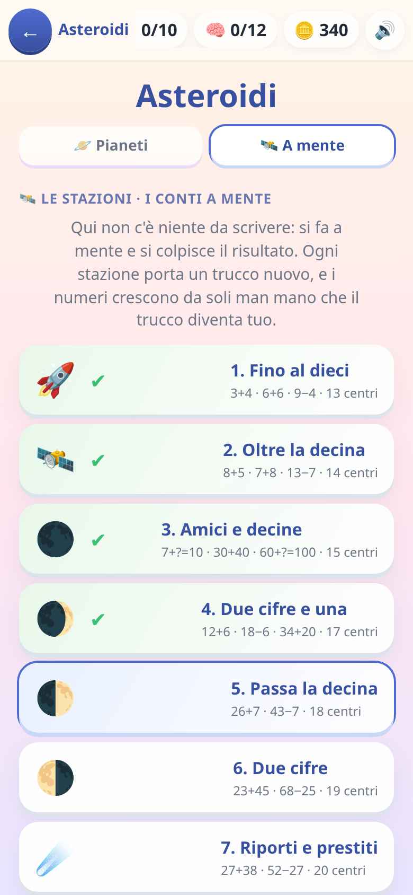

[← torna al README](../README.md)

# ☄️ Asteroidi

*Tabelline e calcolo a mente.* Gli asteroidi scendono con dei numeri sopra:
si colpisce quello giusto prima che arrivi in fondo.

  

## Come è fatto

C'è **una scaletta sola**, spezzata in capitoli, con due specie di tappe
mescolate:

- **I pianeti** sono le tabelline, dalla ×2 in su.
- **Le stazioni** sono il calcolo a mente: somme con il riporto,
  sottrazioni con il prestito, i doppi, il complemento a 10, le
  moltiplicazioni per 10…

L'ordine **non è alternato a turno**: le due liste sono state fuse una volta
guardando cosa chiede davvero ogni tappa, e il perché di ogni giunzione è
scritto in testa a [`src/data/asteroidi.js`](../src/data/asteroidi.js). In
due parole: si comincia dai conti entro il dieci (la tabellina del 2 sono i
doppi, e senza 7+7 non c'è nessun 2×7), le decine tonde arrivano dopo la
tabellina del 10, e **moltiplicare e dividere a mente vengono dopo tutte le
tabelline** — 56:8 è la tabellina dell'8 girata.

In mezzo alla fila possono esserci **due tappe aperte invece di una**, una
per specie: i due progressi restano contati separatamente, ed è la ragione
per cui fondendo le liste nessuno ha perso niente.

## L'astronave

In fondo allo schermo c'è una nave che difende il pianeta, e **dice come sta
andando senza numeri**: nuova, poi ammaccata, poi con l'ala squarciata, il
vetro rotto, il fumo e la luce rossa. Se resta una vita sola gli asteroidi
rallentano un po' — chi è arrivato lì il conto di solito lo sa, e non fa in
tempo a farlo. Man mano che si sale di livello la nave cresce: navetta,
caccia, incrociatore.

Due potenziamenti si guadagnano giocando e finiscono con la partita:

- 🔫 **cannone doppio** — dopo cinque risposte giuste di fila. I punti valgono
  doppio e l'onda porta via anche i sassi sbagliati vicini. Si perde
  sbagliando.
- 🛡️ **scudo** — abbattendo un boss. Para il prossimo errore, o il prossimo
  sasso caduto, senza costare una vita.

Nessuno dei due tocca il calcolo: non accorciano una domanda, non ne saltano
una e non dicono qual è l'asteroide giusto. Non si comprano con le monete —
si pagano con le risposte giuste.

## Quali domande escono, e perché proprio quelle

Le domande non escono a caso: **il motore tiene il conto di cosa il bambino
sa**, tabellina per tabellina.

Ogni singolo fatto (`7×8`, `6×4`…) ha uno stato suo: quante volte è stato
giusto, quante sbagliato, quando è stato visto l'ultima volta, e **quanto in
fretta** si è risposto. Da lì esce un peso, e il peso decide con che
frequenza quel fatto ricompare. In pratica:

| situazione | cosa succede |
|---|---|
| l'ha appena sbagliato | torna quasi subito, e più spesso |
| ci mette tanto a rispondere | conta quasi come mezzo errore: la velocità qui è parte del saperlo |
| l'ha detto giusto due volte di fila | esce dal giro **per il resto della partita** — sa già farlo, è tempo tolto ad altro |
| lo sa da tre settimane | sparisce a lungo, poi rispunta da solo per un controllo |

L'ultima riga è la più importante e la meno ovvia: **la forza cala da sola
col tempo**. Una tabellina imparata dieci giorni fa non vale quanto una
imparata ieri, quindi torna a farsi vedere senza che il bambino l'abbia
sbagliata. È il modo di non far dimenticare quello che era già stato preso.

Il gioco tiene aperto solo un **gruppetto di fatti per volta**, non tutte le
tabelline insieme: finché quelli non si consolidano non ne entrano altri.
Per questo all'inizio le domande sembrano poche e ripetitive — è voluto.

Dentro un pianeta, però, comanda la tappa: **otto domande su dieci sono la
tabellina di quel pianeta**, e non è una media — non capita mai di trovarsi
due domande di fila che parlano d'altro. Le altre sono il ripasso di quelle
di prima, che serve e non deve sparire. E la stessa identica domanda non
esce mai due volte di seguito.

Il **boss**, ogni otto domande, è l'unico che sta fuori: arriva dal pianeta
*successivo*. È un assaggio di quello che non si è ancora fatto — perderlo
non toglie niente al motore, perché una cosa mai insegnata non si misura.

Salendo di livello **il cielo si infittisce, non accelera**: arrivano più
sassi sbagliati da scartare, ma il tempo per fare il conto resta quello. E
il sasso con la risposta giusta entra sempre entro tre secondi dalla
domanda: aspettare non è saper rispondere piano.

Nel **volo libero**, che si apre a campagna finita, non si sceglie più
niente a mano: pesca da sé quello che si ricorda meno, e a chi ricorda tutto
ripropone gli ultimi pianeti giocati.

### Il calcolo a mente ha una regola in più

Le stazioni hanno un **grafo di prerequisiti**: il complemento a 10 viene
prima delle somme con riporto, e così via. Ma il grafo **dosa, non sbarra**:
una stazione aperta è sempre superabile, e i prerequisiti ancora deboli
rientrano come ripasso *accanto* alle domande nuove, non al loro posto.

E ci sono tre assi di difficoltà, non uno: quale concetto è aperto, quanto è
consolidato, e **quanto sono grandi i numeri** — la stessa strategia si
esercita prima su 8+5 e poi su 47+38.

Le risposte sbagliate fra cui scegliere non sono a caso: sono **gli errori
tipici** di quel concetto. Se fossero numeri qualunque, il bambino
arriverebbe alla risposta per esclusione invece che calcolando.

## Cosa allena

Il recupero rapido dei fatti moltiplicativi — cioè saperli **senza
ricalcolarli** — e le strategie di calcolo mentale. Qui la velocità è parte
del saperlo: rispondere piano conta, non solo rispondere giusto.

## Note per i genitori

- Se le tabelline sono ancora troppo, la fila comincia proprio dai conti
  a mente: 3+4 non aspetta nessuna tabellina.
- Al contrario, **chi vuole solo le tabelline spegne il calcolo a mente**
  (*Genitori → giochi → dentro gli asteroidi*): le tappe a mente
  spariscono dalla fila e i pianeti si richiudono in ordine, senza buchi.
  I progressi a mente restano dove sono e riaccendendo tornano.
- Le divisioni si possono spegnere dai settaggi (*Genitori → cosa sa*).
- A che punto della fila si è arrivati si vede nella carta in home.
