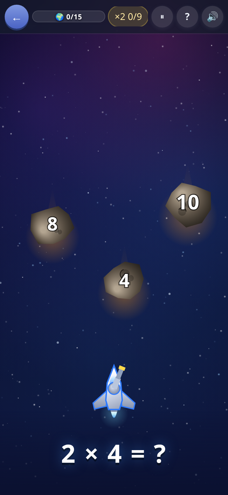
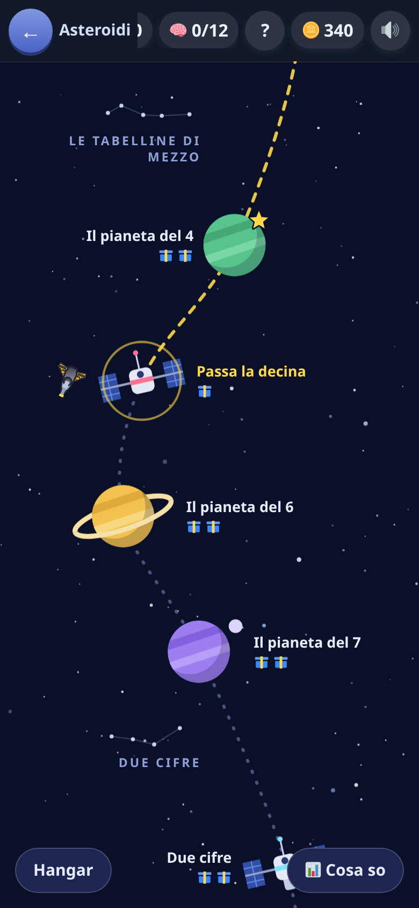
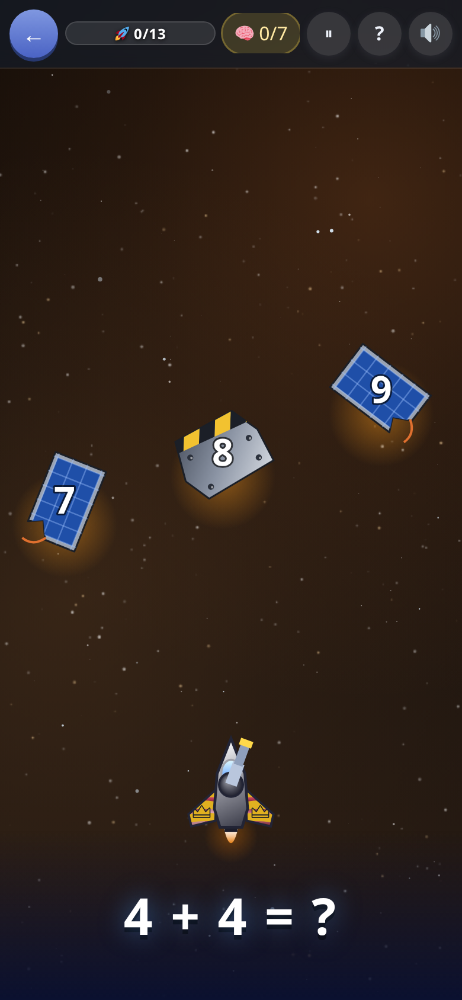

[← torna al README](../../README.md)

# ☄️ Asteroidi

*Tabelline e calcolo a mente.* Gli asteroidi scendono con dei numeri sopra:
si colpisce quello giusto prima che arrivi in fondo.

  

## Come è fatto

C'è **una scaletta sola**, una rotta che serpeggia nello spazio fra le
costellazioni dei capitoli, con due specie di tappe mescolate:

- **I pianeti** sono le tabelline, dalla ×2 in su.
- **Le stazioni** sono il calcolo a mente: somme con il riporto,
  sottrazioni con il prestito, i doppi, il complemento a 10, le
  moltiplicazioni per 10…

L'ordine non è alternato a turno: è deciso guardando cosa chiede davvero
ogni tappa. Si comincia dai conti entro il dieci (la tabellina del 2 sono i
doppi, e senza 7+7 non c'è nessun 2×7), le decine tonde arrivano dopo la
tabellina del 10, da «Passa la decina» in poi le tabelline stanno un passo
avanti — due pianeti e una stazione, perché 7×8 è un fatto solo mentre
27+38 sono tre passaggi da tenere in testa — e moltiplicare e dividere a
mente vengono dopo il Sole, cioè dopo tutte le tabelline insieme: 56:8 è
la tabellina dell'8 girata.

Si va avanti una tappa alla volta, e accanto a ogni tappa c'è un segno
solo: la ⭐ di «superata». Quello che il bambino sa davvero sta altrove —
nei due conti in cima alla mappa (✖️ le tabelline, 🧠 i trucchi), in
**📊 Cosa so**, nell'albo — e sono numeri che **scendono** se non si
ripassa, mentre una tappa superata resta superata.

A fila finita si apre il **volo infinito**: tabelline e conti a mente
insieme.

## L'astronave

In fondo allo schermo c'è una nave, e **dice come sta andando senza
numeri**. Alla prima botta l'ala si **strappa**: bordo frastagliato, pezzi
che galleggiano accanto, scintille, e una spia ambra che lampeggia. Con
una vita sola lo strappo si mangia quasi tutta l'ala, la spia diventa
rossa e batte il doppio, il vetro si crepa. Con una vita sola gli
asteroidi rallentano anche un po': chi è arrivato lì il conto di solito lo
sa, e non fa in tempo a farlo. Salendo di livello la nave cresce:
navetta, caccia, incrociatore.

In cima restano solo le due cose che la nave non può dire: quanto manca
al bersaglio della tappa e quanti centri sulla tabellina nuova.

Due **gettoni** si guadagnano giocando — uno ogni cinque risposte giuste
di fila, a turno — restano in tasca (mai più
di tre) finché non li si preme, e finiscono con la partita. A dieci di
fila arriva una vita al posto del gettone.

- ❄️ **gelo** — congela la domanda che si ha davanti: i sassi rallentano e
  c'è tutto il tempo di fare il conto. Dalla domanda dopo il cielo riparte.
- 🎯 **mirino** — fa sparire una risposta sbagliata, scelta a caso. Non
  dice qual è quella giusta: il conto si fa lo stesso, con un sasso in meno.

**Non si perdono sbagliando**, e nessuno dei due risponde al posto del
bambino. Non si comprano con le monete: si pagano con le risposte giuste.

## Ogni posto ha il suo cielo

Ogni tappa ha i suoi sassi: rottami e pannelli solari attorno alle
stazioni, comete di ghiaccio, cristalli, dischi volanti con l'alieno che
portano il numero, lava sotto il Sole, e il buco nero in fondo. Le regole
non cambiano: un numero per sasso, uno giusto.

**In fondo a ogni tappa arriva la nave madre**: resta in alto e tira tre
bombe col numero. Ogni bomba giusta torna indietro e le stacca un pezzo,
alla terza salta e lascia un pacco. Ogni tappa ha due pacchi: dopo, la
nave madre arriva lo stesso ma non regala più niente, così non conviene
rifare le tappe facili.

Nel pacco c'è un pezzo per l'**hangar**, che si apre sulla mappa col volo
infinito: colori per lo scafo, le ali e le fiamme dei motori, disegni sulle
ali e stemmi. Senza nomi: ognuno si fa la sua nave e se la immagina come
vuole. Non si comprano con le monete.

## Quali domande escono, e perché proprio quelle

**Il motore tiene il conto di cosa il bambino sa**, fatto per fatto
(`7×8`, `6×4`…): quante volte giusto, quante sbagliato, quando l'ultima
volta, e **quanto in fretta**. Da lì esce con che frequenza ricompare:

| situazione | cosa succede |
|---|---|
| l'ha appena sbagliato | torna quasi subito, e più spesso |
| ci mette tanto a rispondere | conta quasi come mezzo errore: la velocità qui è parte del saperlo |
| l'ha detto giusto tre volte di fila | esce dal giro per il resto della partita |
| lo sa da tre settimane | sparisce a lungo, poi rispunta da solo per un controllo |

L'ultima riga è la più importante: **la forza cala da sola col tempo**, e
una tabellina imparata dieci giorni fa torna a farsi vedere senza essere
stata sbagliata. Il gioco tiene aperto solo **un gruppetto di fatti per
volta**: all'inizio le domande sembrano poche e ripetitive, ed è voluto.

Dentro un pianeta **otto domande su dieci sono la tabellina di quel
pianeta**, mai due di fila che parlano d'altro; le altre sono ripasso.

Salendo di livello **il cielo si infittisce, e accelera fino a un
pavimento**: più sassi sbagliati da scartare, e una caduta che nelle tappe
non scende sotto i sette secondi. Anche al minimo il sasso giusto entra
entro tre secondi e resta da toccare per almeno due: aspettare non è
saper rispondere piano.

### Il calcolo a mente

Le stazioni hanno un **grafo di prerequisiti** che **dosa, non sbarra**: una
stazione aperta si supera sempre, e le basi ancora deboli rientrano come
ripasso *accanto* alle domande nuove. La stessa strategia si esercita
prima su 8+5 e poi su 47+38. Le risposte sbagliate fra cui scegliere sono
**gli errori tipici** di quel concetto: se fossero numeri qualunque, si
arriverebbe alla risposta per esclusione invece che calcolando.

### Il volo infinito

È **uno**: tabelline e conti a mente, a turno. **Si complica col
livello**: a livello 1 escono il 2 e il 3 e le somme entro il dieci, a
livello 9 il 7×8 e le centinaia, e **dal nove continua oltre il
catalogo** con le tabelline grandi (11×8, 12×5, 132 : 11) e conti a mente
più grossi. Le grandi non contano da nessun'altra parte. **Chi ha un
record non riparte da 2×3**: la partita comincia due livelli sotto quello
del record.

Il record è in punti, e si legge prima di entrare («record 1240 punti ·
livello 7 · 43 centri · serie 12»); a fine partita si legge di quanto è
stato battuto o quanto è mancato. Sta anche nell'albo, fra i primati.

## Cosa allena

Il recupero rapido dei fatti moltiplicativi — cioè saperli **senza
ricalcolarli** — e le strategie di calcolo mentale. Qui la velocità è
parte del saperlo: rispondere piano conta, non solo rispondere giusto.

## Note per i genitori

- Se le tabelline sono ancora troppo, la fila comincia proprio dai conti
  a mente: 3+4 non aspetta nessuna tabellina.
- **Non c'è un interruttore per togliere il calcolo a mente**: tabelline e
  conti a mente sono la stessa aritmetica. Chi ha bisogno di una scaletta
  più bassa muove **l'età** (*Genitori → Giochi e domande*), che apre in
  anticipo quello che il bambino sa già e tiene chiuso quello che gli sta
  avanti.
- Le divisioni si possono spegnere dai settaggi (*Genitori → cosa sa*).
- A che punto della fila si è arrivati si vede nella carta in home.

Per chi ci lavora: [la scaletta](scaletta.md), [il cielo e il volo](volo.md).
