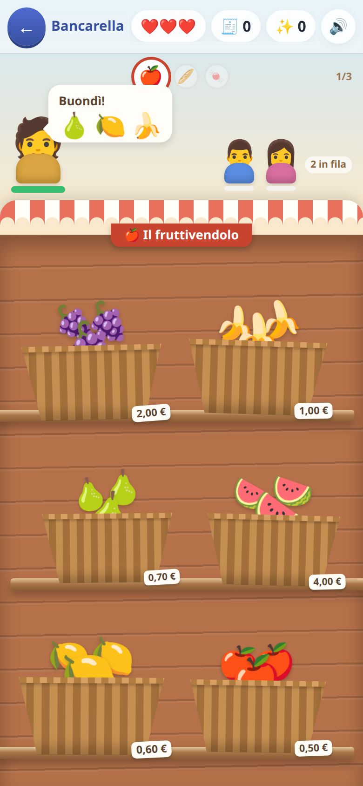
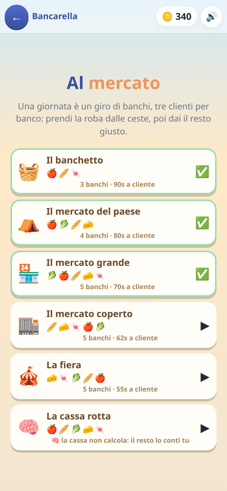

[← torna al README](../README.md)

# 🛒 La bancarella

*Euro, centesimi e resto.* Si sta dall'altra parte del banco: arriva il
cliente, prende la spesa, paga, e bisogna dargli il resto giusto.

 

## Come è fatto

Una **giornata** è una campagna, una **tappa** è un banco — il fruttivendolo,
l'orto, il forno, il frigo, i dolciumi — con tre clienti da servire.

La merce è tutta in vista nelle ceste: niente reparti da aprire, niente cassa
da cercare. Presa la spesa, **il banco diventa il registratore**.

## Dove sta davvero la difficoltà

Non nelle cifre. La difficoltà è **quante monete deve chiedere il resto**.

Dare 2 € di resto con una moneta da 2 € è banale. Darne 2 € con una da 1, una
da 50 centesimi, una da 20 e tre da 10 è tutt'altro esercizio — ed è quello
che serve davvero al mercato. Per questo **il cliente sceglie apposta con che
cosa pagare**: paga in modo che il resto venga della misura voluta.

Le tre leve che si stringono di tappa in tappa e di giornata in giornata:

| leva | cosa cambia |
|---|---|
| **pezzi** | da quante monete deve essere composto il resto |
| **tempo** | quanta pazienza ha il cliente prima di spazientirsi |
| **copie** | quanti articoli uguali nella stessa spesa (quindi moltiplicazioni) |

## L'ultima giornata toglie l'aiuto

Fino a lì il display dice quanto resto va dato, e il lavoro è comporlo con le
monete. Nell'ultima giornata il display fa `? ? ?`: **il resto lo calcola il
bambino**, posa le monete e conferma col tasto ✓. La cassa dice solo giusto o
sbagliato, mai la cifra.

È il passaggio da «so comporre una somma con le monete» a «so fare la
sottrazione al volo», che è la cosa che serve davvero quando si è in fila al
negozio.

## Cosa allena

Il sistema decimale nella sua forma più concreta: euro e centesimi,
scomposizione di una cifra in pezzi, e la sottrazione con il significato di
resto. Più, di striscio, la moltiplicazione (tre confezioni uguali) e la
gestione del tempo.

## Note per i genitori

- Ogni resto è **garantito componibile** con le monete disponibili in quella
  giornata, e il minimo dichiarato è davvero il minimo: c'è una prova
  automatica che lo verifica.
- Il cliente chiede solo roba che è effettivamente sul banco.
- Il tempo si stringe man mano: se diventa frustrante, si può rigiocare una
  giornata precedente, che resta sempre aperta.
