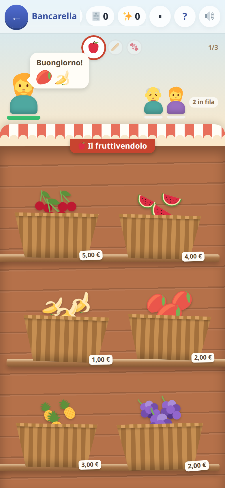
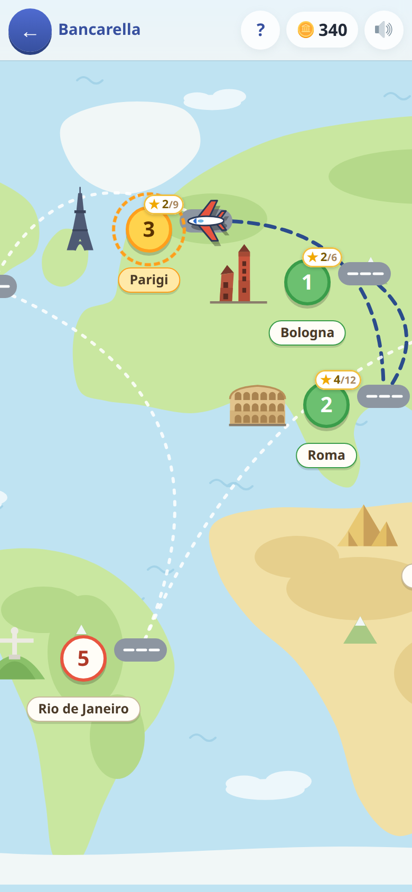

[← torna al README](../../README.md)

# 🛒 La bancarella

*Euro, centesimi e resto.* Si sta dall'altra parte del banco: arriva il
cliente, prende la spesa, paga, e bisogna dargli il resto giusto.

 

## Come è fatto

Una **giornata** è una campagna, una **tappa** è un banco — il fruttivendolo,
l'orto, il forno, il frigo, i dolciumi — con tre clienti da servire.

La merce è tutta in vista nelle ceste: niente reparti da aprire, niente
cassa da cercare. Presa la spesa, **il banco diventa il registratore**.

## La cassa fa sempre meno conti

È la spina dorsale del gioco. Ogni giornata dichiara **chi fa i conti**, e
sono quattro gradini:

| la cassa | il totale | il resto | quello che fai tu |
|---|---|---|---|
| **fa tutto** | lo somma lei | lo calcola lei | componi il resto con le monete |
| **non somma** | `? ? ?` | lo calcola lei | **batti il totale** sulla tastiera |
| **non sottrae** | lo somma lei | `? ? ?` | **conti il resto** e lo posi |
| **è rotta** | `? ? ?` | `? ? ?` | tutti e due |

La cassa non dice mai la cifra giusta a chi sbaglia: dice *troppo* o
*troppo poco*, e costa qualche secondo di pazienza del cliente. Mai un
cuore, mai una moneta.

I conti entrano **uno per volta**, e ognuno entra su numeri che si fanno a
mente: la cassa rotta è il traguardo in cima a una scala, non un gradino
improvviso.

## La scaletta, giornata per giornata

Sedici giornate, e ognuna aggiunge **una cosa sola** rispetto a quella
prima: o un prodotto in più, o una banconota più grande, o i centesimi —
mai due insieme. Quando entra un conto nuovo le altre cose **tornano
indietro**: la fatica si sposta sulla testa, e non si può chiedere tutto
insieme.

| # | giornata | chi fa i conti | la cosa nuova |
|---|---|---|---|
| 1 | 🧺 Il banchetto | la cassa | il gesto: prendi la roba, componi il resto |
| 2 | ⛺ Il mercato del paese | la cassa | la banconota da 10 € |
| 3 | 🧮 Il conto lo fai tu | **il totale** | il totale lo batti tu — somme entro il 10, in euro tondi |
| 4 | ➕ Tre cose sul banco | il totale | un prodotto in più da sommare |
| 5 | 💵 Le spese da venti euro | il totale | la banconota da 20 €, e le somme arrivano al venti |
| 6 | 🏪 Il mercato grande | il totale | un banco in più: quattro |
| 7 | 💶 Il resto da dieci euro | **il resto** | il resto lo conti tu — il totale è scritto, si paga con 10 € |
| 8 | 💴 Il resto da venti euro | il resto | si paga con 20 € |
| 9 | 💸 Il resto da cinquanta euro | il resto | si paga con 50 € |
| 10 | 🪙 I mezzi euro | il resto | i cartellini a mezzo euro |
| 11 | 🎪 La fiera | il resto | una cosa in più nella borsa: tre |
| 12 | 🔟 I centesimi tondi | il resto | le decine di centesimi |
| 13 | 🖐️ I cinque centesimi | il resto | i cinque centesimi |
| 14 | 🏬 Il mercato coperto | il resto | i centesimi veri: 0,89 €, 1,39 € |
| 15 | ♊ Due cose uguali | il resto | «due angurie, per favore» |
| 16 | 🧠 La cassa rotta | **tutti e due** | il totale e il resto insieme |

Poi c'è la **giornata libera**, che non chiude mai: cinque banchi, prezzi
al centesimo, cassa rotta, e il tempo che si stringe finché reggi.

La tabella non è una promessa scritta a mano: una prova automatica la
ricontrolla a ogni giro, e se qualcuno aggiunge due cose insieme diventa
rossa. Da lì esce anche a che età il gioco si offre: **dai sei anni e
mezzo ai dieci scarsi**.

## Dove sta l'altra metà della difficoltà

Non nelle cifre: in **quante monete deve chiedere il resto**. Dare 2 € con
una moneta da 2 € è banale; darli con una da 1, una da 50 centesimi, una
da 20 e tre da 10 è tutt'altro esercizio. Per questo, dove la giornata
lascia scegliere, **il cliente sceglie apposta con che cosa pagare**. Dove
la banconota è dichiarata — «paga con 20 €» — quella è, perché lì la
sottrazione deve partire da un numero conosciuto.

## Quanto rende

Un cliente vale da 🪙2 a 🪙4, secondo quanti conti gli tocca fare. Una
giornata intera va da 🪙18 a 🪙48 — fra i tre e gli otto minuti di
esercizio. Un cliente che se ne va non paga niente.

## Fermarsi

Al banco c'è **⏸**: la fila smette di spazientirsi e resta ferma finché
non si tocca. Se il telefono si posa — lo schermo si blocca, arriva una
chiamata — il mercato va in pausa da solo, e quando si riapre aspetta un
tocco. Lo stesso vale per il foglio «come si gioca» del `?`.

## Cosa allena

Il sistema decimale nella sua forma più concreta: euro e centesimi,
scomposizione di una cifra in pezzi, e la sottrazione con il significato di
resto. Più l'addizione dove serve — sommare i prezzi sul banco — e, di
striscio, la moltiplicazione (tre confezioni uguali) e la gestione del tempo.

## Note per i genitori

- Ogni resto è **garantito componibile** con le monete disponibili in
  quella giornata, e il minimo dichiarato è davvero il minimo: c'è una
  prova automatica che lo verifica.
- Il cliente chiede solo roba che è effettivamente sul banco.
- Il tempo si stringe man mano, e torna largo quando entra un conto nuovo.
  Se diventa frustrante, si può rigiocare una giornata precedente, che
  resta sempre aperta.

Per chi ci lavora: [le regole](regole.md).
