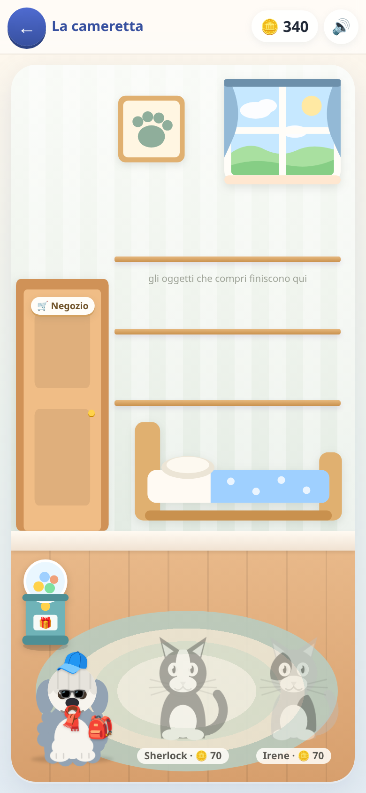

[← torna al README](../README.md)

# 🛏️ La cameretta

*Dove finiscono le monete.* Non ci sono domande: è il motivo per cui si
torna a fare gli esercizi.

 

## Come è fatto

Una stanza disegnata, e **la navigazione è il disegno**: la porta porta al
negozio, la macchinina alle sorprese, l'animale sul tappeto alla sua scheda,
la cuccia vuota all'adozione. Non c'è nessun menù.

Le monete si guadagnano negli altri giochi — rispondendo giusto, finendo
tappe, prendendo traguardi — e si spendono qui.

## Gli animali

Si adotta un animale e poi va accudito. Ha quattro bisogni che calano da
soli col passare del tempo reale, a velocità diverse:

| | bisogno | si svuota in |
|---|---|---|
| 🍽️ | pancia | ~7 ore |
| 🎾 | allegria | ~16 ore |
| 🫧 | pulito | ~40 ore |
| 💪 | forma | ~90 ore |

Nella stanza l'animale dice **una cosa sola, con un'icona** — l'osso, la
palla — e nient'altro. Barre, parole e vestiti stanno nella sua scheda, una
per volta e grande: la stanza deve restare una stanza, non un cruscotto.

La fame si sazia col cibo comprato al negozio, che va tenuto in dispensa.

## La macchina delle sorprese, e perché non è una lotteria

È la macchinetta delle capsule: si paga, esce un accessorio da mettere
addosso a un animale — un cappellino, gli occhiali, una sciarpa, uno zaino.
Ci sono quattro posti su ogni animale, e sei serie da completare.

Vale la pena spiegare bene com'è fatta, perché somiglia a una cosa che non è.

**Non si può perdere niente.** La capsula pesca **solo fra i pezzi che
mancano**: esce sempre qualcosa di nuovo, mai un doppione. Non c'è nessun
rischio di buttare via le monete, e quindi non c'è niente da cui prendere il
vizio. La sorpresa è **quale** pezzo esce, non *se* esce qualcosa — è
l'ovetto, non la slot machine.

**Col tempo si ottiene tutto.** Continuando a giocare si completano le serie,
tutte quante. Non c'è un pezzo raro che non arriva mai, non ci sono
probabilità nascoste.

**A cosa serve, allora.** A dare una destinazione alle monete che avanzano.
Completare tutte le serie costa più di quindici volte l'intero negozio, e
questo tiene le monete sempre *quasi* finite: c'è sempre qualcosa che si sta
per potersi permettere. Ed è il motivo per cui vale la pena tornare a fare
esercizi anche dopo aver comprato tutti i mobili della stanza.

**E cambia le facce.** Un cane sempre uguale a un certo punto stufa. Un
cappellino nuovo lo fa tornare interessante per una settimana — a costo
zero di contenuti, perché sono quattro emoji su un disegno che c'è già.

La prima capsula la offre la casa: una macchina di cui non hai mai visto
l'effetto non la provi, e vedere un cappello comparire sul cane spiega tutto
meglio di qualsiasi scritta.

## Il resto

- **Il negozio**: mobili e oggetti per la stanza, cibo per gli animali.
- **L'albo** (dalla fascia in alto in home): livelli, traguardi, giorni di
  fila, quante cose si sanno per materia.

## A cosa serve, davvero

A dare un motivo per tornare. Un bambino non apre un'app per fare le
tabelline; la apre perché il cane ha fame. Che le monete arrivino dalle
tabelline è, dal suo punto di vista, un dettaglio.

È anche la ragione per cui **le monete sono una sola valuta per tutti i
giochi**: quello che si guadagna facendo inglese si può spendere per il
cane, e questo tiene insieme giochi che altrimenti non si parlerebbero.

## Note per i genitori

- La cameretta e l'albo **non si possono spegnere**: senza, le monete degli
  altri giochi non avrebbero dove andare.
- I bisogni calano col tempo reale, quindi un animale trascurato per una
  settimana si ritrova malmesso. Non muore e non succede niente di
  irreversibile — è pensato apposta per non mettere ansia.
