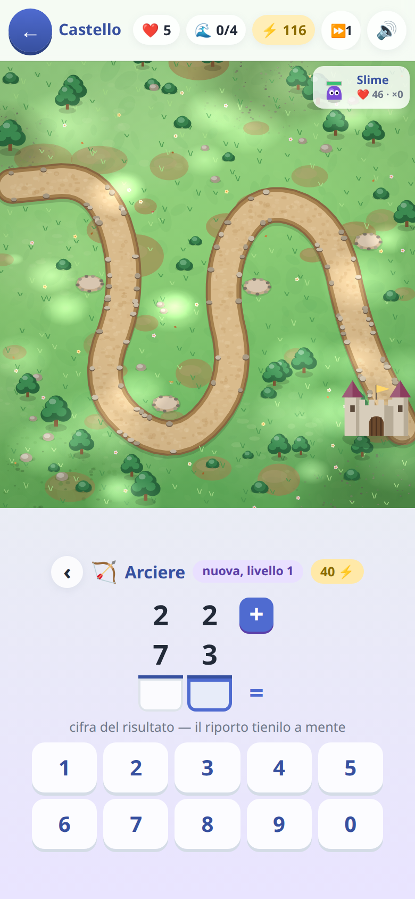

[← torna al README](../README.md)

# 🏰 Difendi il Castello

*Un tower defense dove ogni torre si paga con un'operazione in colonna.* I
mostri camminano lungo il sentiero verso il castello; per fermarli servono
torri, e per costruire una torre bisogna fare il conto.

  

## Come è fatto

Quindici tappe in tre campagne (il bosco, il sottosuolo, le mura). Ogni
tappa ha il suo scenario, i suoi mostri e la sua scaletta di operazioni.

Il ciclo è: arriva l'ondata → serve una torre → **compare l'operazione in
colonna** → si scrive il risultato cifra per cifra, coi riporti → la torre si
costruisce. Chi sbaglia paga una penale in energia, non perde la partita.

## Si compra toccando il campo

Il campo si prende tutto lo schermo e non c'è nessun banco di bottoni sotto:
**si tocca una piazzola vuota** e un foglio sale a chiedere che torre
costruirci, **si tocca una torre** e sale la sua scheda — falla salire di
livello, oppure spostala (gratis: è tattica, non un acquisto). Il conto da
fare sta dentro lo stesso foglio.

Dove si può comprare si vede sul campo: le piazzole respirano quando
l'energia basta per una torre nuova, e le torri hanno un bollino verde
quando basta per farle salire. Mentre si calcola **il campo non si ferma** —
un minimo di fretta ci va — ma si rimpicciolisce per restare visibile sopra
il foglio. Con due dita si sposta e si ingrandisce la mappa, e un doppio
tocco la rimette tutta in quadro.

## A metà scaletta una torre sceglie che fare

Dal sottosuolo in poi, al quarto gradino, il tasto «potenzia» lascia il posto
a **due carte**: l'arciere diventa cecchino (vede lontano, colpisce forte) o
raffica (due frecce per volta); la magica diventa veleno (colpisce piano ma
il male continua) o catena (il colpo rimbalza sui vicini); il ghiaccio
diventa bufera (gela larghissimo) o brina (frena di più, e chi è gelato
prende più danno); le bombe diventano mortaio (arriva lontanissimo) o napalm
(scoppia largo e lascia tutti a bruciare).

La scelta **non costa un calcolo in più**: è quello che il calcolo del
gradino compra, e si presenta dopo aver deciso di salire. E i due rami
valgono lo stesso: cambia la forma del danno, non la quantità — nessuno dei
due è la scelta sbagliata.

## Due porte da difendere

Due tappe — *Le fogne* e *Il torrione* — più la partita libera hanno **due
ingressi**: due strade che scendono da parti diverse e arrivano allo stesso
castello. Le ondate si alternano fra le due bocche, e ogni terza arriva da
tutte e due insieme; il nastro in cima dice da dove, tre ondate prima, così
si fa in tempo a spostare una torre dalla parte giusta.

## Quali operazioni escono, e quanto crescono

Ogni tipo di operazione ha **dieci gradini**, e ogni gradino cambia *una cosa
sola*: prima quante cifre, poi i riporti, poi quanti numeri in colonna.
Perché «sai fare 27+15, adesso prova 247+185+96» è un salto, non un passo.

Qualche esempio vero, generato dal gioco:

| gradino | addizioni | sottrazioni |
|---|---|---|
| 1 | `31 + 15` | `58 − 23` |
| 2 | `71 + 75` — arriva il riporto | `604 − 87` — arriva il prestito |
| 3 | `247 + 185` | `587 − 357` |
| 4 | tre addendi | prestiti doppi, zeri di mezzo |

| gradino | moltiplicazioni | divisioni |
|---|---|---|
| 1 | `47 × 6` | `84 : 4`, esatta |
| 2 | `47 × 6` con riporti | `421 : 3`, col resto |
| 3 | `21 × 32` — due cifre | `8155 : 7`, dividendo lungo |
| 4 | numeri grandi | con lo zero nel quoziente |

Una torre si costruisce al primo gradino e sale uno alla volta: la scaletta
si percorre tutta e in ordine, non si salta.

**Ogni tappa dichiara fin dove può arrivare.** Le prime si fermano ai primi
gradini delle addizioni; le ultime arrivano in fondo, divisioni comprese.

Le divisioni si possono **spegnere dai settaggi**: quando sono spente, la
torre che le chiederebbe passa a moltiplicazioni più difficili. Il gioco
degrada invece di sbarrare — nessuna tappa diventa impossibile.

## Quanto dura una tappa è calibrato, non casuale

**Ogni tappa dichiara quante operazioni costa finirla** — sei nella prima,
trenta nell'ultima — e tutto il resto viene calcolato a partire da quel
numero: il piano degli acquisti, quante ondate servono a pagarlo, l'energia
di partenza, quante postazioni ci sono.

Per un genitore la domanda che conta non è «quanti mostri ci sono» ma
**quanto esercizio chiede questa tappa**: sei conti sono dieci minuti, trenta
sono un pomeriggio. Quel numero è scritto nel gioco, tappa per tappa, e il
resto si adatta di conseguenza — compresa la resistenza dei mostri, che un
simulatore misura giocando la tappa migliaia di volte per assicurarsi che sia
superabile senza essere una passeggiata.

## Cosa allena

L'algoritmo delle operazioni in colonna — riporti e prestiti — con una
pressione di tempo mite: l'ondata arriva, ma il conto si può fare con calma
perché il gioco aspetta.

## Note per i genitori

- Le divisioni si spengono da *Genitori → cosa sa*.
- C'è anche una **partita libera** senza fine, che si sblocca finendo le
  tappe: lì le operazioni sono miste e il gioco non finisce mai.
- Se il bambino sbaglia spesso, non perde: paga di più in energia. Non c'è
  schermata di fallimento legata al calcolo.
