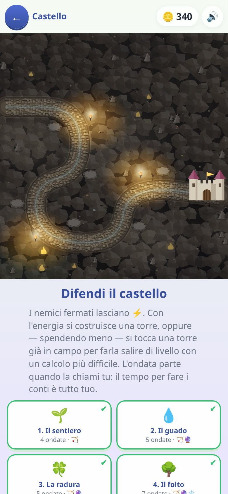

[← torna al README](../README.md)

# 🏰 Difendi il Castello

*Un tower defense dove ogni torre si paga con un'operazione in colonna.* I
mostri camminano lungo il sentiero verso il castello; per fermarli servono
torri, e per costruire una torre bisogna fare il conto.

 

## Come è fatto

Quindici tappe in tre campagne (il bosco, il sottosuolo, la montagna). Ogni
tappa ha il suo scenario, i suoi mostri e la sua scaletta di operazioni.

Il ciclo è: arriva l'ondata → serve una torre → **compare l'operazione in
colonna** → si scrive il risultato cifra per cifra, coi riporti → la torre si
costruisce. Chi sbaglia paga una penale in energia, non perde la partita.

## Quali operazioni escono

La scaletta è progressiva e ogni tappa dichiara **fin dove può arrivare**:

| | tipo | esempio |
|---|---|---|
| 1 | addizioni senza riporto | `34 + 25` |
| 2 | addizioni con riporto | `47 + 38` |
| 3 | sottrazioni senza prestito | `58 − 23` |
| 4 | sottrazioni con prestito | `52 − 27` |
| 5 | moltiplicazioni per una cifra | `47 × 6` |
| 6 | moltiplicazioni per due cifre | `47 × 23` |
| 7 | divisioni | `97 : 4` |

Le divisioni si possono **spegnere dai settaggi**: quando sono spente, la
torre che le chiederebbe passa a moltiplicazioni più difficili. Il gioco
degrada invece di sbarrare — nessuna tappa diventa impossibile.

## Quanto dura una tappa lo decido io, non il caso

**Ogni tappa dichiara quante operazioni costa finirla** — poche nelle prime,
parecchie nelle ultime — e tutto il resto viene calcolato da quel numero: il
piano degli acquisti, quante ondate servono a pagarlo, l'energia di
partenza, quante postazioni ci sono.

È il verso giusto in cui prendere il problema. La domanda che conta per un
genitore non è «quanti mostri ci sono», è **quanto tempo di esercizio chiede
questa tappa** — e quel numero deve essere una decisione, non il risultato
accidentale di quanto sono forti i goblin.

## E il bilanciamento si ricalcola da solo

La vita dei mostri non è una formula: è **un numero per ogni singola ondata,
trovato giocando la tappa migliaia di volte** con un finto giocatore, senza
schermo. Il simulatore risponde a domande vere: *chi spende tutto quello che
guadagna, finisce? Chi si tiene un quarto dei soldi in tasca, perde? Un
bambino che sbaglia un conto su quattro ce la fa lo stesso?*

Il vantaggio non è la precisione: è che **il gioco si ribilancia da solo**.
Quando cambio un prezzo, la potenza di una torre o quanto deve costare una
tappa, non c'è niente da rimettere a posto a mano — si rilancia la taratura e
tutti i numeri si riallineano insieme, coerenti fra loro. Senza, ogni ritocco
vorrebbe dire rifare in fila decine di valori sperando di non dimenticarne
uno; in pratica vorrebbe dire non toccare più niente.

Per lo stesso motivo le prove automatiche di questo gioco **giocano davvero
tutte le tappe** a ogni modifica, e diventano rosse se i dati di equilibrio
sono rimasti indietro rispetto alle regole.

## Cosa allena

L'algoritmo delle operazioni in colonna — riporti e prestiti — con una
pressione di tempo mite: l'ondata arriva, ma il conto si può fare con calma
perché il gioco aspetta.

## Note per i genitori

- Le divisioni si spengono da *Genitori → cosa sa*.
- C'è anche una **partita libera** senza fine, che si sblocca finendo le
  tappe: lì le operazioni sono miste e il gioco non finisce mai.
- Se il bambino sbaglia spesso, non perde: paga di più in energia. Non c'è
  schermata di fallimento legata al calcolo.
