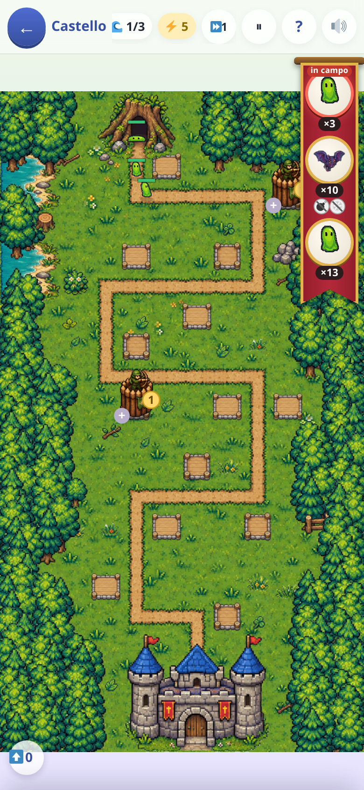
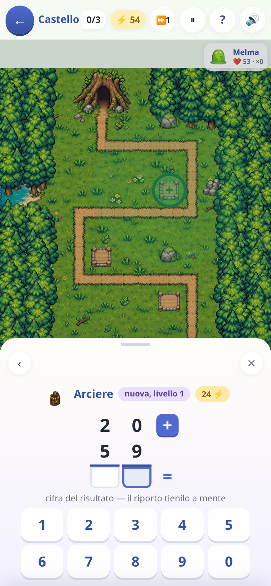
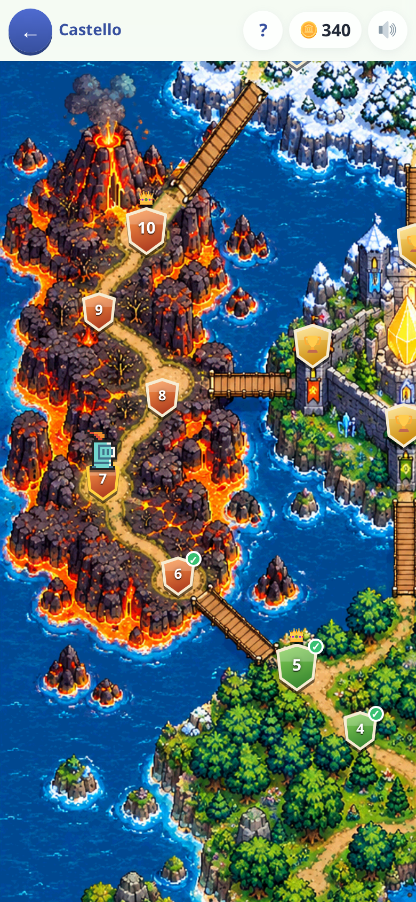

[← torna al README](../../README.md)

# 🏰 Difendi il Castello

*Un tower defense dove ogni torre si paga con un'operazione in colonna.* I
mostri camminano lungo il sentiero verso il castello; per fermarli servono
torri, e per costruire una torre bisogna fare il conto. Il campo è una
carta a scacchiera disegnata in quattro vestiti (il bosco, la neve, la lava,
la palude), con le torri e i mostri presi da un foglio di figure.

  

## Come è fatto

Venti tappe in quattro campagne — il bosco, il sottosuolo, le mura, la
palude — e in coda quattro partite libere, una per terreno. Ogni tappa ha il
suo scenario, i suoi mostri e la sua scaletta di operazioni.

Il ciclo è: arriva l'ondata → serve una torre → **compare l'operazione in
colonna** → si scrive il risultato cifra per cifra, tenendo a mente i
riporti → la torre si costruisce. Chi sbaglia paga qualche ⚡ in più, non
perde la partita.

## Le quattro torri

| torre | operazione | cosa fa | la prima costa |
|---|---|---|---|
| 🏹 Arciere | addizione | colpi rapidi su un nemico | 24 ⚡ |
| 🔮 Magica | sottrazione | un'onda che colpisce a zona | 40 ⚡ |
| ❄️ Ghiaccio | moltiplicazione | non fa danno: gela chi passa vicino | 20 ⚡ |
| 💣 Bombe | divisione | uno scoppio che prende tutti quelli vicini | 56 ⚡ |

Le torri non costano uguale, ed è una scelta: con quello che costa una bomba
si fanno due arcieri, o un arciere portato al livello tre. Ma un ⚡ speso
rende più o meno lo stesso qualunque torre si compri, quindi nessuna è la
scelta sbagliata.

Una torre nasce al livello 1 con l'operazione più facile che esista, e per
farla salire si risolve il gradino dopo. Salendo **cambia faccia** tre volte
(🏹 → 🎯 → 🦅), perché il lavoro fatto deve vedersi. Salire costa un po' di
più a ogni gradino: finché ci sono piazzole libere una torre nuova rende di
più, e quando i posti finiscono si sale — una torre alta occupa un posto
solo, e la matematica difficile è la strada per la torre forte. Una torre
per tipo tirata fino in cima non è più la mossa che vince.

## Si compra toccando il campo

Il campo prende tutto lo schermo e non c'è nessun banco di bottoni: **si
tocca una piazzola vuota** e un foglio sale a chiedere che torre costruirci,
**si tocca una torre** e sale la sua scheda — falla salire, oppure spostala
trascinandola su un'altra piazzola. Il conto da fare sta nello stesso foglio.

Le piazzole respirano quando l'energia basta per una torre nuova, e le torri
hanno un bollino verde quando basta per farle salire. Mentre si calcola **il
campo non si ferma** — un minimo di fretta ci va — e resta visibile sotto il
foglio, che si appoggia sopra senza restringerlo. Con due dita si sposta e si
ingrandisce la mappa, e un doppio tocco la rimette in quadro.

## A metà scaletta una torre sceglie che fare

Al quarto gradino, in ogni tappa che ci arriva, la torre sceglie un mestiere fra
**due carte**: l'arciere diventa cecchino o raffica, la magica veleno o
catena, il ghiaccio bufera o brina, le bombe mortaio o napalm. La scelta non
costa un calcolo in più, e i due rami valgono lo stesso: cambia la forma del
danno, non la quantità.

## I mostri: comuni e immuni

Di base tutte le torri fanno effetto: goblin, orco, ragno, lupo, slime e gli
altri **comuni** li ferisce tutto. Alcuni invece sono **immuni** a una o due
torri, che non li toccano affatto: chi vola passa sopra le bombe, chi è
corazzato si fa rimbalzare addosso frecce e magia, le frecce passano
attraverso il fantasma, la magia non scalfisce il drago. La figura del
mostro lo dice già — pietra e piastre, ossa, ali — e il nastro in cima lo
annuncia tre ondate prima, con le torri sbarrate. In campo una torre non
spreca colpi su chi le è immune.

Le tappe si aprono coi comuni, e gli immuni arrivano dopo: nessuna torre, da
sola, vince una tappa. Nelle ultime campagne arriva anche qualche **ondata
mista**, due tipi di mostri mescolati — un golem con un'arpia — che nessuna
torre ferisce tutti e due.

Dal sottosuolo in poi lo slime e il verme si dividono in due quando cadono
(dalla metà delle mura e della palude i pezzi si dividono ancora), e lo
scheletro e il troll si rialzano una volta. In fondo a ogni campagna
arriva **il capo**: un mostro solo, gigante, con la vita di tutta l'ondata —
se arriva al castello si porta via quattro cuori.

## Il ritmo

**L'ondata parte quando la chiami tu**, o da sola dopo un po' (45 secondi
nella prima tappa, 20 nell'ultima). Il conto alla rovescia scorre solo a
mani ferme: la matematica non è mai sotto cronometro, lo è solo lo stare a
guardare. Chi manda l'ondata prima si prende un po' di ⚡ di premio, e si può
chiamare **la prossima** anche a battaglia in corso: è una scommessa, non un
obbligo. Il tasto ⏩ manda il campo a velocità doppia o tripla.

Alcune tappe, tutta la palude e le partite libere hanno **due ingressi**: le
ondate si alternano fra le due bocche, e più avanti arrivano da tutte e due
insieme. Il nastro dice da dove, così si fa in tempo a spostare una torre.

Il gettone ⬆️ sul campo apre il blocchetto dei potenziamenti: per ogni tipo
di torre quanti gradini ha salito e quanto fa in più di una appena costruita.

## Fermarsi

In cima c'è **⏸**: il campo si ferma dov'è e resta lì finché non si tocca.
Se il telefono si posa — schermo bloccato, un'altra app, una chiamata — la
battaglia va in pausa da sola, e alla riapertura aspetta un tocco. Il `?`
ferma il campo finché è aperto. Il conto invece non ferma niente: per
fermare tutto c'è il ⏸.

## Quali operazioni escono

Ogni operazione ha **dieci gradini**, e ogni gradino cambia *una cosa sola*:
prima quante cifre, poi i riporti, poi quanti numeri in colonna — perché
«sai fare 27+15, adesso prova 247+185+96» è un salto, non un passo.

| gradino | addizioni | sottrazioni | moltiplicazioni | divisioni |
|---|---|---|---|---|
| 1 | `24 + 13` | `46 − 12` | `22 × 3` | `72 : 4`, esatta |
| 2 | `27 + 15`, il riporto | `95 − 58`, il prestito | `84 × 3`, coi riporti | `47 : 2`, col resto |
| 3–4 | tre cifre | tre cifre | tre cifre | tre cifre |
| 5–10 | tre e quattro addendi | prestiti doppi, zeri di mezzo | due cifre per due | lo zero nel quoziente |

Una torre sale un gradino alla volta, e ogni tappa dichiara fin dove si può
arrivare: le prime si fermano alle addizioni corte, le ultime arrivano alle
divisioni. **Ogni tappa dichiara anche quante operazioni costa finirla** —
sei nella prima, trenta nell'ultima delle mura — e tutto il resto si adatta a
quel numero, compresa la vita dei mostri, che un simulatore misura giocando
la tappa migliaia di volte.

## Le partite libere

Finita la campagna si aprono **quattro partite senza fine**, una per terreno:
*La radura grande*, *Il bivio*, *Il bastione* (dove la strada ripassa sopra
sé stessa) e *Il delta*. Ognuna ha il suo record, e ogni cinque ondate si
sceglie **un regalo** fra tre carte — frecce più affilate, gelo che morde,
mani veloci… — che resta per sempre e vale su tutti i terreni. Un regalo è un
passo piccolo (+5%), ma si accumula: è quello che fa salire il record di
partita in partita. Nella campagna i regali non valgono.

## Cosa allena

L'algoritmo delle operazioni in colonna — riporti e prestiti — con una
pressione di tempo mite: l'ondata arriva, ma il conto si può fare con calma
perché il gioco aspetta.

## Note per i genitori

- Le divisioni (e le moltiplicazioni) si spengono da *Genitori → cosa sa*:
  la torre che le chiederebbe passa all'operazione prima, qualche gradino più
  su. Il gioco degrada invece di sbarrare, e nessuna tappa diventa più facile.
- Se il bambino sbaglia spesso non perde: paga di più in energia. Non c'è
  schermata di fallimento legata al calcolo.
- Ogni conto fatto senza errori paga 🪙3 nel momento in cui la torre sale,
  anche nelle partite libere e nelle tappe rifatte; a fine tappa non
  arriva nessun premio in più. I regali non comprano monete e non aprono
  tappe.
- Il record di ogni partita libera — ondate rette, mostri fermati, torri — è
  scritto sul suo tasto nella mappa e nella tabella dei record di *I miei
  progressi*; batterlo fa coriandoli e dice di quanto.
