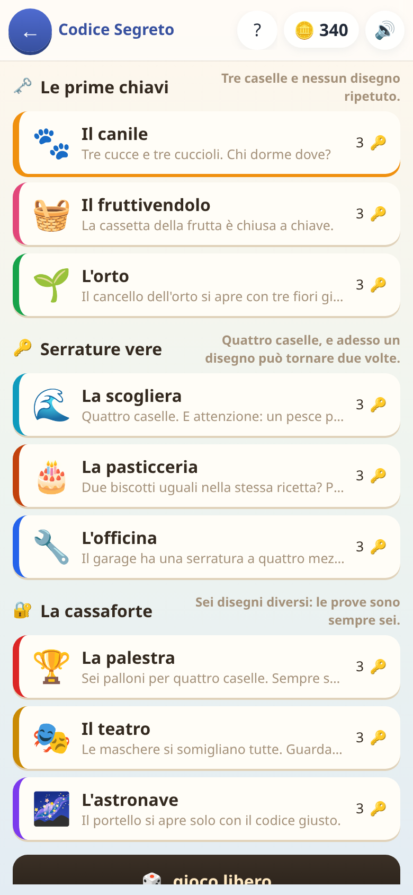

[← torna al README](../README.md)

# 🔐 Codice Segreto

*Deduzione pura, tipo Mastermind.* Niente conti: si indovina una combinazione
nascosta leggendo gli indizi di quelle già provate.

 

## Come è fatto

C'è una combinazione nascosta — tre o quattro figure fra quelle disponibili.
Si prova una combinazione, e il gioco risponde con dei **pallini**:

- 🟢 **verde** — una figura giusta al posto giusto
- 🟡 **giallo** — una figura che c'è, ma in un altro posto

I pallini non dicono *quale*: dicono *quanti*. Tutto il gioco sta lì —
incrociare i tentativi precedenti per capire cosa può ancora essere vero.

## Le nove tappe

Ogni tappa è un tema diverso — il canile, il fruttivendolo, l'orto, la
scogliera, la pasticceria, l'officina, la palestra, il teatro, l'astronave —
e cresce in tre modi: **più figure fra cui scegliere**, **più posti da
indovinare**, e la possibilità di **figure ripetute** nella stessa
combinazione.

Le ripetizioni sono lo scalino vero: finché ogni figura compare al massimo
una volta il ragionamento è lineare, quando possono ripetersi il conteggio
dei pallini diventa molto meno intuitivo. (È anche il punto in cui questo
tipo di gioco viene implementato sbagliato più spesso — qui c'è una prova
automatica dedicata solo a quello.)

## Cosa allena

Il ragionamento deduttivo e, soprattutto, **l'eliminazione sistematica**: non
tirare a indovinare, ma usare quello che si è già scoperto. È l'unico gioco
della raccolta senza nessun contenuto scolastico dentro — non serve sapere
niente, serve solo pensare.

Ed è quello che consiglio quando un bambino è stanco di esercizi ma non ha
voglia di smettere.

## Note per i genitori

- Non ci sono domande da spegnere: non c'è nessun prerequisito scolastico.
- Le prove automatiche di questo gioco **giocano davvero le nove tappe** con
  un finto giocatore che ragiona, e verificano due cose: chi ragiona bene
  vince quasi sempre, e chi ragiona a sprazzi ce la fa comunque più di una
  volta su due. Se non fosse così sarebbe un gioco di fortuna travestito da
  gioco di logica.
