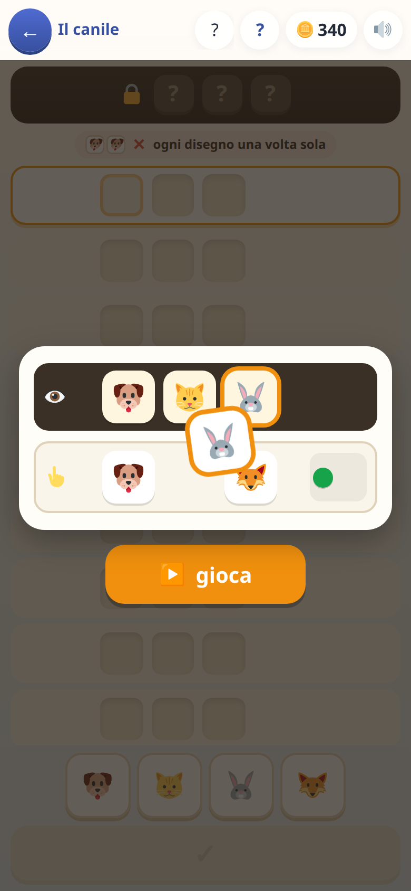
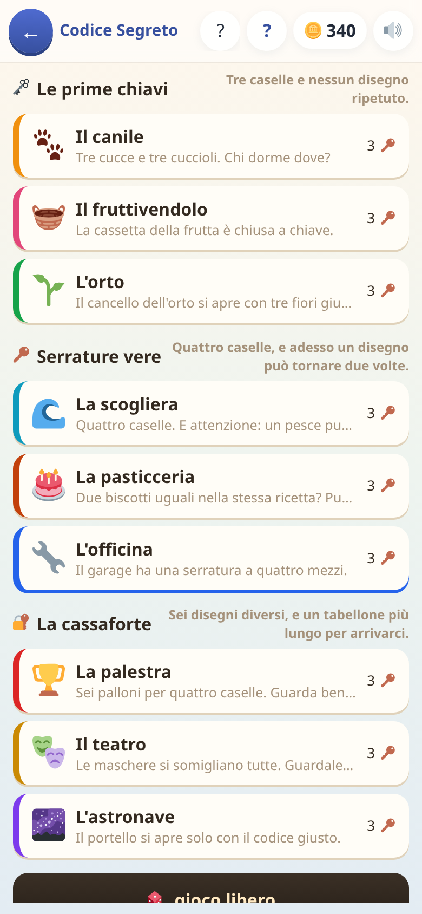

[← torna al README](../../README.md)

# 🔐 Codice Segreto

*Deduzione pura, tipo Mastermind.* Niente conti: si indovina una combinazione
nascosta leggendo gli indizi di quelle già provate.

> **Spoiler: è più complicato di quello che sembra.** Le prime tappe si
> risolvono a occhio, poi non più. Provatelo prima di darlo per «troppo
> facile» — e se un adulto ci mette qualche tentativo, è normale.

 

## Come è fatto

C'è una combinazione nascosta — tre o quattro figure fra quelle disponibili.
Si prova una combinazione, e il gioco risponde con dei **pallini**:

- 🟢 **verde** — una figura giusta al posto giusto
- 🟡 **giallo** — una figura che c'è, ma in un altro posto

I pallini non dicono *quale*: dicono *quanti*. Tutto il gioco sta lì —
incrociare i tentativi precedenti per capire cosa può ancora essere vero.
Per questo i tentativi già fatti non spariscono mai: se non entrano nello
schermo il tabellone si trascina col dito, non si accorcia.

Sotto il codice coperto resta scritta la regola che cambia tutto — «ogni
disegno una volta sola» oppure «lo stesso disegno può tornare» — con due
caselline e un ✕ rosso o un ✓ verde per chi non legge ancora. È la domanda
che torna a ogni riga, e leggerla una volta sola all'inizio non basta.

## Le nove tappe

Ogni tappa è un tema diverso — il canile, il fruttivendolo, l'orto, la
scogliera, la pasticceria, l'officina, la palestra, il teatro, l'astronave —
e cresce in tre modi: **più figure fra cui scegliere**, **più posti da
indovinare**, e la possibilità di **figure ripetute** nella stessa
combinazione.

Le ripetizioni sono lo scalino vero: finché ogni figura compare al massimo
una volta il ragionamento è lineare, quando possono ripetersi il conteggio
dei pallini diventa molto meno intuitivo. È anche il punto in cui questo
tipo di gioco viene implementato sbagliato più spesso, e qui c'è una prova
automatica dedicata solo a quello.

**Cresce anche il numero di tentativi concessi**: nove righe sulle prime
tappe, poi dieci, undici e dodici man mano che le combinazioni possibili
passano da 24 a più di sedicimila. Il numero è tarato su un giocatore che
ragiona due volte su cinque, come un bambino vero: così le partite perse
restano fra il 2 e il 5%, e perdere non diventa mai una questione di
fortuna. Le righe in più non regalano stelle: allungano solo quanto si può
sbagliare prima di perdere.

## Cosa allena

Il ragionamento deduttivo e, soprattutto, **l'eliminazione sistematica**: non
tirare a indovinare, ma usare quello che si è già scoperto. Non c'è dentro
nessun contenuto scolastico: non serve sapere niente, serve solo pensare.

Ed è quello che consiglio quando un bambino è stanco di esercizi ma non ha
voglia di smettere.

## Note per i genitori

- Non ci sono domande da spegnere: non c'è nessun prerequisito scolastico.
- Le prove automatiche **giocano davvero le nove tappe** con un finto
  giocatore che ragiona, e verificano due cose: chi ragiona bene vince
  quasi sempre, e chi ragiona a sprazzi — un bambino vero, che a metà
  partita si distrae — perde al massimo una volta su venti. Se non fosse
  così sarebbe un gioco di fortuna travestito da gioco di logica.
- Le **stelle** di fine partita dipendono da una soglia di tentativi scritta
  per ogni difficoltà, non dalla lunghezza del tabellone: sulle tappe toste
  tre stelle sono difficili ma possibili.
