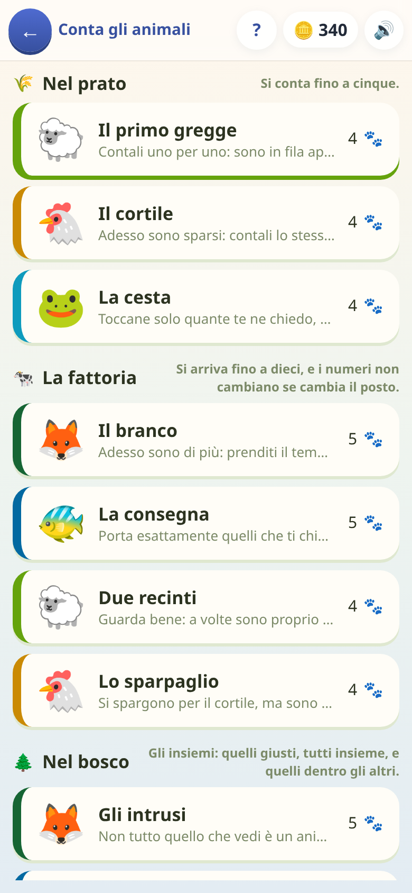

[← torna al README](../README.md)

# 🐑 Conta gli animali

*Il gioco più semplice che c'è qui dentro, e il primo che un bambino di
quattro anni apre da solo.* Si conta quello che si vede, si tocca quello che
si conta. Non c'è una riga da leggere per giocarlo, e non si può perdere.

 

## Come è fatto

In cima c'è la consegna, e **la consegna è fatta di icone**: `❓ 🦊` vuol dire
«quante volpi ci sono?». Sotto, in piccolo, la stessa cosa scritta — che
serve a chi legge e al genitore che guarda da sopra la spalla, non a chi
gioca. Un bambino che non ha ancora imparato a leggere non perde niente.

Sotto c'è il prato con gli animali, e in fondo il modo di rispondere, che
cambia con la domanda:

- **quattro cifre** fra cui scegliere,
- **i gettoni da toccare** uno per uno e poi confermare con ✔,
- **due recinti**, per dire dove ce n'è di più (o che sono uguali),
- **due bottoni**, per l'inclusione: «più volpi o più animali?».

**Sbagliare non toglie niente.** Non c'è un punteggio che scende, non c'è
tempo che stringe: se la risposta è sbagliata si conta insieme e si riprova
la stessa domanda, finché non viene. Una tappa non si perde mai — costa solo
delle stelle, non un'altra sera.

## I nove modi di chiedere «quanti?»

Sono i *verbi* del gioco, e sono la sua vera scaletta: l'ultimo chiede una
cosa che con il primo non c'entra quasi niente.

| | |
|:--|:--|
| **Quanti sono?** | contare quello che si vede, in fila o sparpagliato |
| **Portamene tot** | il verso opposto: dato il numero, prendere quella quantità |
| **Dove ce n'è di più?** | confrontare due mucchi senza contarli per forza |
| **Sono sempre gli stessi?** | si contano, si sparpagliano: quanti sono adesso? |
| **Quante di queste?** | contare una specie sola, ignorando quello che non c'entra |
| **Quanti animali in tutto?** | due specie diverse stanno tutte e due dentro «animali» |
| **Più volpi o più animali?** | l'inclusione: il mucchio piccolo sta dentro quello grande |
| **Uno in più, uno in meno** | ne arriva una, una scappa: quante sono adesso? |
| **Quanti in tutto?** | due gruppi separati messi insieme — l'addizione, senza il segno |

Due meritano una riga in più.

**«Sono sempre gli stessi?»** è il concetto più importante del gioco: la
quantità non cambia se cambia la disposizione. È una cosa che a quattro anni
non è per niente ovvia — cinque pecore sparpagliate *sembrano* più di cinque
pecore in fila — e non si insegna a parole, si insegna facendole spostare
sotto gli occhi.

**«Più volpi o più animali?»** è l'inclusione di classe, ed è la domanda che
un bambino piccolo sbaglia quasi sempre la prima volta: confronta le volpi
con gli *altri* animali invece che con tutti quanti. Ha sempre la stessa
risposta, per costruzione — perciò nella sua tappa si alterna con «dove ce
n'è di più», se no la si impara come si impara la posizione di un tasto.

## Le dodici tappe

Quattro scalini, e ognuno cambia una cosa sola:

1. **Nel prato** — si conta fino a cinque. In fila, poi sparpagliati, poi
   dato il numero si prendono i gettoni.
2. **La fattoria** — si arriva a dieci, e i numeri non cambiano se cambia il
   posto.
3. **Nel bosco** — gli insiemi: quelli giusti in mezzo agli intrusi, due
   specie messe insieme, il mucchio dentro il mucchio.
4. **Al mercato** — uno in più, uno in meno, e due mucchi sommati.

Ogni tappa ha un *mondo* addosso — il prato, il pollaio, lo stagno, il bosco,
il mare, il mercato — con le sue specie, e due tappe di fila non portano mai
lo stesso vestito. La tappa non elenca le domande una per una: dichiara da
dove pescare, e le costruisce a ogni giro. Rigiocata, non fa mai la stessa
fila.

## Cosa allena

La **cardinalità** (l'ultimo numero detto è quanti ce n'è), la
**conservazione del numero**, la **classificazione** e l'**inclusione di
classe**, il **successore e il predecessore**, e infine l'addizione concreta:
due mucchi, quanti in tutto. Tutta roba che a scuola arriva prima dei
simboli, e che qui non ne usa nemmeno uno.

## Note per i genitori

- **Nessuna domanda scritta**: si può giocare senza saper leggere. È il
  motivo per cui esiste.
- **Non si perde.** Non c'è modo di finire una partita male: la tappa si
  chiude quando è chiusa. Le stelle dicono quanto è filata liscia — tre
  senza nemmeno un errore, due fino a due, una comunque.
- **Si spegne con «I numeri e le quantità»** e, per lo scalino del bosco,
  «Tutti e nessuno»: sono i due pezzi di scuola che dichiara.
- **Sparisce da sé quando serve.** La sua campagna sta fra i quattro e i sei
  anni e mezzo scarsi: a un bambino di otto anni la carta non viene proprio
  offerta, a meno che non l'abbia già cominciata — vedi
  [come l'età decide cosa si vede](genitori.md#quanti-anni-ha).
