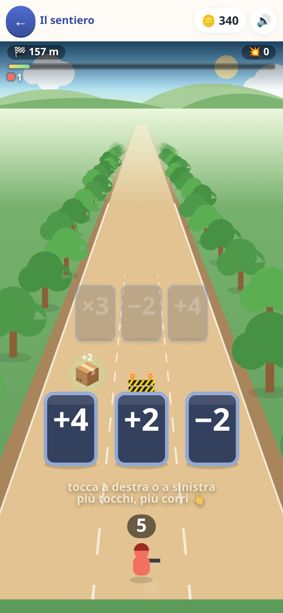

# 🏃 La corsa dei numeri

*Ancora in prova: la carta compare in home solo con «giochi in prova»
acceso nella schermata dei genitori.*

Si corre da soli su tre corsie e si sceglie una cosa sola: **dove**. Ogni
venti metri arriva un cancello — tre operatori, uno per corsia — e quello
che c'è scritto succede alla truppa che ti corre dietro.

`×3` a sinistra, `+18` in mezzo, `÷2` a destra. Con quattro soldati
conviene `+18`, con dodici conviene `×3`, e **capirlo è il gioco**.

Non c'è nessuna domanda da leggere di corsa. Il conto *è* la mossa:
sbagliarlo non è un voto brutto, è arrivare al mostro con meno soldati.

**I tre cancelli sono identici, e non è una svista.** Per un giro sono
stati verdi e rossi — verde chi moltiplica, rosso chi toglie — ed era
comodissimo da lontano: con due corsie rosse su tre non restava niente da
calcolare. Il colore rispondeva alla domanda al posto del bambino. Adesso
c'è scritto solo il conto, e quale conviene dipende da quanti soldati hai
in quel momento. L'unico diverso è quello d'oro, che non dice *quanto
vale*: dice che lì ci si ferma.

## La truppa è un numero scritto in terra

Cinque verdi valgono un rosso, cinque rossi un blu, cinque blu un giallo —
e **ognuno spara quanto vale**. Non è un trucco grafico per non disegnare
seicento figure: è il raggruppamento messo per terra.

87 non è un mucchio: sono **tre blu, due rossi e due verdi**, e si contano
con gli occhi. Il numero scritto in cima allo schermo e la formazione che
corre in basso sono la stessa cosa detta in due modi, sempre, gruppo per
gruppo. È lì che si impara a *leggere* un numero invece di subirlo.

## Un grado alla volta

Ogni tappa dichiara quanto può diventare grande la truppa, e non è una
manopola di difficoltà: è **quanti gradi si stanno imparando**.

| tappe | tetto | cosa c'è in terra |
|:--|--:|:--|
| 1–2 | 24 | solo verdi e rossi |
| 3–5 | 124 | arriva il blu |
| 6–9 | 624 | arriva il giallo |

Il grado nuovo arriva quando il precedente è diventato di casa. Serve anche
a tenere in piedi il gioco: i cancelli moltiplicano, e una truppa senza
tetto arriva a diecimila in un minuto — a quel punto «×3» non è più una
domanda di matematica, è una scritta.

## I mostri, e perché la truppa non cresce all'infinito

Ogni tre cancelli arriva una banda di mostri, e **la truppa gli spara
addosso mentre ci si avvicina**: il numero è la potenza di fuoco. La
truppa stende esattamente un mostro grande quanto lei, quindi la domanda
da farsi è sempre la stessa e sta scritta su due numeri — *il mio è più
grosso del suo?*

Il mostro **non spara**. Durante tutto l'avvicinamento la truppa non
cambia di un soldato: si vede scendere solo la barra della vita del
mostro. Il conto si paga tutto insieme all'impatto, e solo se è ancora in
piedi: quello che gli resta di vita te lo porta via **moltiplicato per
tre**. Sopra la sua misura si passa puliti, sotto si paga caro.

(Per un giro il mostro sparava anche lui, con un fuoco di risposta
continuo. Sulla carta era più giusto; a schermo il numero della truppa
cambiava sessanta volte al secondo e la formazione per terra si rifaceva
a ogni fotogramma. Un numero che lampeggia non si legge, e qui il numero
*è* il gioco.)

Se la truppa arriva a zero si perde e si ricomincia la tappa.

Il mostro non è mai imbattibile e non è mai regalato: si dimensiona su
**dove la truppa sarà**, non su dov'è adesso. I cancelli in volo sono già
tutti generati, quindi il caso peggiore e il migliore si calcolano davvero,
e la vita del mostro si mette poco sopra il caso peggiore. Chi sceglie male
una volta ci arriva col fiato corto; chi sbaglia due volte di fila muore —
ed è una morte che si capisce, perché il cartello dice chi ti ha fermato e
con quanta vita gli era rimasta.

Ogni quarto scontro è un **boss**: davanti a lui la corsa rallenta invece
di fermarsi. Il tempo in più è tempo di fuoco, che è l'unica cosa che serve.

## Il cancello d'oro: un'offerta, non un pedaggio

Ogni tanto uno dei tre cancelli è d'oro e ha un libro sopra. Vale `×5` — il
premio più forte del gioco — ma bisogna **fermarsi e fare un esercizio**.

Le domande sono [le stesse di tutti gli altri giochi](domande.md): italiano,
matematica, spazio, tempo, logica, scienze. Si fanno più toste tappa dopo
tappa, e quello che tuo figlio non ha ancora fatto a scuola non esce.

Tre condizioni, e togliendone una qualunque tornerebbe a essere una tassa:

1. **Si vede prima.** È d'oro e ha il libro, da quaranta metri.
2. **Non è mai obbligatorio.** Le altre due corsie sono cancelli veri, e la
   campagna si finisce **senza fare un solo esercizio** — è una cosa che il
   test verifica giocandola, tappa per tappa.
3. **Sbagliare non toglie niente.** Si resta esattamente com'era: si è perso
   solo il tempo di provarci.

E i conti si fanno **da fermi**: finché la domanda è a schermo la corsa non
avanza di un centimetro. Leggere un esercizio mentre si corre non è
calcolare, è tirare a indovinare.

## Chi ha fretta

**Si tiene premuto e si corre più forte** — col dito, col mouse, con la
barra spaziatrice o la freccia su. Un tocco secco dà comunque una
spintarella, oltre a spostare di corsia. Serve a saltare i venti metri
vuoti fra un cancello e l'altro senza stare lì ad aspettare, e gli scontri
finiscono identici: il danno si conta per metro percorso e non per
secondo, quindi correre più forte non rende un mostro né più facile né
più difficile.

C'è un limite, ed è l'unico punto del gioco in cui il dito non comanda:
**all'avvicinamento di un cancello restano sempre almeno tre secondi**,
qualunque cosa si faccia. A sei anni non si sa ancora di aver bisogno di
qualche secondo per leggere tre numeri, e non si può lasciare che la
fretta se li porti via.

Il limite è in *secondi* e non in metri, e la prima versione sbagliava
proprio lì: frenava sotto i sedici metri dal cancello, ma i cancelli
distano diciassette-ventun metri — la rampa cominciava prima del cancello
precedente e la spinta piena non arrivava mai. Un vincolo scritto in metri
non sa quanto sono distanti i cancelli di quella tappa; scritto in secondi
lo sa da sé.

Le righe di corsa ai lati dello schermo si spengono quando la spinta
smette di lavorare: si vede, invece di continuare a premere senza capire
perché.

## Le tre stelle

- ⭐ **arrivare** in fondo
- ⭐⭐ **senza perdere nemmeno uno scontro** — un mostro si abbatte prima
  dell'impatto solo se la truppa è grossa
- ⭐⭐⭐ e aver preso **il cancello migliore** abbastanza spesso (dal 55%
  della prima tappa all'80% dell'ultima)

Le prime due premiano il risultato, la terza premia **il conto**: è l'unica
misura del gioco che non dipenda da com'è andata la corsa, e infatti si può
prendere anche perdendo. Alla fine il cartello la dice per esteso — *«il
cancello migliore 7 volte su 9»*.

Prendere il cancello d'oro conta come scelta giusta **anche se poi
l'esercizio va male**, e chi tira dritto viene confrontato solo con i due
cancelli normali. Se no la terza stella sarebbe una punizione per aver
provato.

## Si corre piano, apposta

Il prototipo da cui viene questo gioco correva al doppio, e si vedeva
subito il difetto: tre numeri da leggere, capire quale conviene e spostarsi
sono cose che a sei anni richiedono secondi, non decimi.

Qui un cancello arriva ogni **quattro-cinque secondi** e si vede da quaranta
metri, cioè con più di dieci secondi di preavviso. Non è un numero scelto a
occhio: un controllo automatico rende rossa la campagna se una tappa scende
sotto i quattro secondi fra un cancello e l'altro.

Anche la strada è larga per lo stesso motivo. Nel prototipo l'asfalto
prendeva il 44% dello schermo e il resto era prato e cielo — cioè lo spazio
dove non succede niente. Adesso ne prende il 57%, e i tre cancelli arrivano
larghi un dito ciascuno.

## Finita la campagna

Si apre **la corsa infinita**: non c'è traguardo, i cancelli si leggono
senza pensarci, e il punteggio è quanto lontano si arriva.
