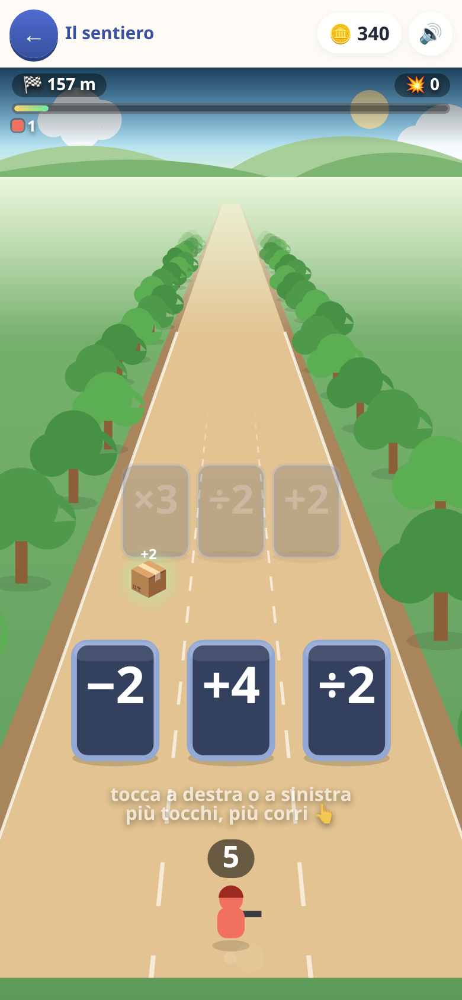

[← torna al README](../../README.md)

# 🏃 La corsa dei numeri

*Ancora in prova: la carta compare in home solo con «giochi in prova» acceso
nella schermata dei genitori.*

Si corre da soli su tre corsie e si sceglie una cosa sola: **dove**. Ogni
venti metri arriva un cancello — tre operatori, uno per corsia — e quello che
c'è scritto succede alla truppa che ti corre dietro.

`×3` a sinistra, `+18` in mezzo, `÷2` a destra. Con quattro soldati conviene
`+18`, con dodici conviene `×3`, e **capirlo è il gioco**. Non c'è nessuna
domanda da leggere di corsa: il conto *è* la mossa, e sbagliarlo non è un voto
brutto, è arrivare al mostro con meno soldati. I tre cancelli sono uguali,
senza colori che suggeriscano la risposta.

## La truppa è un numero scritto in terra

Cinque verdi valgono un rosso, cinque rossi un blu, cinque blu un giallo, e
**ognuno spara quanto vale**. 87 non è un mucchio: sono tre blu, due rossi e
due verdi, e si contano con gli occhi. Il numero in cima allo schermo e la
formazione che corre sono la stessa cosa detta in due modi: è lì che si
impara a *leggere* un numero. I gradi arrivano uno alla volta — prima verdi e
rossi, poi il blu, poi il giallo — quando il precedente è diventato di casa.

## I mostri

Ogni tre cancelli arriva una banda di mostri, e la truppa spara mentre ci si
avvicina: stende un mostro grande quanto lei. La domanda da farsi è sempre la
stessa, scritta su due numeri: *il mio è più grosso del suo?* Sotto la sua
misura si paga caro all'impatto; se la truppa arriva a zero si ricomincia la
tappa. Il mostro non è mai imbattibile né regalato, e ogni quarto scontro è un
boss.

## Il cancello d'oro

Ogni tanto un cancello è d'oro, con un libro sopra: vale `×5`, ma bisogna
**fermarsi e fare un esercizio** di una delle [materie di tutti gli altri
giochi](../apprendimento/presentazione.md). Si vede da lontano, non è mai
obbligatorio — la campagna si finisce senza farne uno — e sbagliare non toglie
niente. Finché la domanda è a schermo la corsa è ferma.

## Il ritmo

Si corre piano, apposta: un cancello ogni quattro-cinque secondi, visto con
più di dieci secondi di preavviso. Tenendo premuto si corre più forte fra un
cancello e l'altro, ma davanti a un cancello restano sempre almeno tre secondi
per leggere. Il ⏸ ferma la corsa; «indietro» invece la abbandona.

## Le tre stelle, e la corsa infinita

⭐ arrivare in fondo · ⭐⭐ senza perdere uno scontro · ⭐⭐⭐ aver preso il
cancello migliore abbastanza spesso — quest'ultima premia **il conto** e si
può prendere anche perdendo. Finita la campagna si apre **la corsa
infinita**: il punteggio è quanto lontano si arriva, e il cartello dice di
quanto si è migliorati («🥇 Nuovo record! 312 m (32 m meglio di prima)»).

## Cosa allena

Le quattro operazioni come scelta, non come esercizio: stimare in fretta
quale conto dà di più partendo da un numero che cambia. E il valore
posizionale visto per terra, gruppo per gruppo.

## Note per i genitori

- Il cancello d'oro rispetta quello che hai spento nel quadro dei grandi, e
  le sue domande si fanno più toste tappa dopo tappa.
- Una corsa lasciata con «indietro» non si salva: per smettere un attimo c'è
  il ⏸.
