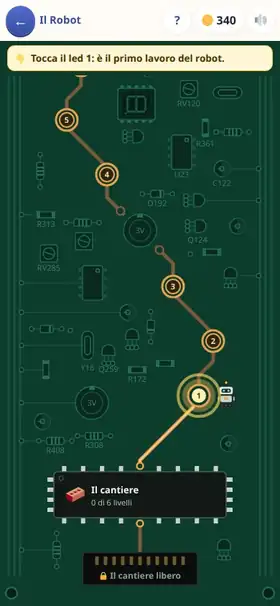
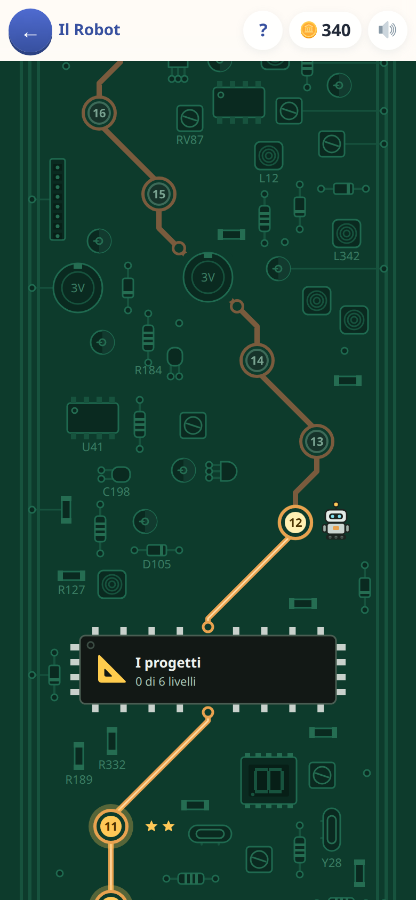

[← torna al README](../../README.md)

# 🤖 Il Robot

*Programmare davvero, senza scrivere codice.* Qualcuno ordina una cosa — un
muro, una scala, un castello — e il bambino scrive il programma con cui un
robot la costruisce. Poi preme ▶ e guarda il cantiere venir su.

Perché un robot: **fa alla lettera quello che gli scrivi**, una riga dopo
l'altra, e da solo non fa niente. Se il muro esce storto non è lui a non
aver capito: è il programma che dice così. Da una persona ci si
aspetterebbe che indovini cosa volevi; da una macchina no.

È il gioco che [il Generale](../generale.md) lasciava a un domani: là si
insegnano sequenze, cicli ed eventi fra più personaggi; qui l'altra metà del
mestiere — **le funzioni coi loro parametri, e le variabili create dal
bambino**.

## Come è fatto

In cima c'è **chi ordina** e cosa vuole, e sotto i suoi **ordini**: la stessa
scala con tre gradini e con cinque, lo stesso fiume largo tre e largo sei.
Poi il cantiere, visto di lato, col disegno da costruire in trasparenza. In
basso il programma, a righe che si leggono come frasi:

    🔁 ripeti [gradini] volte
         🏛️ colonna  alta [h]
         🚶 vai [→ a destra] [1] passo
         📝 [h] diventa [h + 1]

Non si scrive niente a tastiera: si tocca «＋», si sceglie un blocco dalla
cassetta, e si riempiono le caselle toccandole. Il programma si scrive una
volta e deve reggere **tutti gli ordini**: chi scrive «3» dove l'ordine dice
«gradini» vince il primo e perde il secondo — e lo vede, la scala si ferma a
metà. È questo che rende necessari i parametri e le variabili.

Mentre il programma gira la riga che lavora si accende, le lavagnette
cambiano valore sotto gli occhi, e quando il robot entra in un progetto si
apre la sua scheda con le misure di quella chiamata: la pila delle chiamate
fatta vedere invece che spiegata.

## I capitoli

Il **cantiere** (mettere, camminare, ripetere), **guardare e decidere** (il
se, il se… altrimenti, il ripeti finché), **i progetti** (prima usarli, poi
scriverli, con una misura, con due, con un colore), **le lavagnette** (una
variabile che cresce, cala, conta alla rovescia). Poi **il porto**, visto
dall'alto, dove il mondo lavora da solo e il programma deve guardare,
aspettare e decidere; le sfide, le giornate del porto, e in fondo **i primi
algoritmi**: mettere in ordine, cercare dimezzando, le pile, fino alla torre
di Hanoi e al **progetto che chiama sé stesso**.

Finito il primo capitolo si apre **il cantiere libero**: tutti i blocchi e
tutti i colori, non si vince e non paga, si costruisce.

I livelli si scelgono sulla **scheda del robot**: un circuito stampato dove
ogni capitolo è un chip e ogni livello un led. La corrente arriva fin dove
si è arrivati, e vinto un livello è il robot a portarla al led dopo.

## Cosa allena

Scomporre un problema in pezzi riusabili (le **funzioni**), riconoscere
quello che cambia da un caso all'altro (i **parametri**), tenere un conto
(le **variabili**), decidere guardando (le **condizioni**), e reagire a un
mondo che non aspetta. Negli ultimi capitoli, gli algoritmi classici — e
perché costano quello che costano.

## Note per i genitori

- **Le monete arrivano una volta sola** per livello, alla prima vittoria:
  rifarlo è ricordarsi il programma, non scriverlo.
- **Le stelle sono due**: fatto, e fatto senza farsi scrivere la soluzione
  intera.
- **Gli aiuti del 💡 sono una scala, e si pagano in monete**: i primi due
  gradini sono gratis e fanno ragionare, poi gli indizi, poi il gioco scrive
  pezzi del programma. Il prezzo sta sul tasto prima di premerlo, e senza
  monete non si compra niente.
- **Il programma di ogni livello si tiene**, anche uscendo a metà.
- **Un livello vinto apre il successivo**, anche oltre l'età per cui il gioco
  è pensato: averlo vinto è la prova che il bambino ci arriva. L'età decide
  solo se il gioco compare fra quelli di casa.
- Il gioco dà per scontato che il bambino legga da solo: è pensato dai nove
  anni in su.
