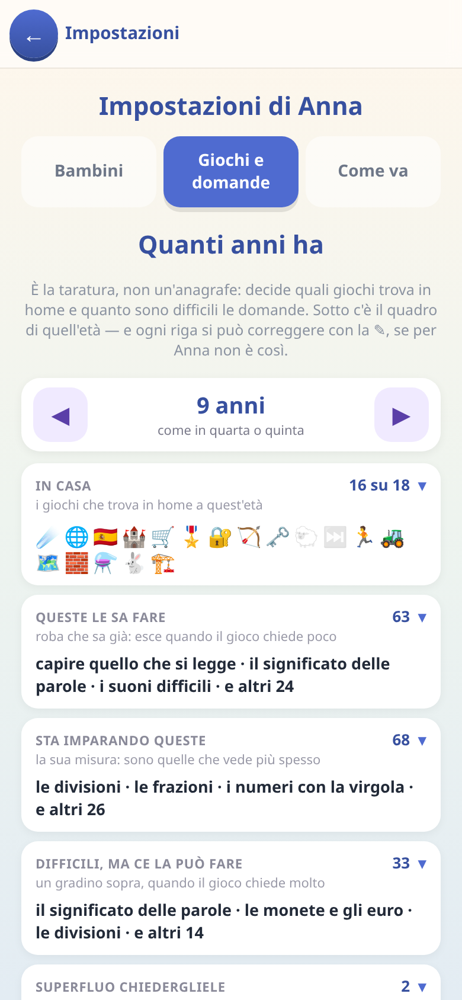
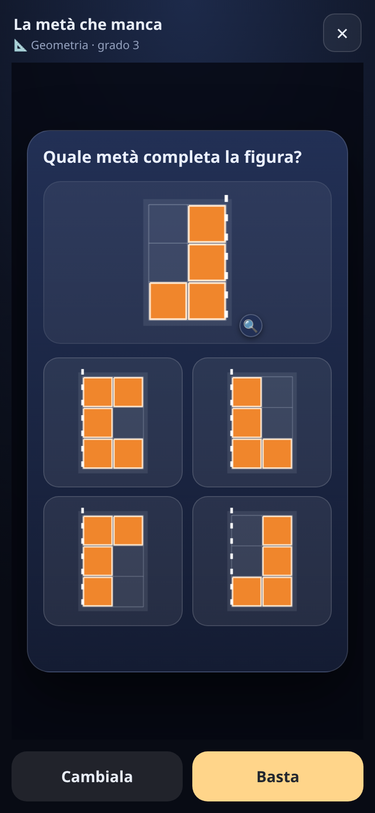

[← torna al README](../README.md)

# ❓ Le domande di tutte le materie

Alcuni giochi — [il Dungeon](dungeon.md), [Survivors](survivors.md) e il
cancello d'oro della [Corsa dei numeri](corsa.md) — non
hanno un contenuto scolastico proprio: chiedono **una domanda** e basta. Le
domande arrivano da un magazzino comune, e questa pagina spiega cosa c'è
dentro.

## Le materie

| materia | di che si parla |
|---|---|
| **Italiano** | ortografia, sillabe e rime, significato delle parole, nomi e articoli, analisi grammaticale, coniugazione dei verbi |
| **Matematica** | senso del numero, decine, stima e arrotondamento, misure e conversioni |
| **Spazio** | coordinate e direzioni su una griglia, percorsi, area e perimetro, i solidi |
| **Tempo** | l'orologio a lancette, giorni e mesi, stagioni, contare i giorni fra due date |
| **Logica** | analogie, sequenze da completare, deduzioni |

## Che tipo di domande, davvero

Ogni materia si divide in tipologie precise. Qualche esempio di quello che
c'è dentro, per dare l'idea:

- **Ortografia** — gn, gl, sc, le doppie, cqu, ce/cie, la lettera h, l'accento
  che cambia il significato (*pero* / *però*), l'apostrofo
- **Senso del numero** — riconoscere una quantità a colpo d'occhio,
  confrontare, mettere in ordine, trovare il posto sulla linea dei numeri,
  quanto vale una cifra dentro un numero, stimare, arrotondare
- **La griglia** — coordinate, direzioni, contare le mosse di un percorso,
  area e perimetro, e la differenza fra i due
- **Logica** — «tutti i gatti hanno la coda» e le sue trappole: la frase
  girata, quella negata, quella che non è stata detta, le catene
- **Calendario** — giorni e mesi, quanti giorni ha un mese, le stagioni, le
  feste, quanti giorni passano fra due date, quanto dura una cosa

Le risposte possono essere testo, emoji, o **una scena disegnata**: un
orologio con le lancette, una figura sulla griglia, un solido visto
dall'alto.

## Come si fanno più difficili

Ogni tipo di domanda ha **da quattro a sette gradi**, dal più facile al più
difficile. Un gioco non li conosce: chiede una domanda con una certa
**durezza, da 0 a 1**, e ognuno traduce quel numero nel proprio grado.

Questo permette a giochi diversissimi di usare la stessa scorta in modi
opposti:

- nel **Dungeon** la durezza dipende da quanto si è scesi — più giù si va,
  più le domande si fanno toste;
- in **Survivors** la sceglie il bambino, perché ogni carta ha il suo prezzo
  in difficoltà;
- nella **Corsa dei numeri** la dice la tappa, e la domanda non è mai
  obbligatoria: paga il cancello d'oro, che si vede prima e che si può
  benissimo non prendere.

Non viene pescata una materia a caso e poi il grado: si pesca direttamente
**una classe di domande** (tipo + grado) fra quelle ammesse a quella durezza.
Così le domande più facili e quelle più difficili di ogni tipo si vedono
davvero, e una tipologia rara pesa quanto una comune invece di sparire.

Il magazzino misura anche la propria **varietà**: un grado che produce sempre
le stesse venti domande si impara a memoria e smette di insegnare qualcosa.
C'è una prova automatica che se ne accorge.

## Quello che il bambino non ha mai fatto non viene chiesto

È la parte che conta di più per un genitore, e sta nei
[settaggi](genitori.md), seconda scheda.

Ogni tipologia dichiara **da quale pezzo di scuola dipende**. Se spegni «i
litri e i chili», tutte le domande che li danno per scontati spariscono — in
tutti i giochi, in tutte le difficoltà. Non sono i giochi a saperlo: è la
domanda stessa a dichiarare cosa pretende.

E quando spegnere qualcosa svuota un intero grado, il gioco **scende a un
grado più facile invece di sparire**: nessuna partita si blocca, nessuna
tappa diventa impossibile.

Si può spegnere un gruppo intero («accenti e apostrofi») o una sola tipologia
dentro il gruppo (solo l'accento tonico, lasciando l'apostrofo).

## Il modo più veloce: provarle

Non serve leggere questa pagina per capire che domande arrivano — **si
guardano**. Apri *Genitori* (codice `0000`), scheda **«Cosa sa»**: accanto a
ogni voce c'è un tasto **▶ prova una domanda**.

 

Esce una domanda vera, giocabile, esattamente come la vedrebbe tuo figlio.
In alto è scritto di che tipo è e a che grado sta; sotto ci sono *Cambiala*,
per vederne un'altra, e *Basta*. Non cambia niente nel gioco e non conta come
esercizio: serve solo a guardare.

È il modo giusto di decidere cosa spegnere — in trenta secondi si capisce se
una tipologia è alla portata, molto meglio che ragionandoci sopra.

## Nota per i genitori

I giochi che usano queste domande **non tengono conto di cosa il bambino ha
già imparato**: la classe si tira a sorte fra quelle ammesse. È diverso da
[Asteroidi](asteroidi.md) e dalle [lingue](lingue.md), dove ogni singola cosa
ha la sua storia e torna quando serve. Le fondamenta ci sono — ogni domanda
ha già la sua chiave — ma il collegamento non è ancora scritto.
