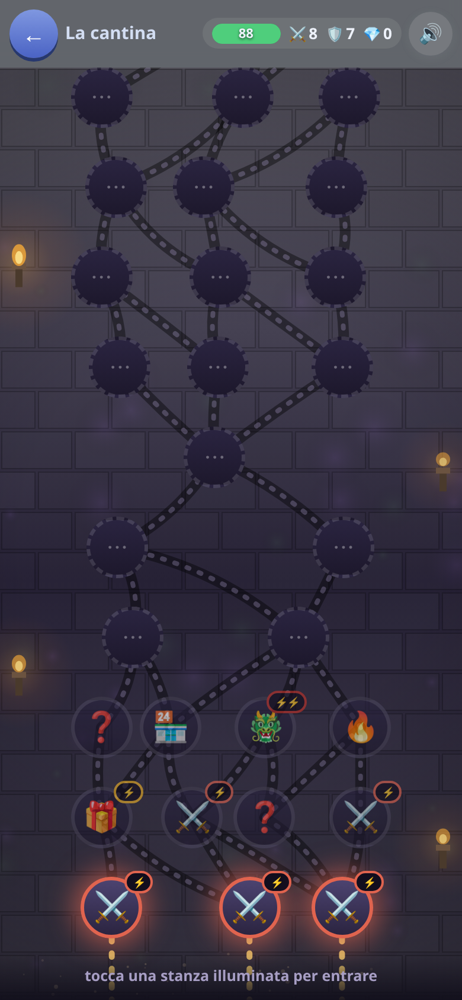
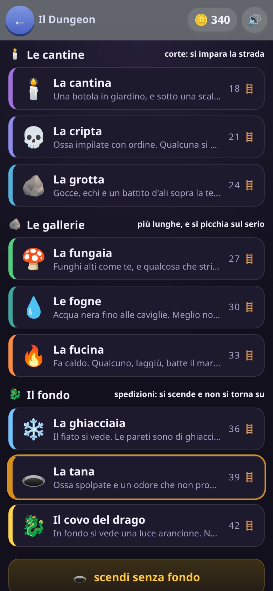

[← torna al README](../../README.md)

# ⚔️ Il Dungeon

*Si scende di stanza in stanza, e più si scende più le domande si fanno
difficili.* Un gioco a carte dove si sceglie sempre fra scendere ancora o
tornare su col bottino.

 

## Come è fatto

Ogni tappa è una discesa: una mappa a nodi, un bivio alla volta. La stanza
può essere un mostro, un forziere, una trappola, un mercante. Davanti a una
sfida il gioco **fa una domanda**: rispondendo giusto si passa, sbagliando si
perde qualcosa.

I mostri sono **disegnati**, non emoji: respirano, sbiancano quando li
colpisci, si ribaltano quando cadono, e un mostro grosso è grosso anche a
schermo — il capo di un piano ancora di più, con un alone. Chi ci abita
cambia con la tappa: nella cantina ragni, topi e vermoni, fino allo zombi
impolverato; nel covo si arriva al drago.

## Perché un bambino continua a rispondere

**Ogni risposta giusta porta bottino.** Ci sono due caselle, un'arma in mano
e un'armatura addosso, tre gradi per ognuna:

- ⚔️ l'arma dà attacco — i mostri cadono in meno scambi;
- 🛡️ l'armatura dà difesa — sbagliare costa meno vita;
- 💎 le gemme si spendono dal mercante.

I mostri difficili lasciano roba migliore: il topo lo spadino, il mostro
grosso la spada di ferro, lo scrigno in fondo la lama del drago. Il bambino
non sta facendo una fila di esercizi: sta cercando una spada migliore, e ogni
risposta lo avvicina.

Tornare su è sempre possibile, e **tornare con poco è meglio che perdere
tutto in fondo**. A fine discesa l'equipaggiamento sparisce; resta l'eroe di
base, che cresce con le tappe portate a casa.

## Quali domande escono, e quanto sono difficili

Domande di tutte le materie — italiano, matematica, spazio, tempo, logica:
ortografia, sillabe, contrari, area e perimetro, l'orologio, le sequenze.
**[→ Cosa c'è dentro, materia per materia](../apprendimento/presentazione.md)**

La difficoltà **dipende da quanto si è scesi**: le prime stanze di una tappa
chiedono poco, le ultime di più, e le tappe più avanti partono più in alto.
Certe stanze chiedono di più per conto loro — il forziere sorvegliato più del
corridoio vuoto. Per questo scendere ancora è una scelta vera: cresce la
ricompensa, ma cresce anche quello che si chiede.

Non serve un tasto di pausa: il Dungeon è a turni, e la stanza aspetta
finché non si torna.

## Cosa allena

Il ragionamento sotto pressione — c'è sempre la tentazione di scendere
ancora — e un ripasso trasversale che tocca materie diverse nella stessa
partita. È il gioco che introduce il **rischio calcolato**.

## Note per i genitori

- Le domande rispettano quello che hai spento nel quadro dei grandi: se il
  bambino non ha ancora fatto le misure, quelle domande non escono, e se un
  grado resta senza domande valide si scende a uno più facile invece di
  sparire.
- Si può sempre risalire prima di rischiare: il gioco non punisce chi si
  ferma, e quello che si porta a casa resta.
