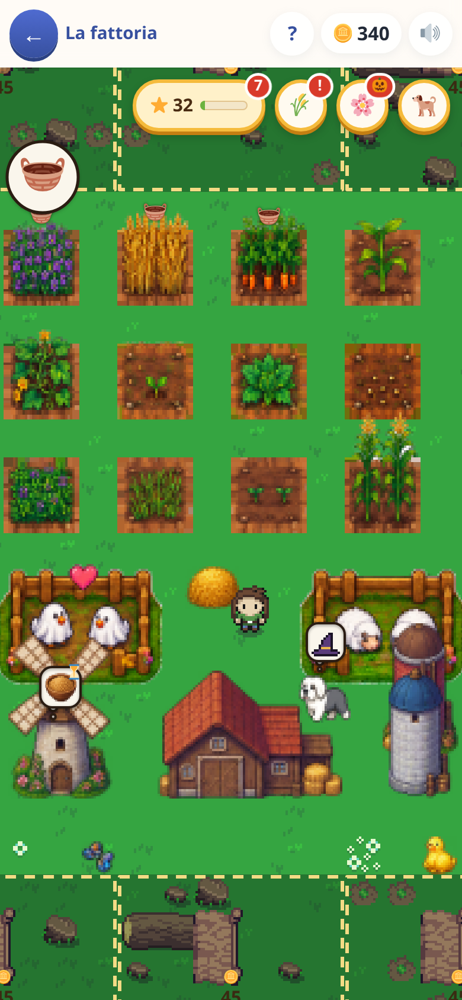
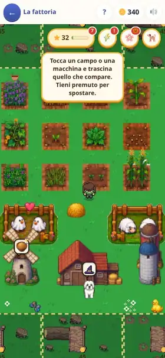

[← torna al README](../../README.md)

# 🚜 La fattoria

**Dove finiscono le monete guadagnate negli altri giochi.** Non ci sono
domande, e non ce ne saranno: è il posto dove si spende, e per questo è il
motivo per cui si torna a fare esercizi.

 

## Cosa si fa

Si compra terra, si sgombera il bosco, si posa quello che si vuole dove si
vuole. Poi si coltiva: un campo si semina, cresce **col tempo vero** e si
raccoglie. Il raccolto va nei silos, e da lì nelle macchine — il mulino fa
la pappa del cane e del gatto, il fienile il mangime delle galline — e nei
recinti, che danno uova, latte, lana, miele. Più avanti arrivano le
botteghe: il telaio fa la stoffa, la sartoria il maglione, il panificio il
pane e la torta.

Quello che si produce serve a qualcosa: alla ciotola delle bestie di casa,
al banco del mercato, alle botteghe del paese, alla mongolfiera che scende
dal cielo a caricare casse. Consegnare fa salire il **livello della
fattoria**, e ogni livello apre una cosa nuova da costruire.

Le bestie di casa — cani, gatti, un coniglio, un pappagallo — hanno fame,
voglia di giocare e il pelo da spazzolare, e si possono vestire con
cappellini e occhiali che si vedono mentre passeggiano per il prato.

## Come si tocca

Un solo gesto per tutto: **si tocca una cosa propria e si vede cosa ci si
può fare.** Toccare un cane apre la sua scheda. Toccare un campo o una
macchina fa comparire sopra i suoi gettoni — i semi, il cesto, le ricette —
che si trascinano col dito: un seme passato su tre campi vuoti li semina
tutti e tre, una ricetta portata sul mulino va in fila.
Tenere premuto e trascinare sposta, e contro il bordo dello schermo il
prato scorre da solo. Tenere premuto sul prato apre il baule lì dove si
vuole mettere qualcosa.

Sopra un campo pronto galleggia un 🧺, sopra una bestia che ha bisogno di
qualcosa un 💭, e un recinto cambia faccia da solo: si vedono da lontano,
senza aprire niente. Sono inviti, non rimproveri.

Quando una cosa non si può fare, il gioco non dice solo «no»: dice cosa
fare adesso, e porta il tasto per farlo — «ti servono 3 🌾: hai un campo
libero, seminaci del grano».

## Cosa allena

Non allena una materia di scuola, e non lo pretende: è il premio degli
esercizi fatti altrove. Quello che chiede è **pianificare**. Ogni ricetta
prende qualche pezzo e ne dà uno solo, quindi «quanti me ne servono» ha
una risposta che si conta sulle dita: per tre uova ci vogliono sei sacchi
di becchime, cioè dodici campi di grano. Una catena lunga — l'erba che
diventa foraggio, lana, stoffa, maglione — si impara a risalire da soli,
e la pagina «🌳 Come si fa» la mostra intera quando serve.

C'è anche la pazienza: i campi crescono in minuti veri, i clienti delle
botteghe tornano dopo un quarto d'ora, e la fattoria si organizza per
lavorare da sola mentre si fa altro.

## Note per i genitori

- **Non ci sono domande.** Le monete si guadagnano solo facendo esercizi
  negli altri giochi; qui si spendono. Niente si vende per monete: se il
  mercato comprasse il grano, la strada più corta per le monete non
  passerebbe più da nessuna tabellina. Le consegne pagano esperienza, cioè
  livelli.
- **Niente marcisce e niente si perde.** Un campo maturo aspetta per
  sempre, le bestie hanno fame ma non muoiono, quello che si mette via va
  nel baule e si ripiazza gratis. È un posto dove tornare, non un dovere.
- **Sale piano, apposta.** Il livello 10 sono circa undici ore di esercizi,
  l'ultimo livello duecento: spalmato su mesi, per un posto che si guarda
  cinque minuti al giorno.
- **Si spegne tutta o niente**: dalla schermata dei grandi si toglie il
  gioco, come tutti gli altri ([la pagina dei genitori](../genitori/README.md)).
  Non c'è un modo di tenere l'arredamento e togliere i campi: senza la
  catena resterebbe un prato con dei mobili.
- A ottobre gli animali dei recinti si travestono da soli (mummie,
  streghe, fantasmini, pipistrelli); da novembre all'Epifania arrivano neve
  e lucine.

Il resto — le regole, i numeri, i perché — sta nei file di questa
cartella: [README.md](README.md).
