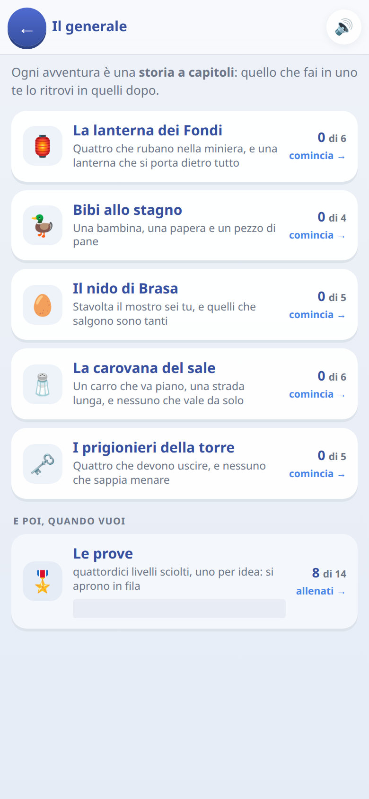

[← torna al README](../README.md)

# 🎖️ Il Generale *(in prova)*

*Programmazione senza scrivere codice.* Si dà una fila di ordini a una
squadretta, si preme play, e si guarda cosa succede.

 

> [!NOTE]
> Questo gioco è **in prova**: non compare in home finché non si accende
> l'interruttore *giochi in prova* nei settaggi. È il più incompleto della
> raccolta.

## Come è fatto

Una mappa vista dall'alto, qualche unità da comandare — l'eroe, il cane — e
un obiettivo. Gli ordini si compongono da un menù, non si scrivono: *vai
laggiù*, *prendi la chiave*, *apri il portone*, *pattuglia questa zona*.

Poi si preme play e **non si può più intervenire**. O funziona o no, e se non
funziona si guarda dove si è rotto e si corregge la fila.

## Che cosa impara, davvero

Detto in breve: **è programmazione asincrona travestita da gioco**. Non è una
metafora vaga — sono gli stessi concetti, nello stesso ordine in cui li
incontra chi impara a programmare sul serio, solo senza sintassi da scrivere.

Le tappe li introducono uno per volta.

### 1. La sequenza

Gli ordini si eseguono uno dopo l'altro, dal primo all'ultimo, e **quello che
non hai scritto non succede**. Sembra ovvio e non lo è: è la prima cosa che
un bambino scopre quando il personaggio si ferma davanti alla porta chiusa
perché nessuno gli ha detto di aprirla.

Insieme arrivano i **prerequisiti** — la spada prima del mostro, la chiave
prima del portone — e quindi l'idea che *l'ordine delle istruzioni è la
differenza fra vincere e perdere*.

### 2. L'astrazione

Dire **dove si va** invece di elencare ogni singolo passo. Costa meno ordini
e, soprattutto, **regge quando la stanza cambia**.

Questo è il salto vero, ed è il motivo per cui il gioco è fatto così: ogni
capitolo **si gioca su tre scene diverse**, e la fila di passi buona per la
prima fallisce sulle altre. Solo l'ordine che descrive l'intenzione le supera
tutte. È la differenza fra scrivere `vai_a(3,4)` e scrivere `destinazione`.

### 3. I condizionali

**«Se vedi l'orco vai di sotto, se non lo vedi vai di sopra.»** Il piano
smette di essere una lista e diventa una cosa che *reagisce a quello che
trova*.

Le tre scene servono esattamente a forzare questo: la scena cambia dove sta
l'orco, e nessuna fila fissa può andare bene per tutte. L'unico modo di
vincerle tutte è scrivere una condizione — che è poi il motivo per cui le
varianti sono differenze scritte a mano e non generate a caso.

### 4. I cicli con condizione d'uscita

*Continua a fare questa cosa finché non succede quest'altra.* Pattuglia una
zona finché non vedi qualcuno; avanza finché non arrivi al muro. Il concetto
che sta dietro a `while`, incontrato per il bisogno di non scrivere venti
volte lo stesso ordine.

### 5. Gli eventi: segnali fra più personaggi

Qui il gioco arriva dove i giochi di programmazione per bambini di solito non
arrivano. Le unità sono più di una, e **hanno file di ordini separate che non
partono insieme**:

> Tilde: *vai al magazzino, apri la porta, **dai il segnale***
> Orso: *****quando arriva il segnale**, esci e fai fracasso*

Uno **emette** un segnale, l'altro **è in ascolto** e reagisce. È esattamente
il modello emitter/subscriber, ed è il modo in cui si coordinano processi che
girano in parallelo: nessuno dei due sa quando l'altro sarà pronto, quindi
non si aspetta un orario — si aspetta *un fatto*.

Un bambino che ha capito questo ha già in testa il modello mentale che serve
per le callback, gli eventi e le promise. Mappare i concetti sulla
programmazione vera, dopo, diventa molto più semplice: la parte difficile
— **entrare nell'ottica che le cose non succedono in fila** — l'ha già fatta
giocando.

## Ogni unità sa fare cose diverse

## Ogni unità sa fare cose diverse

Il forziere lo apre l'eroe, il cane corre e abbaia. Se il cane sapesse aprire
i portoni, «mandaci il cane» sarebbe sempre la risposta giusta e non ci
sarebbe niente da pensare. Il menù degli ordini è filtrato di conseguenza:
**un ordine impossibile non compare nemmeno fra le scelte**.

## Un vincolo che i giochi a blocchi non hanno

Premuto play **non si può più intervenire**. Niente correzioni al volo,
niente aggiustamenti mentre il personaggio cammina: si guarda il proprio
piano fallire, si capisce *dove*, si torna indietro e si cambia.

È scomodo apposta. Aggiustare mentre gira è il modo di risolvere un livello
senza aver capito niente; guardare il proprio ragionamento sbagliare fino in
fondo è il modo di accorgersi di cosa non si era previsto.

## Note per i genitori

- È il gioco più difficile della raccolta e il meno finito.
- Ogni livello ha un **par**: il numero di ordini con cui si può risolvere in
  modo elegante. Vincere è facile, vincere dentro il par è il vero gioco.
- Le prove automatiche giocano davvero tutti i livelli, e verificano anche
  che le soluzioni *sbagliate ma plausibili* perdano almeno una delle tre
  scene: un livello che si lascia vincere dalla fila di passi non insegna
  quello che dovrebbe.
