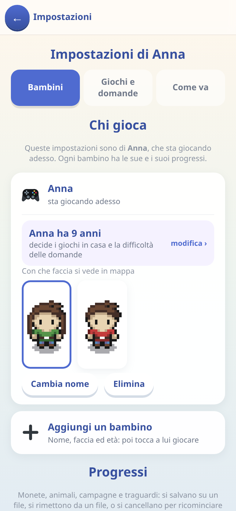
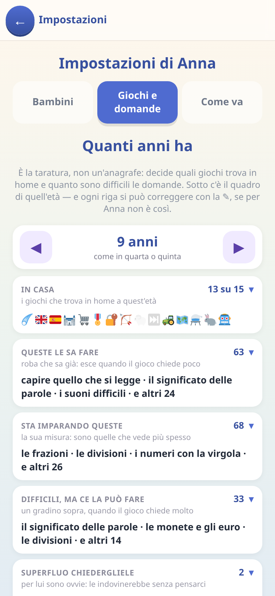

[← torna al README](../../README.md)

# 👨‍👩‍👧 I settaggi per i genitori

Tutto quello che segue sta dietro **un codice di quattro cifre**, che
all'inizio è `0000`.

 

Si arriva dal tasto **⚙︎ Impostazioni** in fondo alla schermata iniziale.

> Il codice non è sicurezza: è **un gradino contro il tocco distratto**. Al
> primo ingresso l'app invita a sceglierne uno vostro. Se lo dimenticate, sul
> tastierino c'è **«Non ricordi il codice?»**: una domanda di cultura
> generale lo rimette a `0000` e ne fa scegliere subito uno nuovo. Dal
> browser si può anche aggiungere `#pin=1234` all'indirizzo.

## Tre schede, e si tara in una sola

**Bambini** dice chi gioca su questo telefono — nome, faccia, progressi — e
dell'età mostra solo una riga: *«Leonardo ha 10 anni · modifica ›»*.
**Giochi e domande** è dove si tara, ed è l'unico posto: l'età in cima, e
sotto **il quadro di quell'età**.

**Come va** risponde all'unica domanda che le altre due non possono: *sta
funzionando?* Tutte le domande che esistono, ordinate da quella che gli va
peggio a quella che gli va meglio, con cinque cuori sulla percentuale di
risposte giuste — **sbiaditi finché le prove sono meno di otto**, perché una
su tre non è «il 33%», è un bambino che ha visto quella cosa tre volte.

Il **punteggio è il tasto**: apre la scheda di quella domanda con tutti i
numeri — quante volte gli è capitata, quante l'ha azzeccata, quanto ci mette,
quand'è stata l'ultima volta — e tre cose da fare: **▶ provala** (la domanda
vera, dallo stesso modulo che la darebbe in partita), **✎ spostala** (la
stessa tacca da mezzi anni del quadro) e **↻ ricomincia a contare**.

L'ultima serve appena si comincia a ritoccare: dopo aver reso una cosa più
facile, «ne ha sbagliate 7 su 10» parla ancora delle domande di prima.
Azzerare butta il conto e **non** il ripasso.

### Quanto ha giocato

In cima a «Come va», prima delle domande: **oggi**, **sette giorni**,
**trenta giorni**. Una fila di barre per i giorni — quelle vuote comprese,
perché tre giorni di fila a zero sono un'informazione — e sotto *a cosa* ha
giocato, col tempo accanto. Impostazioni, albo e guide non contano, e
nemmeno i tocchi sotto i cinque secondi; se il telefono viene posato col
gioco aperto la sessione si chiude da sé.

**Non c'è nessun giudizio su quanto sia tanto**: dipende dal giorno e dalla
famiglia. Ci sono i numeri, il resto lo sa chi legge.

## Il quadro: cosa trova in casa, e cosa gli chiediamo

Sotto la manopola c'è quello che quell'età comporta, e si apre a due livelli.

Il primo blocco è **In casa**: tutti i giochi, ognuno col suo stato — *c'è* ·
*l'ha già passato* · *arriva più avanti* · *l'hai spento tu*. Poi le domande,
divise per come cadono rispetto a lui: *queste le sa fare* · *sta imparando
queste* · *difficili, ma ce la può fare* · *superfluo chiedergliele*. In fondo
**non ancora spiegate**: quello che a scuola non si è ancora fatto, e che
quindi non esce in nessun gioco. Dentro ogni blocco ci sono i **pezzi di
scuola**, e dentro ognuno le sue domande, con l'età a cui servono.

Il **▶** di una riga apre una domanda vera: su un pezzo di scuola le scorre
tutte, col contatore («7 di 37»). Provarla non cambia niente e non lascia
traccia. Se in casa non c'è ancora nessun gioco che faccia domande — succede
fino a cinque anni e mezzo — al posto dei blocchi c'è una riga che dice da
quando arrivano.

Una riga che gli sta andando male porta il suo numero in rosso — «ne ha
sbagliate 7 su 10» — con la stessa soglia dell'avviso che arriva in posta:
almeno otto risposte, meno di metà giuste. Il rosso si vede già sul blocco
chiuso. È l'unico rosso del quadro: gli altri stati dicono *dove* sta una
cosa, questo dice che qualcosa non funziona.

## Correggere una riga: la ✎

L'età è la manopola grossa. La **✎** accanto a ogni riga è la correzione
piccola, per quando l'età ha indovinato tutto tranne una cosa: *le stagioni
le davamo per sapute, e a scuola sono indietro di mezzo anno*.

Su un **pezzo di scuola** o su una **domanda** la ✎ apre una tacca in mezzi
anni: `◀ Nel segno ▶`. Il nome grande è dove la riga andrà a finire, sotto
quello che stai dicendo — «mezzo anno più difficile · vale otto anni» — e
finché non premi «Conferma» non è cambiato niente. Tre scatti per parte; su un
pezzo di scuola ce n'è un ultimo, **«Non ancora spiegate»**, che lo spegne:
da lì le domande che lo danno per scontato non escono più in nessun gioco.

Il punto non è togliere difficoltà. Una domanda su qualcosa che non si è mai
visto **non è difficile: è muta** — si può solo tirare a indovinare, e
indovinare insegna che il gioco è ingiusto.

Su un **gioco** la tacca sceglie chi decide: *Non ce l'ha* · *Come dice
l'età* · *Ce l'ha*. L'ultima serve quando l'età sbaglia — il piccolo che
gioca col fratello grande. Spegnere non cancella niente: i progressi restano
e riaccendendo si ritrovano. La scelta è **per bambino**.

Quando si spegne qualcosa i giochi **degradano invece di sbarrare**: il
castello senza divisioni chiede moltiplicazioni più difficili, un modulo di
quiz che perde un grado scende a uno più facile. Nessun gioco diventa
impossibile e nessuna tappa si blocca.

## Ritrovare quello che si è toccato

**Quello che hai messo a mano resta color ambra** — il contatore dice
quante, il colore dice quali — e quello che hai tolto sta nel blocco «Non
ancora spiegate», da dove si rimette. In fondo al quadro c'è il tasto che
**rimette tutto com'è di partenza a quell'età**, dicendo prima cosa perde:
«2 giochi messi a mano, 1 domanda ritoccata». Non tocca l'età e non tocca i
progressi.

## I progressi: salvarli e spostarli

I progressi stanno **solo nel browser del dispositivo su cui si gioca**.
Non c'è nessun server: se si cancellano i dati del sito, o si cambia
telefono, senza un backup non tornano.

- **Salva su file** — scarica un `.json` con dentro tutto: monete, parole
  imparate, tappe, animali, traguardi, di **tutti** i bambini. Conviene
  farlo la prima sera e poi ogni tanto.
- **Rimetti da un file** — lo rilegge e sostituisce i progressi.

Sono anche il modo di **passare i progressi da un dispositivo a un altro**:
salva sul vecchio, apri i giochi sul nuovo, rimetti il file.

> [!WARNING]
> I progressi sono legati all'**indirizzo** da cui si aprono i giochi. Se
> cambi indirizzo — perché lo servi da un tuo server, o passi dal file
> scaricato al sito — il browser li considera due posti diversi e riparte da
> zero. In quel caso servono salva e rimetti.

- **Cancella i progressi** di chi sta giocando: chiede conferma, e **ne
  resta una copia** in fondo alla scheda (le ultime tre), da cui si
  rimettono. Vale anche per un bambino eliminato o una campagna
  ricominciata.

Quando c'è qualcosa che un genitore potrebbe voler sapere — una novità da
sistemare, una domanda che al bambino va male da un po' — arriva nella
**posta dei grandi**: un pallino sul tasto ⚙︎ e, in home, un nastro che
chiede al bambino di chiamare la mamma o il papà.

## Chi gioca

La schermata parla di **chi sta giocando adesso**: i giochi, i saperi, le
domande e l'età sono suoi e di nessun altro. Gli altri bambini sono una riga
di nomi, e si passa a loro dalla home.

Ognuno ha i suoi progressi, completamente separati. Cambiare nome tocca solo
l'etichetta.

**Aggiungere un bambino** apre la stessa schermata del primo avvio: nome,
faccia, e quanti anni ha. Alla fine tocca a lui giocare.

### Quanti anni ha

È **la taratura, non un'anagrafe**: nessuno chiede una data di nascita, e il
numero non si vede mentre si gioca. Decide due cose, in continuo:

- **quali giochi trova in home** — la bancarella non compare prima dei sei
  anni, il laboratorio delle pozioni prima dei sette e mezzo, e i due giochi
  dei piccoli («Conta gli animali», «Prima e dopo») smettono di essere
  offerti fra i sette e mezzo e gli otto;
- **quanto sono difficili le domande** — ogni classe di domande dichiara a
  che età serve, e da lì si pesca.

La manopola si sposta di mezzo anno per volta, e **sotto il quadro mostra
cosa cambia**: si muove una tacca e si guarda cosa si sposta. Niente è
scritto finché non si preme **Applica**, nel cartello che resta in fondo allo
schermo.

Dentro la stessa fascia di scuola si sposta solo la mira delle domande:
quello che hai spento o ritoccato a mano resta dov'è. Quando invece la tacca
cambia fascia, giochi e saperi ripartono da come sono di partenza a
quell'età — e se avevi sistemato qualcosa a mano il cartello dice **prima**
cosa stai per perdere. Monete, animali, campagne e traguardi non si toccano
mai.

Alla primissima apertura l'app chiede direttamente *«come ti chiami?»* senza
codice: chiedere un codice che nessuno ha ancora scelto la renderebbe
impossibile da aprire. La manopola parte dai quattro anni: si sale finché
il quadro non comincia a dire cose che il bambino non sa.

## Le due cose in fondo

- **Giochi in prova** — un unico interruttore che rivela i giochi ancora in
  lavorazione. Spento (com'è di partenza) quei giochi **non esistono** per
  chi gioca.
- **Apri tutte le tappe** — la scelta si salva, ma per ora nessun gioco la
  legge ancora: sulla carta c'è scritto.

Come funziona tutto il resto — cos'è l'app, come si installa, che giochi ci
sono — sta nelle guide **«? Come funziona»**, in fondo alla home e fuori
dal codice.
