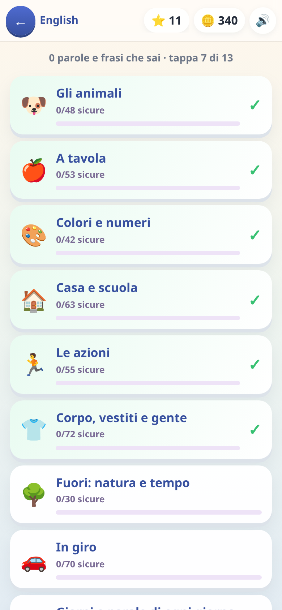
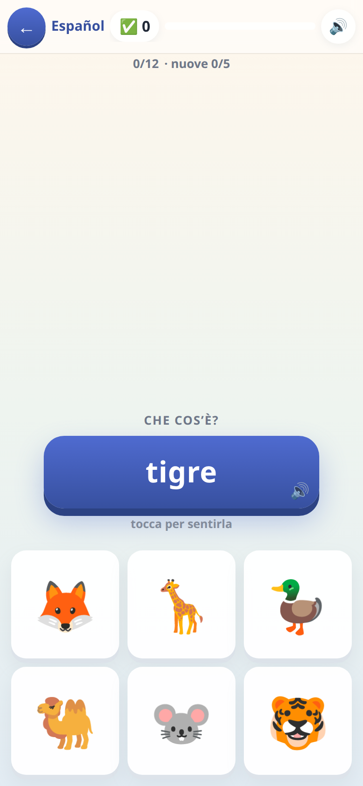

[← torna al README](../README.md)

# 🌐 English e 🇪🇸 Spagnolo

*Parole, verbi e frasi.* Sono **lo stesso gioco con dentro due lingue**: quello
che cambia è solo il vocabolario e la voce.

  

## Come è fatto

Una campagna a tappe: si parte dagli animali e dai colori, si arriva ai verbi
e alle frasi intere. Il meccanismo è sempre lo stesso — un bersaglio e
quattro possibilità — ma **il modo di chiedere cambia**, ed è lì che sta la
difficoltà.

## La pronuncia è incisa, non sintetizzata

Ogni parola la dice **una voce vera registrata a monte**, non la voce del
telefono. È una scelta precisa: la sintesi vocale del dispositivo è una
lotteria — su certi sistemi esce una voce incomprensibile — e a un bambino
una pronuncia sbagliata fa più danno del silenzio.

Lo spagnolo è **quello di casa**, cioè boliviano: `papa` e non `patata`,
`palta`, `durazno`, `auto`, `celular`. La voce è boliviana anche lei.

## Quali domande escono, e come si fanno più difficili

Ci sono **sei modi di chiedere la stessa parola**, e non li decide la tappa:
li decide **quanto quella parola è già sicura**.

| | modo di chiedere | quando arriva |
|---|---|---|
| 1 | vedi il disegno, scegli la parola | subito, anche a parola nuova |
| 2 | **senti** la parola, scegli il disegno | poco dopo |
| 3 | vedi la parola in italiano, scegli la traduzione | quando comincia a essere nota |
| 4 | **senti** la parola, scegli l'italiano | più avanti |
| 5 | vedi la parola straniera, scegli l'italiano | più avanti |
| 6 | dall'italiano alla parola straniera, senza aiuti | solo quando è consolidata |

Una parola appena incontrata si vede col disegno accanto; la stessa parola,
tre giorni dopo, arriva da sola e va riconosciuta all'ascolto. **Il bambino
non se ne accorge**: sente solo che «adesso è più difficile».

Quanto una parola sia sicura non lo decide il numero di volte che si è vista:
ogni parola ha una **forza**, che sale con le risposte giuste, scende con gli
errori e **cala da sola con il tempo**. Una parola imparata due settimane fa
e mai più rivista torna a farsi vedere senza che nessuno l'abbia sbagliata —
ed è così che il modo di chiederla può anche tornare più facile per un giro,
se serve.

I distrattori — le tre risposte sbagliate — escono **sempre dalla stessa
lingua**, mai mescolati.

## Le due lingue non si mescolano mai

Chiavi separate, progressi separati, contatori separati. Sapere «gatto» in
inglese non vuol dire saperlo in spagnolo, e il gioco non lo dà mai per
scontato. Sono due campagne indipendenti che si possono portare avanti a
velocità diverse — o solo una delle due, spegnendo l'altra dai settaggi.

## Cosa allena

Il lessico di base e il legame **suono ↔ significato**, che è la cosa che
manca quasi sempre a chi impara una lingua solo scritta. Nelle frasi entrano
anche i due segni della domanda spagnoli (`¿…?`), e in inglese la domanda si
riconosce dal verbo girato.

## Note per i genitori

- Il numero di parole «sicure» si vede nella carta in home: sono quelle
  arrivate in cima alla scala della forza, non quelle semplicemente viste.
- Se una lingua non serve, si spegne dai settaggi e sparisce dalla home
  senza perdere niente.
