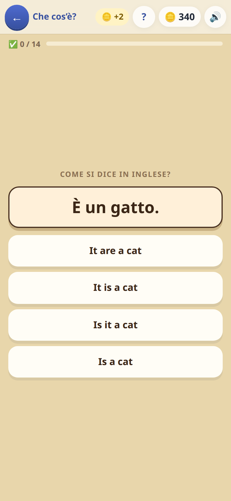
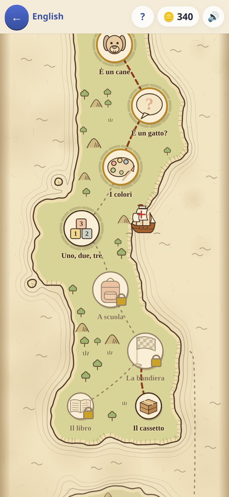
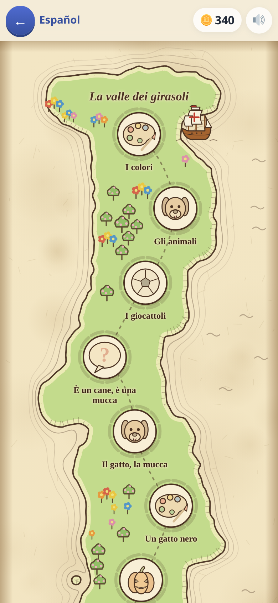

[← torna al README](../../README.md)

# 🌐 English e 🇪🇸 Spagnolo

*Parole, frasi e storie.* L'inglese è una **mappa del tesoro**; lo
spagnolo è ancora la campagna in fila di prima, e ci arriverà.

  

## L'inglese: la mappa del tesoro

Ogni isola della mappa è un **mondo** che insegna un pezzo di grammatica —
*che cos'è*, *io e le mie cose*, poi *dove*, *cosa sai fare*, la giornata,
il presente, il passato — e finire un mondo apre i successivi. Ogni tappa
porta **otto-dieci parole nuove e una struttura**, e le frasi non si
scelgono soltanto: da un certo punto **si compongono**, toccando le parole
una dopo l'altra, prima coi buchi da riempire, poi tutte da mettere in
ordine, poi con qualche parola trappola in mezzo. Chi sbaglia legge il
perché («*is it* va girato per chiedere») e come si fa, e va avanti: non
si perde niente.

Attorno a ogni tappa dieci tacche dicono **quanto è imparata**, e col tempo
calano: il disegno della tappa sbiadisce, e rigiocarla la fa tornare piena.
In fondo a ogni mondo c'è **un capitolo di un libro** da leggere in inglese
— con Laura, Leo e il cane Pip, e ogni volta un po' diverso — e qualche
domanda in italiano per vedere se si è capito. Qualunque parola inglese a
schermo **si tocca e dice cosa vuol dire**; le prime volte è gratis, poi
quella domanda non paga, e il gioco lo dice prima di rispondere.

Chi aveva finito la campagna di prima tiene il suo gioco libero, in fondo
alla mappa.

## Lo spagnolo, e com'era l'inglese

Una campagna di tredici tappe: si parte dagli animali e dai colori, si
arriva ai verbi e alle frasi intere. Il meccanismo è sempre lo stesso — un
bersaglio e alcune risposte, si tocca quella giusta — ma **il modo di
chiedere cambia**, ed è lì che sta la difficoltà.

## La pronuncia è incisa a monte

Ogni parola la dice **una voce di qualità, incisa una volta sola e messa
dentro il gioco**, non la voce del telefono: la stessa su ogni dispositivo,
anche senza rete. La sintesi vocale del dispositivo è una lotteria — su
certi sistemi esce una voce incomprensibile — e a un bambino una pronuncia
sbagliata fa più danno del silenzio.

Lo spagnolo è **quello di casa**, cioè boliviano: `papa` e non `patata`,
`palta`, `durazno`, `auto`, `celular`. Anche la voce ha l'accento boliviano.

## Quali domande escono, e come si fanno più difficili

Ci sono **otto modi di chiedere**, e non li decide la tappa: li decide
**quanto quella parola è già sicura**.

| | modo di chiedere | quando arriva |
|---|---|---|
| 1 | vedi la parola, scegli il disegno | subito, anche a parola nuova |
| 2 | vedi la parola, scegli l'italiano | quando comincia a essere nota |
| 3 | **senti** la parola, scegli il disegno | quando comincia a essere nota |
| 4 | dall'italiano alla parola straniera | quando è sicura |
| 5 | **senti** la parola, scegli l'italiano | quando è sicura |
| 6 | una frase straniera, scegli quella italiana | subito |
| 7 | una frase italiana, scegli quella straniera | quando comincia a essere nota |
| 8 | la parola che manca nella frase (*the cat ___ black*) | quando comincia a essere nota |

Una parola appena incontrata si vede scritta accanto ai disegni; la stessa
parola, tre giorni dopo, arriva da sola e va riconosciuta all'ascolto.
**Il bambino non se ne accorge**: sente solo che «adesso è più difficile».

Quanto una parola sia sicura non lo decide il numero di volte che si è
vista: ogni parola ha una **forza**, che sale con le risposte giuste,
scende con gli errori e **cala da sola con il tempo**. Una parola imparata
due settimane fa e mai più rivista torna a farsi vedere — quasi sempre a
voce, o partendo dall'italiano.

## Le due lingue non si mescolano mai

Chiavi separate, progressi separati, contatori separati, e le risposte
sbagliate escono sempre dalla stessa lingua. Sapere «gatto» in inglese non
vuol dire saperlo in spagnolo, e il gioco non lo dà mai per scontato. Sono
due campagne indipendenti che si possono portare avanti a velocità diverse
— o solo una delle due, spegnendo l'altra dai settaggi.

## Cosa allena

Il lessico di base e il legame **suono ↔ significato**, che è la cosa che
manca quasi sempre a chi impara una lingua solo scritta. In inglese la
domanda si riconosce dal verbo girato (le frasi si scrivono senza punto di
domanda, apposta); lo spagnolo insegna i punti dove è diverso
dall'italiano — *ser* ed *estar*, il genere, *tengo hambre*, *me gusta* —
e i due segni della domanda (`¿…?`).

## Note per i genitori

- Il numero di parole «sicure» si vede nella carta in home: sono quelle
  arrivate in cima alla scala della forza, non quelle semplicemente viste.
- Se una lingua non serve, si spegne dai settaggi e sparisce dalla home
  senza perdere niente.

Per chi ci lavora: [i vocaboli e i modi di chiedere](vocaboli.md),
[la voce](voce.md), [l'inglese a mondi](mondi.md) e [la sua vista](mondi-vista.md).

Nei test: `unita/inglese-mondi` e `unita/inglese-vista` (senza browser),
`integrazione/inglese-mondi`, `integrazione/inglese` (il gioco di prima),
`integrazione/spagnolo`; i bersagli `data-…` sono in
[mondi-vista.md](mondi-vista.md#nei-test).
