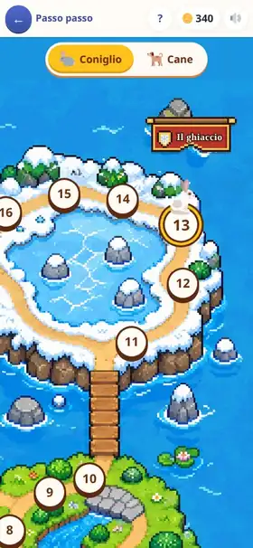

[← torna al README](../../README.md)

# 🐇 Passo passo

*Il primo gradino della programmazione, per chi non sa ancora leggere — e
poi un cane pastore da far pensare, e i cicli, per chi ha otto anni.*

Un coniglio deve tornare nella sua tana. Il bambino non lo guida col dito:
gli scrive una **fila di frecce**, preme ▶, e il coniglio la esegue
dall'inizio alla fine. Se qualcosa va storto si guarda *quale* freccia era
sbagliata, la si cambia, e si riprova.

## Come è fatto

In alto il posto, una mappa vista dall'alto in pixel art; sotto la **fila**
delle frecce scritte, i tasti delle frecce, e in fondo ⌫ ▶ 💡. Non c'è niente
da leggere per giocare: le frecce sono disegni, e quello che succede si vede.

Le frecce si mettono toccando, mai trascinando. ▶ fa ripartire il coniglio
**sempre dalla partenza** — è un programma, non un telecomando — e mentre
corre la freccia che sta eseguendo si accende. Se sbatte o finisce in acqua,
la freccia colpevole lampeggia e il cursore si mette subito dopo: un ⌫ la
toglie, e quella giusta entra al suo posto.

Non c'è tempo che stringe, non ci sono vite, non si perde mai: sbagliare fa
riprovare.

## I gradini

Le regole del mondo arrivano una alla volta e da lì in poi valgono sempre:
il **salto** (si scavalca una cella), il **ghiaccio** (si scivola finché
qualcosa non ferma), le **buche** collegate a coppie, i **massi** da
spingere (nell'acqua diventano un ponte).

Poi arriva il **cane pastore**: le frecce sono le stesse, ma non è il cane a
dover arrivare, sono le pecore. Una pecora si sposta solo scappando dal cane,
quindi la fila si scrive pensando a dove andrà a finire lei. Il cane è una
strada laterale: sulla mappa delle isole parte da una tana, e chi vuole
può tirare dritto col coniglio.

Dai sette anni e mezzo cresce **la lingua**: una carta 🔁 che ripete quello
che ha dentro, poi il «ripeti **fino a**» un colore e il «**se**» sono su
una lastra. E uno **zaino** che tiene poche carte: scritta freccia per
freccia, la strada non ci sta.

In fondo ci sono i **sentieri senza fine**, uno per il coniglio e uno per
il cane: posti fatti al momento, che mescolano tutto quello che il
bambino ha già finito, sempre difficili.

## Cosa allena

La **sequenza** (un programma è una fila di ordini, e l'ordine conta),
l'**esecuzione dall'inizio** (il programma si rifà tutto, non riparte da
dove si è rotto), il **debug** (trovare *quale* ordine è sbagliato, non
ricominciare da zero), e poi la **pianificazione**: col ghiaccio una freccia
vale molte celle, e bisogna pensare dove ci si fermerà prima di scriverla.
Con lo zaino, i **cicli** e le **condizioni**.

## Note per i genitori

- **Nessuna parola da leggere**: si gioca senza saper leggere. Il testo
  piccolo sulla mappa e sui cartelli è per chi guarda da sopra la spalla.
- **Non si perde.** Le stelle dicono com'è andata; la tappa si chiude
  quando il coniglio è a casa.
- **Gli aiuti non risolvono subito**: i primi due gradini del 💡 fanno
  ragionare e sono gratis, poi si pagano in monete, e la strada intera costa
  la stella «l'hai trovata tu».
- **Da quattro anni in su, e poi i cicli**: le tappe dei piccoli (il cane
  compreso) vanno dai quattro ai sette anni e mezzo — a sei anni sono aperte
  tutte, a cinque le prime quattordici — e quelle dello zaino dai sette anni e
  mezzo ai dieci. Dietro non c'è un pezzo di scuola, quindi a un bambino più
  grande non si chiude niente: vedi [come l'età decide cosa si
  vede](../genitori/presentazione.md#quanti-anni-ha). Per lo stesso motivo il
  gioco non si spegne a otto anni come i giochi dei piccoli: comincia da lì,
  ma cresce.
