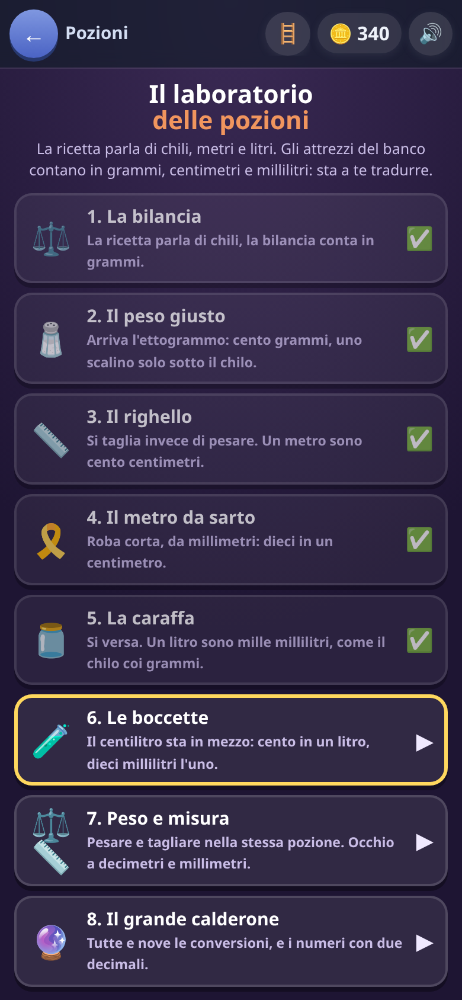

[← torna al README](../README.md)

# ⚗️ Il laboratorio delle pozioni

*Litri, chili e metri — ma col gesto giusto.* Si prepara una pozione dosando
gli ingredienti con gli attrezzi che si hanno sullo scaffale.

 

## Come è fatto

La ricetta chiede una dose: *«180 ml di bava di drago»*. Sullo scaffale ci
sono i misurini, e la dose va composta con quelli che ci sono — non sempre
c'è quello comodo.

Ogni tipo di ingrediente ha **il suo gesto**:

| | tipo | gesto | si misura in |
|---|---|---|---|
| 🫗 | liquido | versa | capacità (l, dl, cl, ml) |
| ⚖️ | polvere | pesa | massa (kg, hg, g, mg) |
| ✂️ | radice | taglia | lunghezza (m, dm, cm, mm) |

Non è un dettaglio decorativo: **è il punto**. Un bambino che sa che i litri
si versano e i chili si pesano ha già metà del lavoro fatto, e l'errore
tipico — «quanti litri pesa» — non nasce nemmeno.

## Quali domande escono, e come salgono

Otto tappe, e **salgono a coppie**. La regola è: la tappa che introduce un
gesto nuovo **riparte coi numeri facili**.

Sembra un dettaglio ed è la cosa che rende il gioco giocabile: chiedere una
conversione difficile *e* un attrezzo nuovo nella stessa tappa vuol dire che
il bambino non sa quale delle due cose non gli è chiara. Prima il gesto
nuovo su numeri semplici, poi gli stessi numeri difficili su un gesto che
ormai conosce.

Ogni dose è **garantita componibile** con gli attrezzi disponibili in quel
momento — c'è una prova automatica che lo verifica su tutte le tappe — e
scegliere quale attrezzo usare è **una scelta vera**, non una sola strada
possibile mascherata.

## Cosa allena

Le unità di misura e le conversioni fra multipli e sottomultipli, ma
soprattutto **la grandezza vera delle cose**: quanto è un litro, quanto è un
chilo, quanto è un metro. È la parte che a scuola si fa con le tabelle e che
resta astratta finché non si versa qualcosa.

## Note per i genitori

Questo gioco **si nasconde da solo** se hai spento le misure o le
conversioni in *Genitori → cosa sa*: senza quel pezzo di scuola non c'è
niente da ragionare, e mostrarlo lo stesso vorrebbe dire farlo giocare a
indovinare. È l'unico gioco con questo comportamento.
