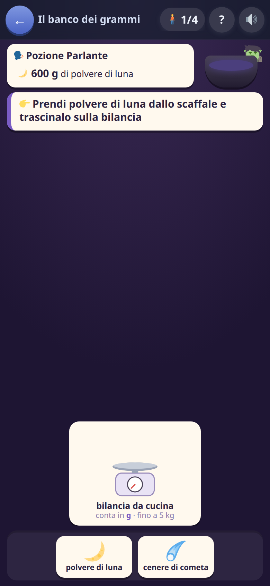
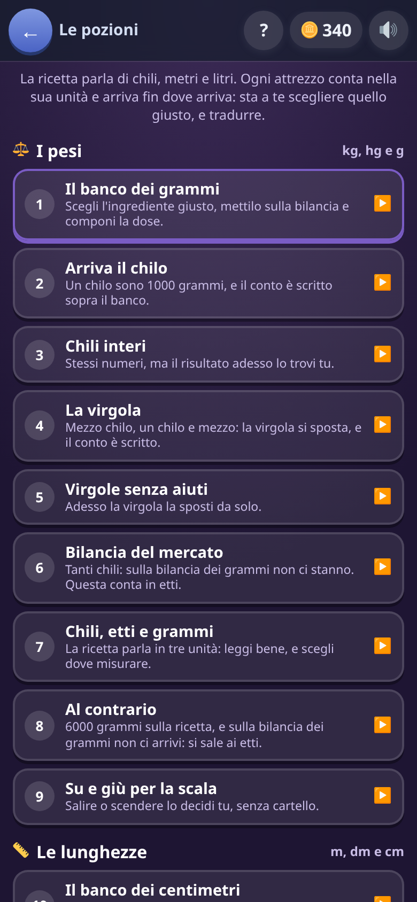

[← torna al README](../../README.md)

# ⚗️ Il laboratorio delle pozioni

*Chili, metri e litri — ma con l'attrezzo giusto.* La ricetta chiede una
dose, sullo scaffale ci sono gli ingredienti, sul banco gli attrezzi: si
prende quello che serve, lo si trascina sull'attrezzo che ci arriva, e si
compone la dose coi pezzi.

 

## Come è fatto

Tre famiglie di misure, e ognuna ha **tre unità e tre attrezzi**:

| | famiglia | unità | attrezzi (in che unità contano · fin dove arrivano) |
|---|---|---|---|
| ⚖️ | i pesi | kg · hg · g | bilancia da cucina (g · 5 kg) · bilancia del mercato (hg · 20 kg) · bilancia del magazzino (kg · 100 kg) |
| 📏 | le lunghezze | m · dm · cm | metro a nastro (cm · 5 m) · corda a spanne (dm · 20 m) · rotella da cantiere (m · 100 m) |
| 🫗 | i liquidi | l · dl · ml | caraffa graduata (ml · 5 l) · brocca a bicchieri (dl · 20 l) · botte (l · 100 l) |

**Un attrezzo conta in una unità sola, e arriva fin lì.** È questo il
gioco: la ricetta parla come le pare — «1,5 kg», «35 hg», «6000 g» — e
bisogna leggere l'unità, scegliere un attrezzo su cui la dose ci sta, e
tradurre nell'unità in cui quell'attrezzo conta. Otto chili sulla bilancia
dei grammi non ci stanno: si sale a quella degli etti, e 8 kg diventano
80 hg. Un chilo sono mille grammi sulla bilancia da cucina e dieci etti su
quella del mercato: vanno bene tutte e due, e scegliere è **una scelta
vera**.

Sull'attrezzo si posano i **pezzi**: i pesi sul piatto, i misurini nella
caraffa, i pezzi di nastro. Il numero sale, e quando fa la dose si manda
tutto nel calderone, che cambia colore a ogni ingrediente.

## La scaletta: una cosa nuova per volta

**Prima si impara il gesto, poi una cosa nuova per volta, e ogni cosa
nuova si spiega finché serve e poi si toglie.** Nove gradini, gli stessi
per le tre famiglie:

| | gradino | cosa chiede | aiuto |
|---|---|---|---|
| 1 | il banco | «500 g»: scegli l'ingrediente, mettilo sulla bilancia, componi la dose | come si gioca |
| 2 | arriva il chilo | «1 kg» sulla bilancia dei grammi | il conto svolto, col risultato |
| 3 | chili interi | 2 kg, 5 kg | solo la regola: 1 kg = 1000 g |
| 4 | la virgola | 0,5 kg, 1,5 kg | il conto svolto |
| 5 | virgole senza aiuti | le stesse, e 1,2 kg | niente |
| 6 | la bilancia del mercato | 8 kg, 12 kg: sulla bilancia dei grammi non ci stanno | il conto svolto, e «usa la bilancia del mercato» |
| 7 | chili, etti e grammi | la ricetta parla in tre unità | la regola |
| 8 | al contrario | «6000 g», e la bilancia dei grammi non ci arriva: si sale agli etti | il conto svolto |
| 9 | su e giù per la scala | tutto insieme | niente |

Le lunghezze rifanno la scaletta con metri, decimetri e centimetri; i
liquidi con litri, decilitri e millilitri. Poi due tappe in cui arriva di
tutto — pesi, lunghezze e liquidi nella stessa pozione — e solo nell'ultima
ci sono **tre attrezzi per famiglia**: nove sul banco, che vanno bene a chi
è esperto e non prima. Ventinove tappe in tutto.

## Il conto svolto

Il cartello sopra il banco dice l'uguaglianza, gli scalini fra le due unità
e il gesto: *1 kg = 1000 g · da kg a g sono 3 scalini in giù · aggiungi 3
zeri · 1 → 10 → 100 → 1000 g*. Con la virgola dice «la virgola va a destra
di 3 posti»; a chi legge «2 kg» la virgola non si vede, e dirgli di
spostarla è dirgli di cercare una cosa che non c'è. Al contrario — dai
grammi agli etti — si sale, e gli zeri si tolgono: *6000 → 600 → 60 hg*.

**Uno sbaglio lo riporta per intero**, anche nelle tappe senza aiuti:
dopo uno sbaglio si dice il perché *e* come si fa. Ogni sbaglio ha le sue
parole — l'ingrediente che non è nella ricetta, la polvere messa nella
caraffa («la polvere si pesa, non si versa: serve una bilancia»),
l'attrezzo troppo piccolo («arriva fino a 5 kg»), la dose troppa o poca.
Poi si sta fermi qualche secondo a leggere, con la barra che dice quanto
manca, e si riprova.

## Senza fretta e senza cuori

Il tempo non è un avversario: una barra che scende sopra un cartello da
leggere insegna a non leggere. **La tappa si finisce sempre**, e a
cambiare sono le stelle — tre senza sbagli, due con pochi, una comunque.
Le monete sono tre per ogni dose azzeccata al primo colpo, e una dose
sbagliata non paga.

## Cosa allena

Le unità di misura e le conversioni fra multipli e sottomultipli, nei due
versi, e **la grandezza vera delle cose**: quanto è un chilo, quanto è un
metro, quanto è un litro — e che con un attrezzo che arriva a cinque chili
otto chili non si pesano.

## Note per i genitori

Questo gioco **si nasconde da solo** se hai spento le misure o le
conversioni in *Impostazioni → Giochi e domande*: qui le misure non sono un
tipo di domanda fra tanti, sono tutto il gioco. Compare in home dai sette
anni e mezzo; a un bambino più grande le prime tappe dei pesi nascono già
aperte, e può cominciare da dove gli serve.

Per chi ci lavora: [le regole](regole.md).
