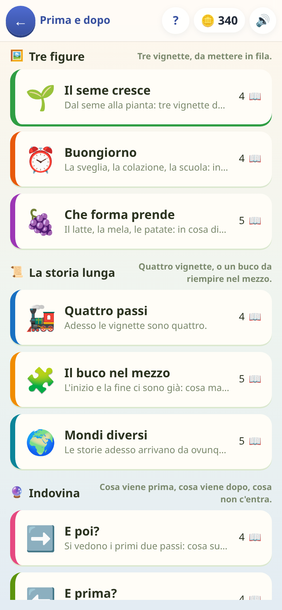

[← torna al README](../README.md)

# ⏭️ Prima e dopo

*Il seme, il germoglio, l'albero: rimettere in fila una storia.* Sequenzialità
temporale e causa-effetto, senza una parola da leggere e senza un numero.

 

## Come è fatto

Ci sono delle vignette mescolate e delle caselle vuote: si tocca una vignetta,
va nella prima buca libera; si tocca di nuovo, torna indietro. Quando le
caselle sono piene la fila si controlla da sé.

La consegna in cima è **una freccia**, non una frase: `⏱️➡️` vuol dire «prima,
poi, infine». La riga scritta sotto c'è per chi legge, ma il gioco funziona
identico ignorandola — ed è la condizione perché un bambino di quattro anni
lo apra da solo.

**Sbagliare non toglie niente**: la fila giusta si accende un istante, si
guarda, e si riprova. Non si perde mai; si vede solo nelle stelle.

## I sei modi di chiedere

| | |
|:--|:--|
| **Metti in fila** | tre vignette da ordinare |
| **Quattro passi** | le stesse, ma quattro: la storia si allunga |
| **Il buco nel mezzo** | l'inizio e la fine ci sono, manca quello in mezzo |
| **E poi?** | si vede l'inizio: cosa succede dopo |
| **E prima?** | si vede la fine: cosa c'era prima |
| **Chi non c'entra** | una vignetta è capitata nella storia sbagliata |

Gli ultimi tre sono un salto vero: ordinare è riconoscere una storia che c'è
già tutta davanti, indovinare è **immaginare il passo che non si vede**. E
«E prima?» è più difficile di «E poi?» — il tempo si percorre all'indietro.

## Le cinquanta storie

Sette famiglie: **crescita** (il seme, l'uovo, il gattino, la bambina che
diventa nonna), **trasformazione** (il latte che diventa gelato, l'uva che
diventa succo), **routine** (la sveglia, la colazione, la scuola),
**causa-effetto**, **costruzione**, **cucina**, **viaggio**.

Una tappa non elenca le storie: dichiara da quali famiglie può pescare, e le
prende a ogni giro. Rigiocata, non fa vedere la stessa fila.

Due cose che si scoprono solo scrivendole:

- **Il verso dev'essere obbligato.** Fra due vignette ci deve essere un prima
  e un dopo veri, non due cose che capitano insieme: il pomodoro e il
  formaggio sulla pizza si possono mettere in qualunque ordine, e un bambino
  che ne sceglie uno ha ragionato bene mentre il gioco gli dà torto. Dove
  succedeva si è tolto un passo e se n'è cercato uno che segua per forza —
  il fuoco, il coltello, la porta.
- **Certe storie hanno senso anche al contrario** (l'acqua che gela è anche
  il ghiaccio che si scioglie). Non sono sbagliate, ma chiedono già di sapere
  qual è il verso giusto: nelle tappe facili, dove la freccia del tempo deve
  essere ovvia, non capitano.

Quattordici storie non sono emoji ma **vignette disegnate**, e sono nate da un
limite preciso: con un inventario chiuso non si sceglie il passo che la storia
chiede, si sceglie quello che l'inventario ha. Quello che restava fuori era il
più interessante — un bambino che si fa male, uno che rompe qualcosa e lo dice,
due che litigano e fanno pace — perché lì l'informazione sta in una faccia, e
una faccia le emoji ce l'hanno solo su una testa gialla staccata dal corpo.

## Le dieci tappe

Tre scalini: **Tre figure** (mettere in fila), **La storia lunga** (quattro
vignette, o il buco da riempire), **Indovina** (dopo, prima, l'intruso).
L'ultima mescola tutti e sei i modi.

## Cosa allena

L'ordine temporale e il rapporto causa-effetto — cioè **la stessa cosa che
«Il Generale» chiede cinque anni dopo con gli ordini in fila**, qui senza
leggere una riga. È anche una delle poche cose in questo repertorio che non
è né matematica né lingua: è come si tiene insieme un racconto.

## Note per i genitori

- **Nessuna domanda scritta**, nessun conto: si gioca guardando.
- **Non si perde**, e le stelle dicono solo quanto è filata liscia: tre senza
  errori, due fino a due, una comunque.
- **Si spegne con «Sequenze e ritmi»**, il pezzo di scuola che dichiara.
- La sua campagna sta **fra i quattro e i sei anni e mezzo**: più avanti la
  carta non viene più offerta a chi non l'ha mai aperta — vedi
  [come l'età decide cosa si vede](genitori.md#quanti-anni-ha).
