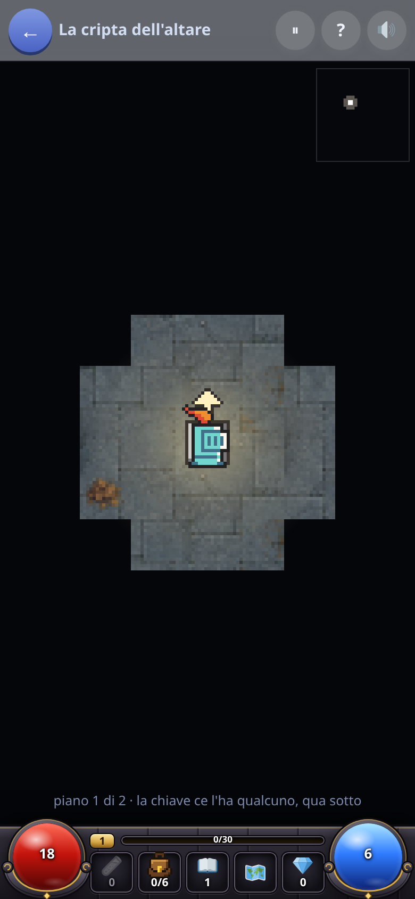
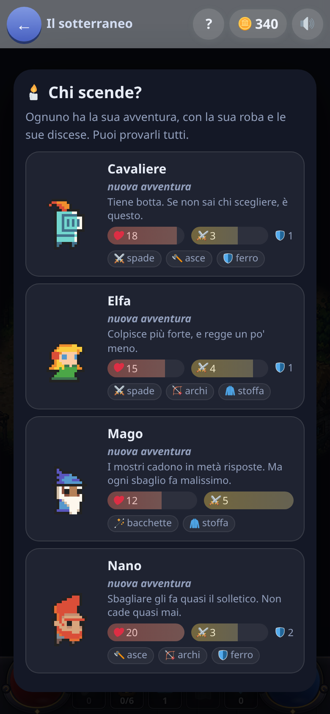

[← torna al README](../../README.md)

# 🗺️ Il sotterraneo

*Un posto che si gira col dito, dove ogni cosa che vale ha un prezzo — e il
prezzo è rispondere.*

 

## Cos'è

Si cammina in un sotterraneo visto dall'alto: si tocca dove si vuole andare,
si entra nelle stanze, si toccano le cose. Nessuna azione interessante si
compie senza rispondere, e nessuna risposta resta senza qualcosa che si
apre.

| cosa si tocca | cosa costa |
|---|---|
| 🚪 una porta chiusa | una domanda facile — sbagliando si riprova |
| 🎁 un forziere | **una domanda sola, tosta**: sbagliata, resta chiuso per sempre |
| 👹 un mostro | una domanda per colpo, finché non cade |
| ⛲ una fonte | una domanda, e ti ridà vita |
| 🏪 un mercante | niente domande: qui si **spende** quello che le domande hanno fruttato |

Non è [il Dungeon](../dungeon/presentazione.md) e non lo sostituisce: quello
è un gioco a carte, un bivio alla volta; questo è un posto. Fanno cose
diverse con gli stessi esercizi, e se un giorno se ne terrà uno solo lo
diranno i bambini.

## L'esercizio è la chiave, la spada e il piede di porco

Un quiz messo *accanto* a un gioco d'esplorazione diventa un pedaggio che
interrompe la cosa bella. Qui è il contrario: senza rispondere non si apre,
non si picchia, non si beve. Le domande sono di tutte le materie e si fanno
più difficili in due modi insieme — **scendendo** (ogni piano alza
l'asticella) e **scegliendo** (un forziere chiede più di una porta). Un
bambino prudente vede domande più facili di uno che va a caccia di scrigni,
nella stessa discesa.

## La scelta è dove spendere le risposte

Si può girare tutto, ma la mappa contiene sempre più roba di quanta se ne
faccia in una seduta, e sbagliare costa vita: chi ripulisce tutto arriva
alla scala con mezzo cuore. I **segni sopra le porte** — 💀 una guardia, 💎
roba buona, 🏪 un mercante, ⛲ acqua — si leggono prima di pagare e non
mentono mai. La scala è chiusa, e la chiave ce l'ha un guardiano: è l'unica
cosa obbligatoria di ogni piano.

## Chi scende, e chi ci abita

Quattro eroi — cavaliere, elfa, mago, nano — che differiscono in quanto
reggono, quanto picchiano e cosa possono impugnare; si sceglie una volta.
Sotto abitano quattordici creature, e più si scende più sono dure. Dentro
una discesa l'equipaggiamento scende con te di piano in piano; fra una
discesa e l'altra si riparte a mani nude.

Finite le sei discese si apre **l'abisso**: una discesa sola che non
finisce, dove l'arma trovata non si butta più.

## Cosa allena

Tutte le materie, alla difficoltà della sua età. E una cosa che una scheda
non chiede: **decidere dove spendere lo sforzo** — il forziere tosto o la
porta facile, restare a combattere o scappare con un graffio, ripulire il
piano o correre alla scala.

## Note per i genitori

- Le domande rispettano l'età del bambino e quello che hai spento nel
  quadro dei grandi.
- Una discesa dura venti minuti buoni: si può uscire e riprenderla da dove
  si era, e il ⏸ la ferma senza uscire.
- Si può perdere: dopo troppi svenimenti si risale e la discesa si rifà.
  Rispondendo bene otto volte su dieci si arriva in fondo quasi sempre;
  premendo a caso quasi mai.
