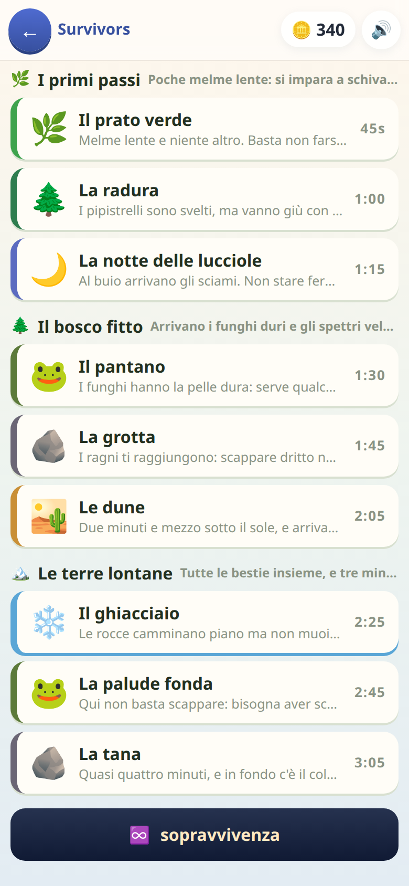

[← torna al README](../README.md)

# 🏹 Survivors

*Sopravvivenza a ondate, dove ogni potenziamento ha un prezzo in difficoltà.*

 

## Come è fatto

Si resiste a ondate di nemici che arrivano da tutti i lati. Ogni tanto il
gioco si ferma e offre **tre carte** fra cui scegliere: un'arma nuova, più
velocità, più vita, un colpo che rimbalza.

## La regola che rende il gioco un gioco

**Le carte non sono gratis: ognuna ha un prezzo, e il prezzo è la difficoltà
della domanda che devi indovinare per averla.**

Il prezzo si compone di due cose.

**Quanto quella carta cambia la partita.** Una freccia in più raddoppia il
fuoco; la calamita fa solo volare le gemme un po' più da lontano.

| fascia | esempi | che domanda arriva |
|---|---|---|
| debole | la mela che ridà un cuore, la calamita | facile |
| media | | media |
| forte | la freccia in più | tosta |

**E quanto quella carta è già cresciuta.** La prima freccia in più costa
quello che dice la sua fascia; la quinta costa molto di più. La stessa
capacità, presa in basso, chiede una domanda facile — presa in alto, ne
chiede una tosta.

Serve a tenere viva la scelta: senza, prendere nove volte la stessa carta
sarebbe nove volte lo stesso pedaggio, e dopo il terzo livello non ci sarebbe
più niente da decidere.

Se rispondi giusto, prendi il potenziamento. Se sbagli, niente carta: il
giro dopo arriva presto, perché le gemme continuano a cadere.

Al posto di «niente» c'era una monetina — un «ci hai provato» che valeva in
cameretta e non in campo, e che sembrava innocua. Era il buco più grosso del
gioco, per una ragione che il codice non poteva sapere: **quello che un
bambino vuole sono le monete**, perché quelle si spendono. Una moneta per
ogni risposta sbagliata non è un premio di consolazione, è il modo più
veloce di farne — chiedi una carta, premi un tasto a caso, incassi,
ricominci — e nella partita libera, dove non si vince niente, era perfino
l'unica fonte. Adesso le monete di questo gioco si prendono in un modo solo:
arrivare in fondo a una tappa.

Questo trasforma ogni offerta in **una scelta vera**: prendo la carta forte
rischiando una domanda difficile, o mi accontento di quella debole che sono
sicuro di indovinare? Senza il prezzo, la scelta sarebbe solo «quale carta è
più utile», e la risposta sarebbe sempre la stessa.

È anche il motivo per cui un bambino che ha voglia di vincere **sceglie da
solo le domande difficili**, il che è esattamente il punto.

## Una partita si può lasciare a metà

Le tappe durano fra i 45 secondi e i tre minuti, la Sopravvivenza non
finisce mai. Uscire non butta più via niente: si scrive dove si era
(`motore/sosta.js`) e la mappa la offre in cima — «⏱ mancano 38s · ❤️ 3/4 ·
livello 6 — torno in campo da dove ero». È la stessa promessa del
[sotterraneo](sotterraneo.md), e vale la pena tenerla uguale in tutti i
giochi: un bambino che ha imparato che di là si può uscire non deve
scoprire che qui no.

Quello che si salva sta in meno di un chilobyte, perché quasi tutto si
**rifà**: lo scenario sta nella tappa, i numeri dell'eroe sono una funzione
delle carte prese. Si scrive solo quello che è *successo* — dove si era
arrivati, cosa si è preso, chi c'è in campo.

Tre scelte dentro questa:

- **I mostri non si cancellano, si spingono via.** Riaprire il gioco a campo
  pulito sarebbe comodissimo, e diventerebbe *una mossa*: quando sei
  circondato esci, rientri, e la marea ricomincia da capo mentre l'orologio
  no. In campagna quei secondi valgono un cuore, cioè una stella; nella
  Sopravvivenza valgono il primato. Quindi i mostri si ritrovano dov'erano,
  e solo quelli addosso fanno un passo indietro — perché riprendere con la
  melma sul naso e mezzo cuore in meno è il modo più rapido di far pentire
  qualcuno di aver ripreso.
- **Il campo riprende fermo**, e riparte al primo dito. Questo gioco non è a
  turni: chi riapre sta ancora guardando dov'era rimasto, e la marea non
  aspetta nessuno.
- **Dopo il traguardo non si salva più.** Lì stelle e monete sono già state
  contate: chi resta in campo gioca tempo regalato, e interromperlo costa
  qualche monetina e nient'altro. Salvare anche quello vorrebbe dire
  portarsi dietro *che i premi sono già stati pagati* — e un salvataggio che
  si scorda quella riga paga la tappa due volte.

Le tre carte in attesa si salvano **per chiave** e si rivestono riprendendo:
ripescarle sarebbe una riga in meno e un tiro nuovo a ogni uscita, cioè chi
non gradisce l'offerta esce e rientra finché non gliene capita una migliore.

## Quali domande escono

Tutte le materie: italiano, matematica, spazio, tempo, logica. Il gioco non
sa quali esistano, chiede solo una domanda di una certa durezza.

**[→ Cosa c'è dentro, materia per materia](domande.md)**

La difficoltà non dipende da quanto è lunga la partita ma **da cosa scegli**:
quale carta, e quanto l'hai già cresciuta. Nel [Dungeon](dungeon.md) invece
dipende da quanto si è scesi — stesse domande, due modi diversi di dosarle.

## Cosa allena

La stessa cosa del Dungeon come contenuto, ma con un'abitudine mentale
diversa: **valutare quanto si è sicuri di sé prima di impegnarsi**. È
metacognizione mascherata da gioco d'azione.

## Note per i genitori

- Vale quello che hai spento in *Genitori → cosa sa*: quelle domande non
  escono più, in nessuna fascia di prezzo.
- È fra i giochi più recenti ed è ancora in movimento.
