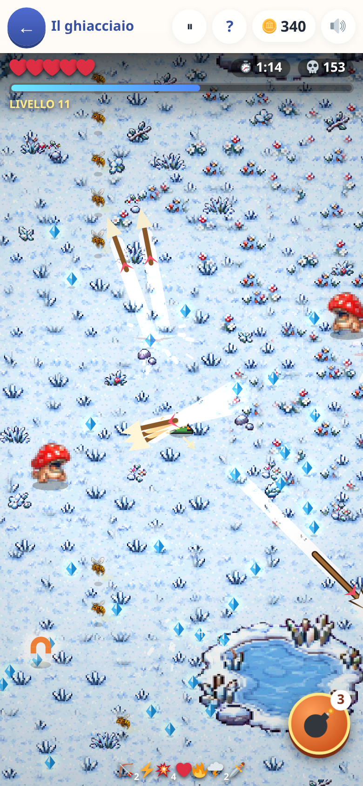
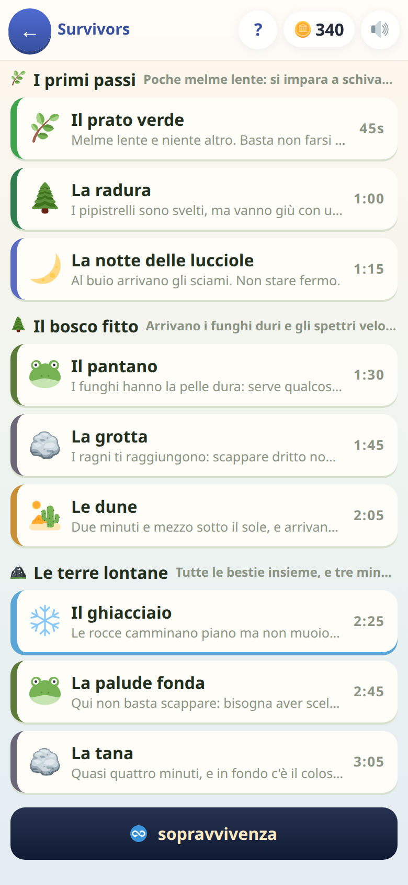

[← torna al README](../../README.md)

# 🏹 Survivors

*Sopravvivenza a ondate, dove ogni potenziamento ha un prezzo in difficoltà.*

 

## Come è fatto

Si resiste a ondate di nemici che arrivano da tutti i lati, guidando l'eroe
col dito. L'arco tira da solo, ma non basta stare fermi: le gemme che fanno
salire di livello si prendono **passandoci sopra**, a terra compaiono cuori,
calamite e casse da andare a prendere, ogni tanto una fila di mostri
attraversa lo schermo e va schivata dal suo varco, e le armi migliori tirano
dove si sta correndo. Chi non muove il dito non vince nessuna tappa.

Salendo di livello il gioco si ferma e offre **tre carte**: un'arma nuova, più
velocità, più vita, un colpo che rimbalza.

## La regola che rende il gioco un gioco

**Le carte non sono gratis: il prezzo è la difficoltà della domanda da
indovinare per averla.** Dipende da quanto la carta cambia la partita (la
mela che ridà un cuore chiede una domanda facile, la freccia in più una
tosta) e da quanto è già cresciuta: la prima copia costa quello che dice la
sua fascia, la quinta molto di più.

Rispondendo giusto si prende la carta; sbagliando niente, e il giro dopo
arriva presto. Ogni offerta diventa **una scelta vera**: la carta forte
rischiando una domanda difficile, o quella debole che si è sicuri di
indovinare? Un bambino che vuole vincere **sceglie da solo le domande
difficili**, che è esattamente il punto.

Le monete si prendono in un modo solo: rispondendo giusto, 🪙3 a carta
vinta, subito, anche nella partita libera e in una tappa che poi si perde.
A fine tappa non arriva nessun premio in più, e una risposta sbagliata non
paga mai niente.

## Si può lasciare a metà, e fermare

Le tappe durano fra i 45 secondi e i tre minuti. Uscendo si scrive dove si
era, e la mappa lo offre in cima («⏱ mancano 38s · ❤️ 3/4 · livello 6 — torno
in campo da dove ero»). Il ⏸ ferma la partita senza uscire, e al ritorno si
riparte al tocco.

## La Sopravvivenza, che non finisce

Finite le nove tappe si apre **la Sopravvivenza**: nessun traguardo, la marea
che sale e basta. L'unica cosa che ha da dare è **dire di quanto sei
migliorato**: «🥇 Nuovo record! 2:05 (32s meglio di prima)», coi coriandoli, e
quando il record resta dov'era quanto è mancato. Record, partite fatte e
ultime cinque stanno anche in **I miei progressi**, sotto *I miei record*.

## Quali domande escono

Tutte le materie: italiano, matematica, spazio, tempo, logica.
**[→ Cosa c'è dentro, materia per materia](../apprendimento/presentazione.md)**

La difficoltà non dipende da quanto è lunga la partita ma **da cosa scegli**:
quale carta, e quanto l'hai già cresciuta. Nel
[Dungeon](../dungeon/presentazione.md) invece dipende da quanto si è scesi —
stesse domande, due modi di dosarle.

## Cosa allena

Lo stesso contenuto del Dungeon, con un'abitudine mentale diversa:
**valutare quanto si è sicuri di sé prima di impegnarsi**. È metacognizione
mascherata da gioco d'azione.

## Note per i genitori

- Vale quello che hai spento nel quadro dei grandi: quelle domande non escono,
  in nessuna fascia di prezzo.
- È fra i giochi più recenti ed è ancora in movimento.
